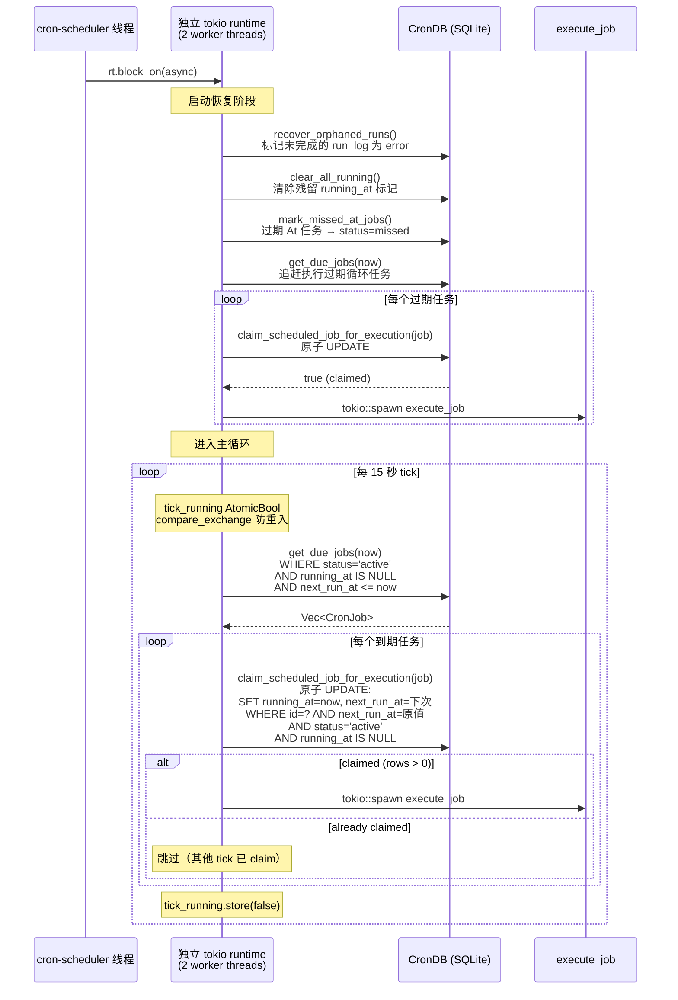
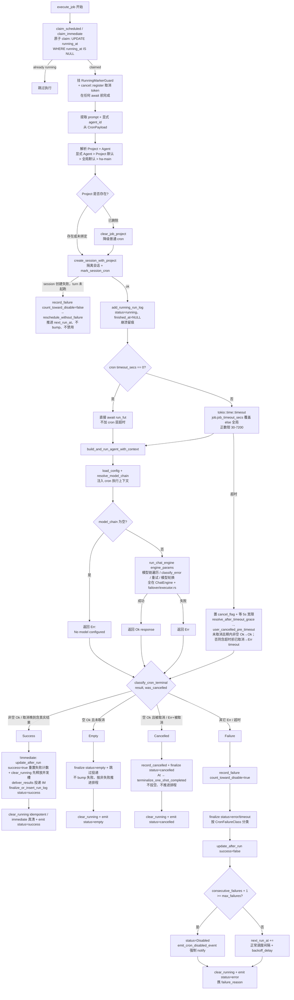
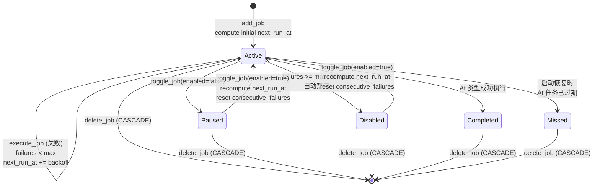

# Cron 定时任务架构
> 返回 [文档索引](../README.md) | 更新时间：2026-07-20

## 概述

Cron 系统提供定时调度能力，支持一次性（At）、固定间隔（Every）和 cron 表达式（Cron）三种调度模式。任务触发后在隔离会话中执行 Agent 对话，具备完整的 failover 模型链重试、任务级指数退避、连续失败自动禁用、启动恢复和日历视图。

任务可选绑定 Project（`project_id` / API `projectId`）。绑定后，每次执行创建的隔离会话会写入 `sessions.project_id`，因此 Project 指令、Project 记忆、Project 工作目录和工具 cwd 解析都与正常 Project 对话一致。未显式指定 `agent_id` 时，Agent 解析顺序为：任务 payload 显式 Agent > `project.default_agent_id` > 全局默认 > `ha-main`。如果任务关联的 Project 已被删除，执行器会清空该 job 的 `project_id` 并按普通 cron 继续执行，本次不计失败。

`Every` 调度在 2026-04-22 起补齐了持久化 `start_at`（首个计划触发时间）语义。这样日历展开不再从查询窗口起点“硬铺”，旧数据库里的 `Every` 任务也会在 `CronDB::open` 时自动按 `created_at + interval_ms` 回填 `start_at`，修复“4 月 22 日刚创建的喝水提醒在 4 月 1 日开始出现”的错位问题。

调度器运行在独立 OS 线程 + 独立 tokio runtime（2 worker threads）中，每 15 秒 tick 一次查询到期任务。任务 claim 使用原子 SQL UPDATE（`WHERE status='active' AND running_at IS NULL AND next_run_at <= now`）防止重复执行。

## 模块结构

| 文件 | 职责 |
|------|------|
| `cron/mod.rs` | 模块入口、re-exports |
| `cron/types.rs` | CronSchedule / CronPayload / CronJob / CronJobStatus / CronRunLog / NewCronJob / CalendarEvent |
| `cron/schedule.rs` | `compute_next_run` 三种调度计算、cron 表达式验证、`backoff_delay_ms` 指数退避、时间戳灵活解析 |
| `cron/scheduler.rs` | `start_scheduler` 后台调度循环 + 启动恢复 + 追赶执行 |
| `cron/executor.rs` | `execute_job` 任务执行 + `build_and_run_agent` 含 failover + `record_failure` + 事件发射 |
| `cron/delivery.rs` | `deliver_results` 把执行结果文本 fan-out 到 IM 渠道会话（每 target 10s 超时保护 + **投递前白名单校验**，详见「投递白名单与 delete 审批门控」）；`deliver_injection_for_session`（G2）按会话反查 `cron_run_logs → job` 后,把**后台 job/subagent 完成的注入 turn** 同样下发到 `delivery_targets`——cron turn 里 spawn 的后台任务稍后完成时不再投递给无人 |
| `cron/cancel.rs` | 任务级 cancel token 注册 / 触发 / 清理 + §9 claim↔register 窗口的 `PENDING_CANCELS` 占位，供 `cancel_running_job` 取消路径使用 |
| `cron/failure.rs` | §5 `CronFailureClass` 纯函数失败分类（`classify` / `run_log_status` / `key`），**只做诊断、不改禁用策略** |
| `cron/timeline.rs` | `cron_run_timeline` 跨库装配（cron.db run logs + sessions.db title/unread，两库不可 JOIN） |
| `cron/db.rs` | `CronDB` SQLite 持久化（CRUD、claim、running 标记、run_log 生命周期、calendar 查询、启动恢复、schema 迁移与 backfill） |

## 数据模型

### CronSchedule（三种调度类型）

serde tag 区分，`rename_all = "camelCase"`：

| 类型 | 字段 | 说明 |
|------|------|------|
| `At` | `timestamp: String` | 一次性触发。支持 RFC 3339（`2026-04-05T10:00:00+08:00`）和紧凑时区偏移（`+0800`），通过 `parse_flexible_timestamp` + `normalize_tz_offset` 自动转换 |
| `Every` | `interval_ms: u64`, `start_at: Option<String>` | 固定间隔触发，每 N 毫秒。`start_at` 表示**首个计划触发时间**；`compute_next_run` 返回“严格晚于 `after` 的下一个锚定时间点” |
| `Cron` | `expression: String`, `timezone: Option<String>` | 标准 cron 表达式（`cron` crate `Schedule::from_str`）。**`timezone` 真正生效**（见下「时区语义」）：携带 IANA 名时按该时区墙钟解释、DST-aware；`None`/空回退 UTC |

#### 排程校验单一真相源（§6）

`schedule::validate_schedule(&CronSchedule)`（[`cron/schedule.rs`](../../crates/ha-core/src/cron/schedule.rs)）是「这条排程是否合法」的唯一裁决，三入口共用、绝不各自发散：

- **规则**：`At` timestamp 可 RFC3339 解析；`Every` `interval_ms` 须 **∈ `[MIN_EVERY_INTERVAL_MS, i64::MAX]`**——下限 `60000`（1 分钟地板，太小是「误造全功能 agent turn 跑飞循环」的经典坑），上限 `i64::MAX` ms（超出会在 `as i64` / `i64::try_from` 处溢出 → `compute_next_run` 返 `None` → 落成 `active` + `next_run_at=NULL` 的永不触发、永不回收僵尸，因 `mark_missed_at_jobs` 只管 `At`；C13）；`Cron` 表达式合法 + 非空 `timezone` 是已知 IANA 名（空 / 空白 = UTC，不校验）。
- **入口①持久化 chokepoint**：`CronDB::add_job` / `update_job` 入口即 `validate_schedule(&schedule)?`。这是红线——owner 平面 Tauri `cron_create_job`/`cron_update_job` + HTTP `create_job`/`update_job` 把**前端构造的 `CronSchedule` 直接喂** add/update，此前只校验 `Cron` expr+tz，于是 `At` 垃圾时间戳、`Every interval_ms=0`（永不触发的死任务）能从 owner 平面绕过持久化。现在全 variant 统一在 chokepoint 拒绝。
- **入口②模型工具路径**：`parse_schedule`（[`tools/cron.rs`](../../crates/ha-core/src/tools/cron.rs)）提取 + 归一化 JSON 字段（字段缺失给 field-specific 错误）后委托 `validate_schedule`，不再内联各自的值校验。
- `validate_cron_expression` / `validate_timezone` 仍是 expr / timezone 级原语，被 `validate_schedule` 复用（见下「时区语义」）。
- **`At` 时间戳用 `parse_flexible_timestamp` 校验**（与运行时 `compute_next_run` / `compute_occurrences` 同一 parser），故 RFC3339 与紧凑偏移 `+0800` 都接受——绝不把运行时能执行的时间戳判非法、让任务无法编辑。
- **遗留坏行的取舍**：`update_job` 校验的是**整条** schedule。若某行是 §6 之前经 owner 平面 API 绕过持久化的非法排程（`interval_ms=0` / 垃圾 `At`），则之后**仅改非排程字段（重命名 / 改 prompt / 改投递目标）也会因整条 schedule 重校验而被拒**。这是 chokepoint 红线的可接受代价——坏行本就从不正确触发，且恢复路径俱在：`toggle_job`（暂停 / 恢复）/ `delete_job` 刻意跳校验，GUI 重存会因前端 clamp 自动修复排程。**先修排程（或删任务）再改其它字段**。

### 时区语义（Cron）

`Cron` 的 `timezone` 是 IANA 名（`Asia/Shanghai` 等），决定 cron 表达式的时/分字段按哪个时区的墙钟解释：

- **计算**：`compute_next_cron`（[`cron/schedule.rs`](../../crates/ha-core/src/cron/schedule.rs)）把 `timezone` 经 `parse_timezone` 解析为 `chrono_tz::Tz`，对 `schedule.after(&after.with_timezone(&tz))` 迭代取**第一个换算回 UTC 后严格 `> after`** 的 occurrence（`.find(|dt| *dt > *after)` 而非裸 `.next()`）再落库（`cron` 0.13 的 `after<Z: TimeZone>` 泛型直接吃 `DateTime<Tz>`）。`None`/未知名回退 UTC——但创建期已校验（见下），故回退只对 legacy / 显式无时区行生效。**`.find(> after)` 是 DST 秋退红线**：fall-back 当天 ambiguous 墙钟（如 01:30 出现两次）下 `cron` 的下一个本地 occurrence 换算回 UTC 可能**早于** `after`，裸 `.next()` 会把过去时刻写进 `next_run_at`，叠加 `get_due_jobs`（`next_run_at <= now`）→ 该任务在约 30 分钟 ambiguous 窗口内**每 tick 重复触发**（C01，已实测复现）；跳过非严格未来的 occurrence 与 At/Every 路径的 `> after` 契约一致。
- **日历**：`compute_occurrences`（[`cron/db.rs`](../../crates/ha-core/src/cron/db.rs)）按**同一口径**展开（同样 `parse_timezone` + tz-aware 迭代），保证日历预览与实际触发一致。
- **校验单一真相源**：`schedule::parse_timezone` / `validate_timezone`（pub，经 `cron::validate_timezone` re-export）。`parse_schedule`（[`tools/cron.rs`](../../crates/ha-core/src/tools/cron.rs)）创建/更新期 trim + 校验，非法 IANA 名直接 `bail!`（不再静默回退 UTC——正是静默回退让旧 bug 隐形）。
- **前端**：`CronJobForm` 仅 `cron` 类型显示 IANA 选择器（`Intl.supportedValuesOf("timeZone")`），新任务默认填浏览器检测时区（`Intl.DateTimeFormat().resolvedOptions().timeZone`）；`buildSchedule` 下传该名，不再硬编码 `null`。`At`/`Every` 无时区字段（其时间戳已自带 offset、本就正确）。**编辑既有 cron 任务**时选择器精确保留其存储时区——null/空（「Omit for UTC」故意创建的 UTC 任务）归一化显示为显式 `UTC`、**绝不回退浏览器时区**，否则一次无关编辑（改名 / 改投递目标）会在保存时把时区改写成浏览器时区、按本地 UTC offset 平移每次触发的墙钟（合入前 /code-review #1）。仅**新建任务**（或从非 cron 类型转 cron）才默认填浏览器检测时区。
- **DST**：`cron` crate 在 `Tz` 上迭代对春进不存在时刻 / 秋退重复时刻优雅跳过、不 panic（`schedule.rs` 单测 `cron_dst_spring_forward_does_not_panic` / `cron_dst_fall_back_does_not_panic` 守）。
- **一次性 backfill（正确性，非兼容路径）**：`CronDB::open` 的 `backfill_cron_schedule_timezone` 把 `timezone` 为 null/空 的 Cron 行回填为**宿主检测时区**（`iana-time-zone::get_timezone`，本就是 chrono 传递依赖）并重算 `next_run_at`，使存量「静默 UTC」任务即刻校正为本地语义（幂等：已有有效时区者只跳过**时区赋值**、但仍重算 clean active 行的 `next_run_at`——其旧 `next_run_at` 同样是按 UTC 算的、一样 stale，Codex 复核 P1；宿主时区不可检测/非法则整体 no-op 不猜）。**真·一次性（`cron_meta` sentinel `tz_backfill_done` 门控，跑过即短路、不再每次 open 全表扫描）**——这是红线：`None` 时区有**双重语义**（迁移前的 legacy vs `parse_schedule` 「Omit for UTC」故意创建的 UTC 任务），若每次启动都回填，会把升级后新建的故意-UTC 任务在下次重启静默改成宿主时区；sentinel 把回填收敛为「只迁移升级那一刻已存在的行」。宿主时区不可检测时**不写 sentinel**（下次启动重试，期间 legacy 行维持 UTC 解释 = pre-fix 行为）。**破坏性提醒**：UTC+8 用户存量「每天 9 点」此前实际 17:00 触发，升级后回到 09:00。

### CronPayload（任务载荷）

serde tag 区分，目前仅一种类型：

| 类型 | 字段 | 说明 |
|------|------|------|
| `AgentTurn` | `prompt: String`, `agent_id: Option<String>` | 以指定 prompt 调用 Agent 对话，`agent_id` 缺省为 `"ha-main"`（`DEFAULT_AGENT_ID`） |

### CronJobStatus（五态枚举）

| 状态 | 说明 |
|------|------|
| `Active` | 正常调度中 |
| `Paused` | 手动暂停 |
| `Disabled` | 连续失败超限自动禁用 |
| `Completed` | At 类型一次性任务成功完成 |
| `Missed` | At 类型任务过期未执行（启动恢复时标记） |

### CronJob（完整字段）

| 字段 | 类型 | 说明 |
|------|------|------|
| `id` | `String` | UUID v4 |
| `name` | `String` | 任务名称 |
| `description` | `Option<String>` | 任务描述 |
| `project_id` | `Option<String>` | 可选 Project 关联；执行时创建 Project 会话并注入 Project 上下文。Project 缺失时自愈清空并降级为普通 cron |
| `schedule` | `CronSchedule` | 调度配置（At / Every / Cron） |
| `payload` | `CronPayload` | 执行内容（AgentTurn） |
| `status` | `CronJobStatus` | 五态状态 |
| `next_run_at` | `Option<String>` | 下次执行时间（RFC 3339）。At 类型完成后为 None |
| `last_run_at` | `Option<String>` | 上次执行时间 |
| `running_at` | `Option<String>` | 正在执行标记。非 NULL 表示正在运行，用于原子 claim 和防重复。启动时 `clear_all_running()` 清除残留 |
| `consecutive_failures` | `u32` | 连续失败次数。成功后重置为 0 |
| `max_failures` | `u32` | 最大允许连续失败数（默认 5）。超过后自动 `status = Disabled` |
| `created_at` | `String` | 创建时间（RFC 3339） |
| `updated_at` | `String` | 最后更新时间 |
| `notify_on_complete` | `bool` | 完成后是否发送桌面通知（默认 `true`，`default_true` 函数） |
| `delivery_targets` | `Vec<CronDeliveryTarget>` | IM 渠道 fan-out 目标列表。空 = 仅落入隔离会话不发送；非空 = 任务收尾时把 final assistant 文本投递到列出的 IM 会话（每 target 10s 超时保护，详见 `cron/delivery.rs`） |
| `prefix_delivery_with_name` | `bool` | §8 opt-in（默认 `false`）：成功投递加 `[Cron] {name}` 前缀。见「投递健壮性」 |

### CronDeliveryTarget（IM 渠道投递目标）

每条 `delivery_targets` 元素描述一个 IM 渠道会话的投递坐标，serde `rename_all = "camelCase"`：

| 字段 | 类型 | 说明 |
|------|------|------|
| `channel_id` | `String` | Channel 插件 id，例如 `"telegram"` / `"feishu"` / `"slack"` |
| `account_id` | `String` | 发送方 `ChannelAccountConfig.id`，决定用哪个账号发出 |
| `chat_id` | `String` | 目标 `ChannelConversation.chat_id`（群 / 私聊） |
| `thread_id` | `Option<String>` | 可选话题 / 线程 id（飞书 topic、Slack thread 等） |
| `label` | `Option<String>` | 缓存的人类可读标签，仅用于 UI 显示，不参与发送时寻址 |
| `stale` | `bool` | §8：发送账号已删除（投递期检测或删账号时 eager 标记）。投递时跳过 + GUI 标红；账号恢复则清回 |

### CronRunLog（执行日志）

| 字段 | 类型 | 说明 |
|------|------|------|
| `id` | `i64` | 自增主键 |
| `job_id` | `String` | 关联的任务 ID（CASCADE 删除） |
| `session_id` | `String` | 本次执行创建的隔离会话 ID |
| `status` | `String` | `"running"`（§9 在途）/ `"success"` / `"empty"`（§10 零输出）/ `"cancelled"` / `"error"` / `"timeout"`（§5 分类）/ `"no_session"`（session 创建失败的 infra 失败字面量，由 `record_failure` 直接写）。**新增 status 前先读下节「run_log status 同步契约」** |
| `started_at` | `String` | 开始时间（RFC 3339） |
| `finished_at` | `Option<String>` | 完成时间。§9：在途 run_log 为 NULL，终态由 `finalize_run_log` 写入；`recover_orphaned_runs` 据此判定崩溃留痕 |
| `duration_ms` | `Option<u64>` | 执行耗时（毫秒） |
| `result_preview` | `Option<String>` | 结果预览（截断至 500 字节） |
| `error` | `Option<String>` | 错误信息 |
| `delivery_status` | `Option<String>` | §8：fan-out 结果——`None`=无目标 / `"delivered"` / `"partial"` / `"failed"`。见「投递健壮性」 |

#### run_log status 同步契约（红线：新增状态必须同步三处）

`cron_run_logs.status` 是自由文本列、没有 Rust enum 把关，所以每加一个新的终态字符串都可能在三个下游被静默误分类。**失败类新状态是免费的**（下游按 denylist 归失败，见下），**非失败类新状态一律要改这三处**——§10 自己声明「错过槽位 `skipped` run_log」为延后项，下一个动它的 PR 就会正面撞上这条契约。

| # | 触点 | 现有三个非成功状态各自怎么被特殊处理 |
|---|------|--------------------------------------|
| 1 | **Dashboard 聚合**（[`dashboard/insights.rs`](../../crates/ha-core/src/dashboard/insights.rs) 的 cron 成功率 + [`dashboard/queries.rs`](../../crates/ha-core/src/dashboard/queries.rs) 的 `CronJobStats`） | 两处各有一条 `status NOT IN ('success','running','empty','cancelled')` 的**失败 denylist**（C05）——`running` / `empty` / `cancelled` 靠出现在这份排除名单里才不进失败分母；`queries.rs` 另有 `SUM(CASE WHEN status != 'running' …)` 让**只有 `running`** 被排除在 `total_runs` 之外（在途、非终态），`empty` / `cancelled` 仍计入总数。新非失败状态**不加进这两条 denylist 就会被当失败**、稀释成功率 |
| 2 | **前端渲染** | ① [`cronHelpers.ts`](../../src/components/cron/cronHelpers.ts) 的 `runLogDotColor`（`running`→蓝 / `empty`·`cancelled`→`bg-muted-foreground` / `success`→绿 / 其余→红）与 `runStatusDisplay`（`running`→蓝无符号 `cron.runStatusRunning` / `empty`→muted `○` `cron.runStatusEmpty` / `cancelled`→muted `○` `common.cancel` / `success`→绿 `✓` / **`default` 分支一律红 `✕` `cron.runStatusError`**），供 `CronCalendarView`（日历圆点 + 当日侧栏）与 `CronConversationsPanel`（历史时间线）共用；② [`CronJobDetail.tsx`](../../src/components/cron/CronJobDetail.tsx) 运行历史列表**另有一套 inline 三元链**（`success`→`CheckCircle2` 绿 / `running`→`Loader2` 蓝转 / `empty`→`CircleSlash` muted / `cancelled`→`XCircle` muted / 其余→`XCircle` 红），与 helper 是两份、必须一起改；③ [`TaskSection.tsx`](../../src/components/dashboard/TaskSection.tsx) 的圆环与中心百分比按 `successRuns + failedRuns` 这个 decided 分母算，随 #1 的后端口径自动生效 |
| 3 | **通知分支**（[`useChatSession.ts`](../../src/components/chat/hooks/useChatSession.ts) 的 `cron:run_completed` 监听） | `auto_disabled` 优先短路（强制弹 `cronDisabled*`），其后按 `payload.status` 分流：`success`→`cronSuccess` / `empty`→中性 `cronEmpty` / `cancelled`→中性 `cronCancelled` / **`else` 一律 `cronError`**（附 `failure_reason` 本地化）。新非失败状态不加分支就会弹「任务失败」；同时后端 `emit_cron_event` 必须传对应的 `notify` 语义（如 empty 的 `notify_empty = notify_on_complete && At`） |

判定口径由 [`failure::CronFailureClass::run_log_status`](../../crates/ha-core/src/cron/failure.rs) 的 doc 注释锁定：失败侧刻意是 **denylist 而非 allowlist**——恢复成 `IN ('error','timeout')` 会把 `no_session` 这类 infra 失败字面量静默踢出失败分母、虚高成功率（正是 C05 修掉的 bug）。所以新增**失败**状态无需改 #1，但 #2 / #3 的红色 default 分支要确认文案合适。

### NewCronJob（创建输入）

| 字段 | 类型 | 说明 |
|------|------|------|
| `name` | `String` | 任务名称 |
| `description` | `Option<String>` | 描述 |
| `project_id` | `Option<String>` | 可选 Project 关联；`None` = 普通 cron。模型工具 `manage_cron create` 缺省继承当前会话 Project，显式 `null` / 空串表示不关联 |
| `schedule` | `CronSchedule` | 调度配置 |
| `payload` | `CronPayload` | 执行内容 |
| `max_failures` | `Option<u32>` | 最大失败数（默认 5） |
| `notify_on_complete` | `Option<bool>` | 通知开关（默认 true） |
| `delivery_targets` | `Option<Vec<CronDeliveryTarget>>` | IM 投递目标。`None` = 不下发（IM 会话内创建任务时由 `deliver_to_targets` 隐式推断当前会话）；`Some([])` = 显式关闭 fan-out；`Some([..])` = 投递到列出的 IM 会话 |

### CalendarEvent（日历视图）

| 字段 | 类型 | 说明 |
|------|------|------|
| `job_id` | `String` | 任务 ID |
| `job_name` | `String` | 任务名称 |
| `project_id` | `Option<String>` | 可选 Project 关联；API 暴露为 `projectId`，与对应 CronJob 一致 |
| `scheduled_at` | `String` | 计划执行时间 |
| `status` | `CronJobStatus` | 任务状态 |
| `run_log` | `Option<CronRunLog>` | 匹配的执行日志（§10 **前向匹配**：每条 log 归到不晚于其 `started_at` 的最近 occurrence + 60s 反向 skew 容差，每条 log 只归一个 occurrence，密集 / 秒级排程不丢圆点） |

### `manage_cron` 工具 Project 语义

- `action="list_projects"` 枚举可传给 `project_id` 的 Project；`include_archived=true` 时包含归档项目
- `create`：省略 `project_id` 时若当前会话在 Project 内，则自动继承该 Project；传 `project_id=null` 或空串表示显式不关联 Project
- `update`：省略 `project_id` 保持原值；传 Project id 切换关联；传 `null` 或空串清空关联
- 工具层会校验显式传入的 Project id 必须存在；执行层仍保留 Project 删除后的降级自愈兜底

## 投递白名单与 delete 审批门控

cron 投递携 IM 账号身份、可周期触发、且 `manage_cron` 标 `internal:true`（走权限引擎直接 Allow、无审批），故对**被 prompt 注入的模型**是潜在数据外泄面。两道防线（来源：cron 优化 OQ5 / OQ6）：

**投递目标白名单**——`delivery_targets` 的 `(channel_id, account_id, chat_id, thread_id)` 必须命中 `channel_conversations`（与 `action=list_channel_targets` 同源：[`ChannelDB::conversation_exists`](../../crates/ha-core/src/channel/db.rs) = `get_session(...).is_some()`）：

- **创建/更新期**（[`tools/cron.rs`](../../crates/ha-core/src/tools/cron.rs) `validate_delivery_targets`）：模型**显式提供**的未命中目标直接 `bail!` 拒绝，引导其先调 `list_channel_targets` 发现合法坐标。从当前会话 IM 对话**推断**出的目标可信、不校验（构造自真实会话行）。`Some([])` 显式关闭 fan-out 不受影响。
- **投递期/运行时**（[`cron/delivery.rs`](../../crates/ha-core/src/cron/delivery.rs) `deliver_results`）：每个 target 投递前再查一次白名单，未命中 / channel_db 不可用 → **fail-closed 跳过 + `app_warn!("cron","delivery",...)`**（防御会话事后被删/接管）。`deliver_injection_for_session`（G2）委托 `deliver_results`，自动继承该 guard。投递目标已被白名单约束在「已记录的 IM 会话」（非任意 URL），故投递路径**不再叠加 SSRF 检查**——白名单即边界。

**delete 审批**——`manage_cron action=delete` 是唯一对接统一权限引擎 v2 的 action（其余 action 维持 internal 免审）。delete 分支单独以 `is_internal=false` 调一次 [`resolve_tool_permission`](../../crates/ha-core/src/tools/execution.rs)，引擎 [`check_cron_delete`](../../crates/ha-core/src/permission/engine.rs)（落在 `resolve_soft_approval_layer`，YOLO 短路与 AllowAlways 累加器之后）发**非 strict** `AskReason::CronDelete`：

- **Default** 弹标准审批；**Smart** 交 judge 模型自决；**YOLO / global-yolo** 免审；**无人值守**（cron 自身 turn 内调用、无 surface）按 `unattended_approval_action` **fail-closed**（默认 deny）。
- 非 strict（不进 `forbids_allow_always`）只约束 **timeout / unattended 轴**（超时不强制 deny、可按配置 proceed、Smart 可降级 judge）。**AllowAlways 刻意抑制**（红线）：`gate_cron_delete` 对该审批强制 `allow_always_forbidden=true`，前端 `barsAllowAlways` 同步禁用按钮——因为 `manage_cron` 的 allowlist matcher 只按 `action` 匹配、**不含 job `id`**（`stable_field_matchers`），一旦持久化便是「静默删除任意定时任务」的 id 无关常驻授权，且 `allows_tool_call` 在 `check_cron_delete` 之前命中会绕过本门。故每次 delete 都需逐次确认，永不留常驻 grant。`ApprovalReasonKind::CronDelete` 与前端 `ApprovalDialog.tsx` union / 12 语言 `approval.reasons.cron_delete` 文案同步。
- delete 成功落 `app_info!("cron","manage",...)` 审计；不做 creator 作用域隔离（模型需管理用户全部提醒）。

## 投递健壮性（§8）

[`deliver_results`](../../crates/ha-core/src/cron/delivery.rs) 在白名单（上节）之上叠加四项健壮性，返回 [`DeliveryReport`](../../crates/ha-core/src/cron/delivery.rs) 汇总「结果到底有没有到人」：

- **有界退避重投**：每个 target 的 send 超时 / 报错时按 `SEND_BACKOFF_BASE_MS=500ms` 指数退避重投，至多 `MAX_SEND_ATTEMPTS=3` 次。与 [`async_jobs::retry`](../../crates/ha-core/src/async_jobs/retry.rs)（计费工具、config-gated、默认关）不同——IM 投递不计费，故**默认开 + 固定小次数、非用户旋钮**。语义是 **at-least-once**：超时的 send 可能已落地，重投极少数情况会重复一条消息；但对周期任务而言「静默丢掉唯一一份结果」（IM 限流 / token 过期 / server 重启）是更坏的失败，故取此权衡。
- **`cron_run_logs.delivery_status`**（迁移列，nullable）：`DeliveryReport::run_log_status()` 派生——`None`=无投递目标（无可 fan-out，区别于「投了但没人收到」）/ `"delivered"`=全部到达 / `"partial"`=部分失败或跳过 / `"failed"`=有目标但无人收到。§9 后**统一经终态 `finalize_run_log` 的单次 UPDATE 写入**（在途 run_log 在 run 起跑即开，fan-out 完成后随 status / 时长 / error 一并 finalize）；failure / cancelled 路同样经 `finalize_or_insert_run_log` 带入。GUI `CronJobDetail` run-log 列表展示。
- **失效目标可见（`CronDeliveryTarget.stale`）**：投递期账号已删 → 该 target 标 `stale` 经 [`apply_delivery_target_stale_flags`](../../crates/ha-core/src/cron/db.rs)（**单锁内 read-modify-write、按 `account_id` 翻转 stale**——绝不经 `update_job` 重校验整条 schedule（§6 chokepoint 对坏行的副作用见上「遗留坏行的取舍」），且**绝不用 claim 时快照整列覆盖**：cron 单次可跑至 2h，期间用户经 `update_job` 改了投递目标，写回必须读 DB 当前列、只改匹配 account 的 stale 位，保留用户的增删改）写回；账号又恢复（同 id）则投递成功时清回 `stale=false`。删账号入口 [`channel::accounts::remove_account`](../../crates/ha-core/src/channel/accounts.rs) 经 `mark_account_delivery_targets_stale`（幂等、返回触达 job 数、每 job 走同一原子方法）**eager 标记**，避免 UI 仍显示一个永远投不出去的目标。GUI `CronJobForm` 目标行标红。
- **删账号反向提醒**：`jobs_referencing_account(account_id)` → `Vec<CronAccountRef{job_id, job_name, target_count}>`，owner 平面 Tauri `cron_jobs_referencing_account` / HTTP `GET /api/cron/jobs-referencing-account/{account_id}`。前端 `ChannelPanel` 删除前先扫，命中则弹 `AlertDialog` 列出受影响任务，零命中沿用直接删。
- **per-job 成功前缀（`prefix_delivery_with_name`，opt-in 默认关）**：开启后成功投递加 `[Cron] {name}\n\n` 前缀（失败投递本就带 `⚠️ [Cron] {name} failed:`），便于区分投到同一群的多个任务。迁移列 + `manage_cron` schema 字段 + `CronJobForm` 开关（仅有投递目标时显示）。**job 级字段、非 `AppConfig`**，故不走设置三件套。
- **per-job 权限 / 沙箱覆盖（owner 专属）**：`CronJob.{permission_mode_override,sandbox_mode_override}: Option<{SessionMode,SandboxMode}>`（job 级、不走设置三件套，与 `job_timeout_secs` 同类）。`None`=跟随 Agent 默认；非空时 [`executor`](../../crates/ha-core/src/cron/executor.rs) 经 `update_session_{permission,sandbox}_mode` 回写会话行（会话行是引擎/exec 读取的单一真相源，**不碰权限引擎、不改无人值守 fail-closed**）。**只对 owner 平面开放**（GUI `CronJobForm` 两个 Select + Tauri/HTTP create/update）；**模型面 `manage_cron` 工具恒 `None`、不进 schema、`update` 拒改带 owner 覆盖的 job**——否则被注入的模型可排一个 `permission=yolo` 的无人值守任务自我提权、降沙箱、或改写现有特权 job 的 prompt 重置提权（`manage_cron_schema_never_exposes_*` 单测 + update `bail!` 双锁）。
- **沙箱写入/预检全 fail-closed（红线）**：① 沙箱 override 写入失败 → fail-closed 终止本次运行（exec 读同一会话行，写丢=裸跑 host）；权限 override 写失败仅 `app_warn`（退回 Agent 默认更严、安全）。② Docker 预检读 `get_session_sandbox_mode`，**读错回退到 expected（per-job override，否则 Agent `effective_default_sandbox_mode()`）而非 `Off`**，避免读 blip 跳过应沙箱化任务的守卫。③ 有效沙箱 `enabled()` 则 `ensure_sandbox_available()`，失败 run_log `error`「sandbox unavailable」+ return、**绝不回落宿主机**；**`count_toward_disable=false`**——turn 未跑、无副作用（与 `no_session` 同档），否则瞬时 Docker 抖动（开机 / daemon 重启）或根本不调 `exec` 的任务会被误自动禁用。前端 `CronJobForm` 选非 off 沙箱渲染 `DockerSetupHint`、`permission=yolo && sandbox=off` 渲染醒目警示。
- **意图感知 Smart（无人值守专属，见 [permission-system.md](permission-system.md)）**：executor 经 [`permission::task_intent`](../../crates/ha-core/src/permission/task_intent.rs)（session-keyed map + RAII `TaskIntentGuard`）记录 cron prompt 为「意图」；`execution.rs` **仅在 Smart 会话**经 `evaluate_approval_surface`（单一真相源，覆盖 cron / cron 血缘 subagent / headless / acp）派生 `ResolveContext.unattended` 并取意图 → `resolve_async` 透传 `judge::JudgeContext` → Smart 裁判放行与意图一致的删除/外发、拒越界或疑似被注入的。strict（`forbids_allow_always`）在裁判前已拦、永不放行；意图经 `<task_intent>` 信封结构隔离 + 「仅作范围参考、不自授权」声明（防意图自述「全部已授权」击穿）；**非 unattended/非 Smart 会话 judge prompt/cache key 与改动前逐字节一致，普通对话 smart 零变化**（穷举单测锁）。外发仍叠 `delivery_targets` 白名单。**已知限制**：cron 血缘 subagent 与跨 turn 后台 job 的意图按会话 id 查不到 → 退化为保守的无意图无人值守框架（安全、不越权，仅可能过严拒掉范围内操作）。
- **槽释放时序（红线，合入前 /code-review #6）**：scheduled run 在 `deliver_results` fan-out **之前**就 `clear_running` 释放 §4 并发槽——其 `next_run_at` 已被 `update_after_run` 推进到未来 / NULL，不会被重新 claim，于是一个挂死 / 限流的投递目标（最坏 `MAX_SEND_ATTEMPTS × SEND_TIMEOUT` 量级）不再占用一个 cap slot 阻塞其它到期任务。run-now（`immediate`）**保槽穿过投递**：它不推进 `next_run_at`，提前清会让调度器在投递中途二次 claim 仍到期的任务（故 immediate 路径在投递后才 `clear_running`）。

## 调度机制



### 并发配额：slot-before-claim（§4）

每个 cron 运行是一轮完整 agent turn（可再起 subagent / 工具），N 个任务同一时刻齐发会 spawn N 个并发 LLM turn，足以打满机器 / 触发供应商限流。`CronConfig.max_concurrent`（`AppConfig.cron`，默认 5，`0` = 不限）给调度器一个全局并发上限。

关键是**先抢 slot 再 claim**（slot-before-claim）。`claim_scheduled_job_for_execution` 的副作用是**推进 `next_run_at`**，所以若先 claim 再发现没空位跑，就白白跳过了一次执行。调度器（catch-up + 每 tick 共用 `dispatch_due_jobs`）改为：

1. 读 `cron.effective_max_concurrent()`（`None` = 不限）。
2. `count_running()`（`COUNT(running_at IS NOT NULL)`，是并发计数的单一真相源——覆盖 scheduled / catch-up / 手动 run-now 三条路径，因为三者都 set `running_at`）。
3. `available = max - running`（`available_slots` 纯函数，`saturating_sub` 防下溢；不限则 `None`）。
4. 逐个 claim，**至多 `available` 个**；到上限即 `break`，**剩余到期任务保持 `running_at=NULL` / `next_run_at` 不变**，下个 tick（15s 后）重试——不丢、不跳。

**顺序不可对调（红线）**：这四步是「先 `count_running` → 算 `available` → 逐个 claim」，**绝不能改成「先 claim 再看有没有空位、没空位就丢弃」**。`claim_scheduled_job_for_execution` 的 UPDATE 同时 set `running_at` 和**把 `next_run_at` 推进到下一个 occurrence**（一次性 `At` 则清成 NULL），claim 一旦成功那个执行槽位就在 DB 里被消费掉了；claim 后再放弃执行 = 静默跳过一次触发且无任何留痕。反过来「先抢 slot 后 claim」最坏只是把任务推迟一个 tick（15s）。

边界：
- **手动「立即运行」(`run now`) 绕过上限**（用户显式操作即时生效），但其 `running_at` 计入 `count_running`，故调度器不会在手动任务在跑时超额 spawn。**C12b（K 个 run-now 占满 cap 饿死调度）本期未做**——run-now 是用户手动、次数有界。
- `count_running()` 失败时**保守跳过本 pass**（fail closed），下个 tick 重试——poisoned lock 下 claim 本也会失败。
- 计数取 tick 起始快照；pass 内每成功 claim 本地 `available -= 1`，期间完成的任务释放的 slot 留到下个 tick 回收（保守、无害）。
- **claim 输掉竞态不消耗 slot**：`Ok(None)`（别处已 claim）分支只 `app_debug` 后继续，**不减 `available`**——那个任务本就没占用本进程的预算。
- **派发顺序是 load-bearing（#10）**：`get_due_jobs` 的 SQL 带 `ORDER BY next_run_at ASC`。有了「至多 claim N 个、到顶 `break`」之后，裸 rowid 序在持续满槽时会让**最逾期的任务每个 tick 都排在后面被跳过（饿死）**；最逾期优先让并发上限对所有任务公平。
- **泄漏 slot 的 panic 安全兜底（红线）**：因 `count_running` 现在是**全局**配额分母，一个泄漏的 `running_at` marker 会永久占一个 slot——若干次 panic 即可让 `available=0` 永真、整个调度器停摆到重启。故 `execute_claimed_job` 顶部挂一个 RAII `RunningMarkerGuard`：drop 时做 **owner-checked 清除**（`clear_running_if_owner` = `UPDATE … WHERE id=? AND running_at=?` 本次 claimed_at）。正常终态路径已 `clear_running`（running_at=NULL 不匹配 → no-op）；run_chat_engine 任意 await 点 panic 解栈时 guard 释放 slot；被后续 re-claim 的 marker（running_at=新时间戳 ≠ 旧 claimed_at）guard 不动——三种情况都对，happy path 零改动。进程崩溃（非 panic）仍由启动期 `clear_all_running` 兜底。

### 全局 cron 配置（`CronConfig` / 设置三件套）

§4 / §5 / §7 三个旋钮同属一个 `CronConfig` struct（`AppConfig.cron`，[`config/mod.rs`](../../crates/ha-core/src/config/mod.rs)），MEDIUM 风险，配齐设置三件套：

| 字段 | 默认 | 钳值 / `0` 语义 | 作用 |
|------|------|----------------|------|
| `max_concurrent` | 5 | `0` = 真不限 | 调度器全局并发上限（§4 slot-before-claim） |
| `job_timeout_secs` | 0 | `0` = 不加 cron 层超时；正数钳 `[30, 7200]` | 全局 per-run wall-clock 预算（§5）；可被 per-job `CronJob.job_timeout_secs` 覆盖（C19） |
| `at_grace_secs` | 300 | 仅上限钳 7 天；`0` = 严格不补跑（**不钳地板**） | At 一次性任务 late-fire 补跑窗口（§7） |

- **三件套入口**：GUI = 设置页「定时任务」分区 [`CronSettingsPanel`](../../src/components/settings/CronSettingsPanel.tsx)（`SettingsView` 的 `activeSection === "cron"` 挂载）；cron 面板头部的齿轮按钮经 `onOpenSettings("cron")` 深链跳进来，**cron 面板自身不再内嵌配置输入框**。技能 = [`tools/settings.rs`](../../crates/ha-core/src/tools/settings.rs) `"cron"` category（[`tpa-settings` SKILL.md](../../skills/tpa-settings/SKILL.md) 风险表已登记）；命令 = `get_cron_config` / `save_cron_config`（Tauri + HTTP `GET` / `PUT /api/config/cron`）。
- **gotcha（红线）**：`save_cron_config` **替换整个 `CronConfig`**——每次保存必须同时回传全三字段，只传其一会让其余两字段被 serde 默认重置。`CronSettingsPanel` 的三个 commit 回调（`commitMaxConcurrent` / `commitJobTimeout` / `commitAtGrace`）都汇入同一个 `persistCron`，固定带全三字段。
- **加载门（C18）**：面板内部 `loaded` state 在 `get_cron_config` 成功返回前把三个 `NumberInput` 全部 `disabled`——否则加载失败时组件的硬编码初值（5 / 0 / 300）会在用户随手一改时被整体写回，静默覆盖已有配置。

## 执行流程



## 运行身份与 KB 访问（`ChatSource::Cron`）

cron 执行通过 `run_chat_engine` 起一轮对话，其 `source` 是专属的 [`ChatSource::Cron`](../../crates/ha-core/src/chat_engine/stream_seq.rs)（早期复用 `Channel` 桶，已废弃）。这个 source 的语义定位是**「后台、非交互，但 owner-internal 的顶层会话」**：

| 维度 | Cron | 理由 |
|------|------|------|
| `holds_foreground_idle_guard` | ✅ | 后台 job / subagent 完成注入必须让位于在跑的 cron turn（R2 §5.4），否则注入打在活跃 turn 上 |
| `fires_user_lifecycle_hooks` | ✅ | cron 是合法顶层会话（无 subagent 级联风险），`SessionStart` 等照常触发 |
| `tracks_seq` | ✅ | cron 会话真实可持久化、用户可见；注册进 stream_seq 还顺带拿到「同会话第二条流被拒」的并发流守卫 |
| `broadcasts_to_user_ui` | ❌ | 后台 turn，不上主 `chat:stream_delta` bus；结果走 `delivery_targets` fan-out 到 IM |
| `active_counts` 桶 | 不计 | cron 不是 desktop/http/channel 交互会话，与 `Subagent` / `ParentInjection` 同属后台、不进状态条计数 |
| `kb_access_source` | `KbAccessSource::Cron` | **非 IM owner 桶**：见下 |

**KB 访问（D10 + WS8）**：`engine.rs::kb_access_source` 把 `ChatSource::Cron` 映射到 `KbAccessSource::Cron`。该桶 `is_im() == false`，故 `effective_kb_access` 的 `im_lineage_denied` 不触发，cron turn 走 owner 的 `max(session_attach, project_attach)` 路径 —— 与桌面 / HTTP owner turn 同权，`note_*` / `[[note]]` / `knowledge_recall` 在 cron 会话 attach / 所属 project 的 KB 上正常可用。早期 cron 背 `Channel` → `Im` → WS8 无 `channel_kb_context` 一律拒，导致**定时任务静默拿不到任何 KB**，本节即修复该缺陷。

红线：

- **incognito 仍归零** —— `effective_kb_access` 的 incognito 短路在 IM 门之前，cron 不豁免（cron 与 incognito 本就互斥，双保险）。
- **subagent 血缘不洗权限** —— cron 起的 subagent 继承 `origin_source = Cron`（executor 传 `origin_source: None`，引擎按 `source` 派生），`Cron` 非 IM 故子代理同样走 owner 路径、不被 WS8 拒；反之一个 IM origin 的链条即便中途 source 变也仍按 origin 判定。
- **owner KB 读 + `delivery_targets` 投递是两道独立门** —— cron 能读 KB（owner）与 cron 能投递到某 IM chat（§1 白名单 `channel_conversations`）各自裁决；「定时任务读 KB 再投递到用户自己配置的 IM 会话」是用户显式意图，投递边界由 §1 白名单守。

### 失败处理：可配 timeout / 分类 / 自动禁用通知（§5）

- **可配 per-run timeout**：`CronConfig.job_timeout_secs`（`AppConfig.cron`，与 §4 `max_concurrent` 同属一个 `CronConfig`，默认 **0** = 不加 cron 层超时；`effective_job_timeout_secs()` 对 `0` 原样返回，对正数钳 `[30, 7200]`）。**per-job 覆盖（C19）**：`CronJob.job_timeout_secs`（`Option<u64>`，job 级字段、不走设置三件套）非空时优先（经同款 `clamp_cron_job_timeout_secs` 处理），让一个任务声明自己的预算而不必抬高全局对所有任务的上限；`0` 表示该 job 不加 cron 层超时。正数执行包在 `tokio::time::timeout` 里：超时先置 `cancel_flag` 给 `CRON_TIMEOUT_CANCEL_GRACE_SECS=5s` 协作收尾，**若引擎在宽限期内跑完并返回非空 Ok 则采纳为 Success**（纯函数 `resolve_after_timeout_grace`，C02——否则踩线完成的真实产出被丢、误投 timeout 失败、连续踩线 `max_failures` 次会静默禁用本能跑完的健康任务）——**除非用户在超时触发前就已取消（`user_cancelled_pre_timeout`，C08 优先于 C02），此时宽限期产出被丢弃、归 Cancelled**（用户既已喊停，停止后的产出无意义；合入前 /code-review #4），否则记一条 `timeout` 失败、释放 slot（叠加 §4 panic guard 兜底 panic 路径）。
- **失败分类**（`cron::failure::CronFailureClass`，纯函数 `classify(error)`）：`Timeout` / `Configuration`（no model / no agent 等重跑也不会好的配置问题）/ `Transient`（默认——未识别错误绝不误判成配置问题）。**只做诊断**：`run_log_status()` 让 timeout 在运行日志里显示 `timeout`（其余仍 `error`，不动既有过滤），`key()` 作为稳定 wire key 喂日志 + 前端本地化。**刻意不改禁用策略**（仍 `max_failures` 连续失败），避免误分类导致过早禁用。
- **自动禁用触发条件（红线，`update_after_run` 失败分支）**：三个守卫缺一不可——① **`max_failures > 0`**（C26）：`0` = 不限 / **永不自动禁用**，对齐 `max_concurrent` 的 `0`-语义；漏了这条则 `new_failures >= 0` 恒真，模型工具 / HTTP 传 `maxFailures=0`（GUI 的 `|| 5` 掩盖此路径）会在**首次失败**即禁用。② UPDATE 带 `AND status != 'disabled'`：**只有 active→disabled 这一次转换返 `true`**，故 run-now 重跑一个已禁用任务再失败不会重复通知 / 重复 bump（`claim_immediate_job_for_execution` 只查 `running_at`、不看 status）。③ 一次性 `At` 在这之前就已被终态化 `missed` 早退（见「指数退避公式」），根本走不到自动禁用。
- **自动禁用通知（红线）**：`update_after_run` 现返回 `bool`——失败把 `consecutive_failures` 推到 `max_failures` 翻 `disabled` 时返 `true`。`record_failure` 据此发**一次性** `emit_cron_disabled_event`：复用 `cron:run_completed` 通道但**强制 `notify=true`**（无视 job 的 `notify_on_complete`——任务静默死掉正是要暴露的失效）+ 带 `auto_disabled` / `consecutive_failures` / `failure_reason`。前端 `useChatSession` 监听到 `auto_disabled` 弹专属通知「任务 X 连续失败 N 次已禁用（原因）」。普通失败仍走原 `emit_cron_event`（受 `notify_on_complete` 控制）。

### At 一次性任务的补跑与终态（§7）

一次性 `At` 任务此前有两个失效：① 宕机期间错过触发时点的任务在重启时被 `mark_missed_at_jobs` **无条件**标 `missed`（哪怕只晚 1 秒、且在 catch-up 之前跑），从不补跑；② `claim` 时 `At` 的 `next_run_at` 被清成 NULL，若 claim 后崩溃，重启 `clear_all_running` 清掉 `running_at` 后该行成僵尸（`active` + `next_run_at=NULL`，`get_due_jobs` 与旧 `mark_missed`（都要求 `next_run_at IS NOT NULL`）均不选它，永不触发也永不终态）。

- **late-fire grace**：`mark_missed_at_jobs(grace_secs)`（grace = `CronConfig.at_grace_secs`，`AppConfig.cron`、与 §4/§5 同一 `CronConfig`，默认 300s，`effective_at_grace_secs()` 仅上限钳 7 天、`0` = 严格不补跑，由调度器传入）现按 `cutoff = now - grace` 判定：`next_run_at < cutoff`（逾期超过 grace）→ `missed`；`next_run_at ∈ [cutoff, now]`（逾期在 grace 内）→ **保持 active**，紧随其后的 catch-up（`get_due_jobs` 取 `next_run_at <= now`）经 §4 `dispatch_due_jobs` slot-aware 补跑。`grace=0` ⇒ 严格（任何逾期即 missed，pre-§7 行为）。**`mark_missed_at_jobs` 在启动恢复期与每个 tick（dispatch 之前）各跑一次**（合入前 /code-review #5）——一个判定 within-grace 保留为 active 的 `At` 若因并发上限持续抢不到 slot，会被后续每个 tick 重新评估（cutoff 每次从 `now` 重算）：一旦它累计逾期超过 grace，就终态化为 `missed`，而不是永远停在 active 被无限重评。修前 `mark_missed` 仅启动期跑一次，这类抢不到 slot 的 within-grace `At` 会无限滞留 active（grace 管的是逾期时长、不是 slot 争用延迟）。
- **僵尸终态**：同一 `mark_missed_at_jobs` 把 `next_run_at IS NULL` 的 active `At` 行一并标 `missed`——覆盖「claim 后崩溃」与「以过去时间戳创建」（`compute_next_run` 返 `None`）两种。**一次性任务可能崩溃前已产生副作用，故标 missed 不重跑**（side-effect 安全；用户决策）。
- **`running_at IS NULL` 守卫（红线，与「每 tick 复扫」配套）**：`mark_missed_at_jobs` 的 SQL 谓词是 `status='active' AND running_at IS NULL AND schedule_json LIKE '%"type":"at"%' AND (next_run_at IS NULL OR next_run_at < cutoff)`。少了 `running_at IS NULL` 这一条，**正在执行中的一次性 `At` 会被自己的每 tick 复扫误杀**——`claim_scheduled_job_for_execution` 在 claim 时就把 `At` 的 `next_run_at` 清成 NULL、`status` 仍是 `active`，于是任何跑够一个 tick（≥15s）的 `At` 都会落进上面的 NULL 分支被标 `missed`；随后它成功收尾的 `update_after_run` 因成功分支带 `AND status='active'` 守卫而变成 no-op，最终得到一条 `success` run_log + 一个卡在 `missed` 的任务。**这个守卫不会漏掉真僵尸**：启动恢复顺序是 `clear_all_running`（把崩溃残留的 `running_at` 重置为 NULL）**先于** `mark_missed_at_jobs`，claim-后-崩溃的行照样匹配。
- **顺序红线**：`mark_missed_at_jobs` 在启动恢复阶段与每个 tick 都必须在该轮 catch-up / dispatch **之前**跑——先把超 grace / 僵尸剔除，dispatch 才不会把已 aging-out 的 `At` 当 due 选中。启动恢复的完整顺序是 `recover_orphaned_runs` → `clear_all_running` → `mark_missed_at_jobs` → catch-up dispatch，三者的先后都是 load-bearing（见上一条）。

### 崩溃 / 取消 / 接管一致性（§9）

一组并发 / 恢复锐边：

- **取消不丢 / 取消不误判（C4）**：终态判定收敛到纯函数 `classify_cron_terminal(result, was_cancelled)`（可穷举单测）。关键 quirk——cron 跑引擎用 `abort_on_cancel=false`，**取消中断不抛 `Err` 而是返回 `Ok("")`**（引擎吞掉取消、收尾返回空串，见 `engine.rs` 的 `!abort_on_cancel && cancel` 两条收敛路径）。故决策表（**match 臂顺序本身 load-bearing**：cancel 分支必须排在 Empty 分支之前，否则被取消的空串会被判成 §10 的 `Empty` 而按非失败推进排程）：`Ok` 空串 + `was_cancelled` → **Cancelled**（中断、不投空消息、不推进排程 / 不清失败计数）；`Ok` 空串 + 未取消 → **Empty**（§10）；非空 `Ok` → **Success**（含「取消在产出真实结果之后才到」——尊重已完成的工作，C4 本意）；`Err` + `was_cancelled` → Cancelled（防御，仅当未来有调用方翻 `abort_on_cancel=true`）；其它 `Err` → Failure。修正了旧版「`was_cancelled` 先判 → 成功瞬间被取消则结果被当 cancelled 丢弃」与「naïve result-first → 取消中断被当 success 投空消息」两个反向坑。**绝不可为了「简化」改回「`Ok` 一律 Success」**：cron 的 `abort_on_cancel=false` 让取消长得和成功一模一样，那一改就是「每次取消都往 IM 投一条空消息 + 推进排程」。
- **claim↔register 窗口（C7）**：`cancel::register` 提前到 claim 成功后、session 创建 / 任何 await **之前**（job.id 已知即注册），并由 RAII `CancelRegistrationGuard` 在所有退出路径（含 no-session 早退、panic）清理。`cancel.rs` 增 `PENDING_CANCELS`：`cancel()` 在 flag 未注册时（窗口内）落一个 pending 占位（`cancel_running_job` 已先验 `running_at.is_some()`，故占位只对真在飞的 run 成立、绝不误伤未来运行），`register()` drain 占位使 run 起跑即取消，`remove()` 清未消费占位防泄漏到下次运行。
  - **全路径 run-key（审查修复，红线）**：`CANCELS` 的值由裸 `Arc<AtomicBool>` 升为 `(claimed_at, flag)`，**live-flag 分支与 pending 占位分支同样按 `claimed_at` 比对**；`remove(job_id, claimed_at)` 亦 run-keyed。否则一个针对已结束 run A 的迟到取消（`cancel_running_job` 读 `running_at` 与 `cancel()` 之间 A 跑完、循环任务以同 `job_id` 重 claim 成 run B）会误翻 **B** 的 live flag、取消用户从未针对的 B（C7 旧实现只补了占位分支，live 分支裸按 job_id 命中即翻 = 半个洞）。匹配则翻、不匹配返回 `false`（目标 run 已逝、无可取消）。回归测试 `live_flag_for_a_different_run_is_not_cancelled`。
- **跨进程取消（C5，取舍）**：cancel 注册表是**进程本地** static map，cron 调度仅在 Primary 进程跑。另一实例（Secondary / 远端客户端）对 Primary 在跑的 run 发取消会查无 flag——若用户配置了正数 per-run timeout，则回落到该预算兜底释放；若配置为 `0`，cron 层不额外中断。本期不引入持久化 `cancel_requested` 列（cron 单 Primary、取消多为同进程，跨进程属边缘场景）。
- **崩溃留痕 + 实时「运行中」（D2）**：run 起跑（session 创建后）即 `add_running_run_log` 插入 `status='running'` / `finished_at=NULL` 的**在途** run_log，终态经 `finalize_run_log` 单次 UPDATE 收尾（success/error/cancelled + 时长 + 投递结果）。这让 `recover_orphaned_runs`（启动期，`WHERE finished_at IS NULL`）**真正生效**——崩溃中途的 run 在下次启动被收为 `error`（此前 run_log 只在执行后落库，该函数对 cron 是死代码）。同进程 panic 由 `RunningMarkerGuard` 兜底 finalize 为 error。前端 run-log 列表渲染 `running` 态（蓝色 spinner）。
  - **开 run_log 失败的兜底（审查修复）**：`add_running_run_log` 自身失败时 `run_log_id` 为 `None`（不再 `unwrap_or(0)`）；四条终态路径统一经 `finalize_or_insert_run_log`——`Some(id)` finalize、`None` 直接 INSERT 一条完整终态行。否则 `UPDATE WHERE id=0` 匹配 0 行 → 成功/失败/取消的 run **整条审计行静默丢失**。no-session 早退同走此路径（`run_log_id=None` → INSERT）。
- **Primary 崩溃可观测（C6）**：调度器每 tick UPSERT `cron_meta.scheduler_heartbeat`；启动时若上次心跳距今 ≥ `HEARTBEAT_STALE_WARN_SECS`（300s）则 `app_warn` 提示「调度器曾离线 ~Ns」。纯日志可观测——Primary 崩溃**非丢任务**（重启 catch-up 按 grace 补跑），故不做 Secondary 竞选接管。

### 可观测性 + 日历精度（§10）

low 债集中清理：

- **零输出不再掩盖（empty 终态）**：终态分类 `classify_cron_terminal` 新增 `Empty`——非取消的空 `Ok`（trim 后为空）记 run_log `status='empty'`、**跳过投递（不发空消息）**、`app_warn`，但仍按非失败推进排程（不 bump 失败计数）。`deliver_results` 另加空 Success 文本守卫覆盖 G2 注入路径。前端 run-log 渲染 `empty`（灰 `CircleSlash`）。**通知面（审查修复 #5）**：empty 终态 emit `status="empty"`（不再借 `"success"`），前端弹中性 `notification.cronEmpty`（「已完成，无输出」）而非成功 toast——`status="success"` 会与「零输出不掩盖」自相矛盾。**且仅一次性 `At` 任务弹**（合入前 /code-review #14）：循环任务（Cron/Every）的 empty 强制 `notify=false`（`notify_empty = notify_on_complete && At`），仍 emit 事件刷新 run-log / 日历但不每轮弹 toast——「健康即静默」的监控类任务（如「仅磁盘 >90% 才输出」）否则每轮都弹一次「无输出」。
- **失败原因纳入通知（D4）**：`emit_cron_event` 增 `failure_reason`（timeout/configuration/transient 分类），error run 的 `cron:run_completed` 携带之；前端 `useChatSession` 普通错误通知体附原因（与 auto-disabled 通知同款 `cronReason` 文案）。
- **日历匹配前向化（审查修复 #7，替代旧自适应窗口）**：`match_run_logs_to_occurrences` 改为**前向匹配**——每条 run_log 归到「不晚于其 `started_at` 的最近 occurrence」（即它触发的那个槽），辅以 60s 反向 skew 容差吸收时钟偏移。旧的对称 `min(±2min, 最小间隔/2)` 窗口对密集排程（秒级 cron 表达式，`validate_cron_expression` 不设最小间隔）会把窗口压到半个间隔以下、低于 15s tick + claim/LLM 延迟，导致**真跑过的 run 在日历上没圆点**；前向匹配对任意「不超过到下个 occurrence」的延迟都正确，且每条 log 仍只归一个 occurrence。
- **`find_job_by_session` 确定性排序**：`ORDER BY id DESC`（自增主键 tiebreak）替代 `ORDER BY started_at DESC`，同秒多 run_log 时 G2 注入路由不再不确定。
- **`mark_missed_at_jobs` serde 假设加测试锁**：`schedule_json LIKE '%"type":"at"%'` 的 SQL 过滤保留（高效、startup-only），加单测 `at_schedule_serializes_with_type_at_tag` 锁定 serde tag 格式，防 rename 静默破坏「un-missing 所有逾期 At」。
- **`schedule_summary` <60s 显示真实秒数**；**`manage_cron` schema** update 语义精确化（传 `schedule_type` 才替换排程、须补齐该类型必填字段，否则保持原排程）。

**本期未做（延后）**：周期任务宕机错过槽位的 `skipped` run_log 记录——§9 的调度器心跳已覆盖「宕机多久」这一可观测信号，且 no-compensation 策略（catch-up 只跑一次、推进到下个未来 slot）已是现行为；逐 Cron-occurrence 计数错过槽数成本高、收益边际，故不在本期落地。

### 审查修复（pre-merge xhigh review 收口）

§1–§10 合入前一轮 xhigh recall 审查捞出的真 bug，已随本支修复（除上文已就地标注的 #1 cancel run-key / #5 empty 通知 / #7 日历前向 / #8 backfill sentinel / #9 run-log 兜底）：

- **超时协作取消（#2）**：per-run 超时不再硬 drop 在飞 turn——先置 `cancel_flag` 再给 `CRON_TIMEOUT_CANCEL_GRACE_SECS`（5s，有界）让引擎协作收尾（flush session 行、停止 spawn），而非任意 await 点被腰斩。超时**默认归类 Failure(timeout)**：终态判定走纯函数 `compute_was_cancelled(timed_out, user_cancelled_pre_timeout, flag)`——超时路径忽略我们为 grace 自设的 flag，**但若用户在超时触发前就已取消（`user_cancelled_pre_timeout`，C08）则归 Cancelled**（引擎被用户卡住没到 checkpoint、外层 timeout 兜底 kill，仍尊重取消意图：不计禁用、弹 cronCancelled）；非超时路径任何 flag 都是用户取消。脱钩的子代理 / async job 各有自己的预算与取消路径，本期不强行透传。
- **infra 失败不计入禁用（#4）**：`record_failure` 增 `count_toward_disable`——session 创建失败这类 **agent turn 从未起跑**的基础设施错误走 `reschedule_without_failure`（推进 `next_run_at`、不 bump `consecutive_failures`、不自动禁用），仅真正的 run 失败计入 `max_failures`。否则连续几次瞬时 DB 抖动就把健康任务禁用。
- **取消通知不误报错误（#6）**：`record_cancelled` emit `status="cancelled"`，前端 `useChatSession` 新增 `cancelled` 分支弹中性 `notification.cronCancelled`，不再落进 `cronError` 分支（用户主动 / 跨端取消不是失败）。
- **取消一次性 `At` 标终态（#11）**：`record_cancelled` 对 `At` schedule 调 `CronDB::mark_job_completed`（`status='completed'` + `next_run_at=NULL`；run-now 经 `immediate` 跳过——`claim_immediate_job_for_execution` 没动 `next_run_at`，终态化会误杀真排程）——其 `next_run_at` 已在 claim 时清空，不终态会留个 `active` 僵尸到下次重启才被 `mark_missed_at_jobs` 收。循环任务保持 active（仍按排程触发）。
- **`get_due_jobs` 公平序（#10）**：SQL 加 `ORDER BY next_run_at ASC`。§4「先抢 slot、claim 至多 N、到顶 break」使派发顺序变得 load-bearing，否则裸 rowid 序下持续满槽时**最逾期的任务可能每个 tick 都被跳过（饿死）**；最逾期优先使并发上限公平。
- **dashboard 成功率不被新状态污染（#3）**：成功率分母改为 **decided outcomes（success + failed）**，`total_runs` 排除在途 `running`；`'running'` / `'empty'` / `'cancelled'` 既非成功也非失败，不再稀释成功率 / 虚增总数。前端 `TaskSection` 圆环与中心百分比同步按 decided 计算。
- **时区 fire 时解析失败不再静默（#12）**：`compute_next_cron` 对**非空但解析失败**的时区名（依赖漂移 / 旧二进制 / 篡改行）回退 UTC 前 `app_warn`；空 / 缺省时区仍是静默的 UTC 默认（符合预期）。

### 全链路对抗复核修复（post §1–§10，多 agent 对抗审查）

§1–§10 合入后又跑一轮全链路多场景对抗复核（多 finder × 3 票验证，C01/C13 另有 /tmp 独立实测 / rustc 验证），修掉 4 个 high：

- **DST 秋退重复触发（C01，已实测复现）**：`compute_next_cron` 两条返回路径由裸 `.next()` 改 `.find(|dt| *dt > *after)`（详见上「时区语义 · 计算」）。修前 fall-back ambiguous 墙钟窗口内，`cron` 下一个本地 occurrence 换算回 UTC 早于 `after`，过去时刻写进 `next_run_at` → 每 15s tick 重复跑完整 turn + 投递 IM，持续约 30 分钟，每年秋退命中 ambiguous 墙钟的所有时区 cron 全中招。
- **超时宽限期内完成被丢弃（C02）**：宽限期结果由 `let _=` 丢弃改为经纯函数 `resolve_after_timeout_grace` 判定——期内跑完的非空 Ok 采纳为 Success（详见上「失败处理 §5」）。修前踩线完成的真实产出被丢、误投 timeout 失败、连续踩线 `max_failures` 次静默禁用本能跑完的健康任务。**合入前 /code-review 又补 C08 优先于 C02**：若用户在超时触发前已取消，宽限期产出反而被丢弃、归 Cancelled（该函数现收 `user_cancelled_pre_timeout` 参数，见 §5）。
- **Every interval 溢出僵尸（C13）**：`validate_schedule` 的 Every 分支加 `i64::MAX` ms 上限（详见上「排程校验 §6 规则」）。修前 `interval_ms > i64::MAX`（如 `u64::MAX`）通过校验却落成 `active` + `next_run_at=NULL` 的永不触发、永不回收僵尸。
- **一次性 At 失败/超时重复副作用（Sweep#1）**：`update_after_run` 失败分支对 `At` 终态化 `missed`、不退避重试（详见上「指数退避公式」），与 §7 一次性副作用安全一致。修前失败/超时的 At 按退避重投，最多重复其副作用 `1+max_failures`（默认 6）次。

同批清掉 6 个 med（5 后端 + 1 前端）：

- **dashboard 失败口径漏 `no_session`（C05）**：成功率 / 失败聚合（`dashboard/{insights,queries}.rs`）由 `status IN ('error','timeout')` 改为 `status NOT IN ('success','running','empty','cancelled')`——infra 失败 `no_session`（`record_failure` 写的字面量）此前既不进失败分母又虚高成功率，现作为「非成功终态的补集」一并计失败。
- **Empty 误清失败计数（C07）**：Empty 终态对 **recurring** 改走 `reschedule_without_failure`（推进排程但**不重置** `consecutive_failures`），仅 **At-Empty** 仍 `update_after_run(true)` 终态化 `Completed`。修前一律 `update_after_run(true)` 把失败计数清零，偶发空输出（模型只调工具没说话 / final text 被压缩吃掉）会掩盖持续失败、让病态任务永不自动禁用。
- **`toggle_job` resume 过去 At 僵尸（C24）**：resume 一个时间已过的一次性 `At` 时终态化 `missed`，镜像 add_job / update_job 的 §7（`toggle_job` 是唯一漏对称处理的 resume 路径，旧版会写成 `active`+`next_run=NULL` 僵尸）。
- **`max_failures=0` 首次失败即禁用（C26）**：`update_after_run` 自动禁用判定加 `max_failures > 0` 守卫——`0` = 不限 / 永不自动禁用（对齐 `max_concurrent` 的 `0`=不限）。修前 `new_failures >= 0` 恒真，模型工具 / HTTP 传 `maxFailures=0`（GUI `||5` 掩盖此路径）会在**首次失败**即禁用。
- **删运行中任务不止跑（C15）**：`delete_job` 删前先 `super::cancel::cancel`（**run-key 安全**：按 `running_at` 比对，不误伤循环任务的后续 run）请求在途 run 取消，使其尽快 `Ok("")`→Cancelled 收尾、**不再白跑完 + 投递到已删任务**；在途 run_log 随 `ON DELETE CASCADE` 一并删（用户主动删，审计行丢失可接受），其终态写 no-op 命中已删行。三条 delete 入口（tool / Tauri / HTTP）经此单点 chokepoint 统一覆盖。
- **日历/侧边栏把 empty/cancelled/running 误渲染成「失败」（C21，前端）**：`CronCalendarView` 圆点与当日侧边栏原先只判 `success`→绿、`error/timeout`→红，其余（含 empty/cancelled/running）回退 job 状态色或一律红 ✕「失败」，与 §10 引入这些独立状态「不掩盖、不误判」初衷矛盾。提取 `cronHelpers` 纯函数 `runLogDotColor` / `runStatusDisplay` 与 `CronJobDetail` 的 per-status 分支对齐：empty/cancelled→中性 muted、running→蓝、仅 error/timeout 红、success 绿（cancelled 复用 `common.cancel`，i18n key 全复用现成、无新增）。
- **`update_job` 用 client 快照覆盖系统字段（C04，既存）**：`update_job` 改为把 `status` / `next_run_at` / `consecutive_failures` 当**系统管理字段**、从 live 行读取而非取 caller 快照——① 编辑一个字段（改名 / prompt / 投递目标）不再按 `now` 重算 `next_run_at`、不再丢在途退避偏移（快照的 next_run 是旧的）：仅当**排程真的变了**且 Active 才重算；② 不再把系统在快照之后改的状态（如表单打开期间任务被自动禁用）**复活回 active**——`status` 取 live 值，只保留「Active 编成过去 `At` → `missed`」这一编辑驱动的合法转换，终态 / 暂停状态绝不复活。代价是 `update_job` 锁内多读一次当前行。
- **多进程 / run-now 正交化批（C09 / C10 / C12a）**：cron 是 Primary-only，把 run-now 也补上这道门并让它与调度机制正交。
  - **C10**：`execute_job_public`（run-now 三入口 Tauri / HTTP / `manage_cron` 工具的单 chokepoint）顶部加 `runtime_lock::is_primary()` 门——Secondary 进程 run-now 直接早退，**Secondary 永不跑 cron**，于是 Primary 启动期 `recover_orphaned_runs` / `clear_all_running` 只清自己上次崩溃残留、绝不误伤其它活进程的在途 run（也就不会把 recurring job 放开二次 claim 双跑）。owner 三入口（Tauri `cron_run_now` / HTTP `POST /api/cron/jobs/{id}/run` / `manage_cron action=run_now` 工具）在 spawn 前各自前置 `is_primary()` 校验，非 Primary 直接返错（HTTP 409 `conflict_with_code("not_primary")` / Tauri·工具 `Err`）而非假成功（`{scheduled:true}` / "Triggered immediate execution"）——否则 Secondary 上的 run-now 返回成功却永不执行 / 投递（合入前 /code-review #3；工具路径由 Codex 复核 P2 补齐）。
  - **C09**：`cancel` 的占位分支加 `is_primary()` 门（内层 `cancel_with_pending(allow_pending)`，单测传 `true` 模拟 Primary）——非 Primary 取消一个本进程没有 live flag 的 run（run 在 Primary 内存里）返回 **false**（not_running）、不留永不排空的占位，回落 job-timeout（合 C5），不再骗 UI「已取消」。
  - **C12a**：`ClaimedCronJob.immediate`（`claim_immediate`=true / `claim_scheduled`=false）让 run-now **与调度 / 禁用机制正交**——run-now 只记 run_log + 投递 + clear_running + emit，**绝不动 status / schedule / consecutive_failures**：run-now 一个 disabled 任务成功不再复活成 active，run-now 失败不再 bump 失败计数 / 自动禁用你的计划任务，也不推进 next_run_at / 不终态化一次性 At（`record_failure` / `record_cancelled` 收 immediate 参数，Success/Empty 臂的 `update_after_run` 受 `!immediate` 守卫）。**C12b（K 个 run-now 占满并发 cap 饿死调度，有界）本期未做**。

### 合入前第二轮 /code-review 完善（12 项）

上述对抗复核合入后、PR 前再跑一轮 xhigh `/code-review`（10 finder × 验证 × sweep），修掉 12 项有效问题（多为编辑 / 通知路径上的静默错值；与代码契约相关者已在各自小节 inline 标注，此处为统一记录）：

- **#1 时区编辑保真**：编辑既有 cron 任务精确保留存储时区（null→显式 `UTC`），不再回退浏览器时区（见「时区语义 · 前端」）。
- **#2 暂停任务不被成功跑复活**：`update_after_run` 成功分支 UPDATE 加 `AND status='active'` 守卫——用户 mid-run 暂停（`toggle_job` 不取消在途 run）的循环任务，该次运行成功完成时不再被静默改回 `active`（对齐失败-禁用分支的 `status != 'disabled'` 守卫；run-now 经 `immediate` 跳过本路径）。
- **#3 run-now 非 Primary 返错**：owner 三入口前置 `is_primary()`，Secondary 返错而非假成功（见 §9「多进程 / run-now 正交化批 C10」）。
- **#4 取消优先于超时宽限产出**：`resolve_after_timeout_grace` 收 `user_cancelled_pre_timeout`，超时前用户已取消则丢弃宽限期产出、归 Cancelled（C08 优先于 C02，见 §5）。
- **#5 `mark_missed_at_jobs` 每 tick 复扫**：不再仅启动期一次（见 §7）。
- **#6 投递前释放并发槽**：scheduled run 投递前即 `clear_running`（见 §8「槽释放时序」）。
- **#9 间隔取整**：`CronJobForm` 的 every interval `Math.round(num*multiplier)`，小数（如 1.1 小时）不再产生浮点尾巴致后端 `u64` 反序列化失败。
- **#10 空日期本地化校验**：`at` 类型未填时间前置校验报 `cron.errorDateRequired`，不再抛裸 `RangeError`。
- **#13 注释订正**：`failure.rs::run_log_status` doc 订正 dashboard 失败口径为 denylist（见上「dashboard 失败口径漏 no_session C05」）。
- **C27 编辑单位防呆**：编辑 every 任务按存储间隔选最大整除单位（天/时/分）回填，不再一律「分钟」——避免用户只改单位下拉就把间隔静默放大 60×。
- **C18 设置面板防覆盖**：cron 全局设置面板在 `get_cron_config` 成功前禁用三输入框（`cronLoaded` 门），加载失败不再拿硬编码默认（5/0/300）整体覆盖已存配置。
- **#14 循环空输出不刷屏**：循环任务 empty 强制 `notify=false`（仍 emit 刷新 run-log / 日历），仅一次性 `At` 弹 `cronEmpty`（见 §10）。

## 调度计算：compute_next_run

三种 `CronSchedule` 类型的下次执行时间计算：

| 类型 | 算法 | 完成后行为 |
|------|------|------------|
| `At` | 若 `timestamp > after` 则返回 `timestamp`，否则 `None` | 成功后 `status = Completed`，`next_run_at = None` |
| `Every` | 基于 `start_at` 计算 `> after` 的下一个锚定时间点 | 固定相位；若执行耗时超过一个周期，会跳过错过的槽位而不是把后续触发整体漂移 |
| `Cron` | `CronExpression::from_str(expression).after(after).next()` | 每次执行后基于当前时间重算 |

**时间戳解析**：`parse_flexible_timestamp` 先尝试 RFC 3339，失败后通过 `normalize_tz_offset` 将紧凑偏移（如 `+0800`）转为标准格式（`+08:00`）再解析。

## 指数退避公式

```
backoff_delay_ms = base_ms * 2^min(consecutive_failures, 20)

其中：
  base_ms = 30,000 (30 秒)
  max_ms  = 3,600,000 (1 小时)
  delay   = min(base_ms * 2^failures, max_ms)
```

失败后 `next_run_at` 的计算：
- **At 类型**：**不退避重试**——一次性 `At` 失败 / 超时即在 `update_after_run` 终态化为 `missed`（`next_run_at=NULL`，记失败计数但不再触发；Sweep#1）。其 agent turn 可能已产生副作用（发邮件 / 下单），重投会重复副作用，与 §7「一次性副作用安全」一致。**仅 infra 失败例外**走 `reschedule_without_failure`（turn 未起跑、无副作用，At → `now+60s` 重试）。
- **Every / Cron 类型**：`compute_next_run(schedule, now) + backoff_delay`（正常间隔 + 退避叠加），连续失败触顶 `max_failures` 自动禁用

退避序列：30s → 60s → 120s → 240s → 480s → 960s → ... → 1h（上限）

## Failover 策略

`build_and_run_agent_with_context` 只负责 `resolve_model_chain` 构建模型链 + 一次性交给 `run_chat_engine`；模型链遍历、错误分类、重试与模型轮换全在 ChatEngine（`failover/executor.rs`）里完成，cron 不再内联任何 `classify_error` / 重试循环：

| 错误分类 | 处理方式 |
|----------|----------|
| ContextOverflow | 不再是 terminal——经 `needs_compaction()` 触发上下文压缩后重试（`is_terminal()` 恒返回 `false`，无错误立即终止其他模型尝试的情形） |
| Retryable（RateLimit / Overloaded / Timeout） | 同模型重试最多 `MAX_RETRIES=2` 次，指数退避 `retry_delay_ms(attempt, 1000, 10000)` |
| Non-retryable（Auth / Billing / ModelNotFound / Unknown） | 跳过当前模型，尝试链中下一个 |

模型链构建：`resolve_model_chain(agent_model_config, store)` → primary + fallbacks（去重）。

## SQLite Schema

```sql
CREATE TABLE cron_jobs (
    id TEXT PRIMARY KEY,
    name TEXT NOT NULL,
    description TEXT,
    project_id TEXT,                   -- 可选 Project 关联（base CREATE 即有）
    schedule_json TEXT NOT NULL,       -- CronSchedule JSON
    payload_json TEXT NOT NULL,        -- CronPayload JSON
    status TEXT NOT NULL DEFAULT 'active',
    next_run_at TEXT,
    last_run_at TEXT,
    running_at TEXT,                   -- 非 NULL = 正在执行（原子 claim）
    consecutive_failures INTEGER NOT NULL DEFAULT 0,
    max_failures INTEGER NOT NULL DEFAULT 5,
    notify_on_complete INTEGER NOT NULL DEFAULT 1,
    delivery_targets_json TEXT NOT NULL DEFAULT '[]',      -- §8 IM 投递目标
    prefix_delivery_with_name INTEGER NOT NULL DEFAULT 0,  -- §8 成功投递加 [Cron] 前缀
    created_at TEXT NOT NULL,
    updated_at TEXT NOT NULL
);

-- 联合索引：调度器查询到期任务时使用
CREATE INDEX idx_cron_jobs_status_next
    ON cron_jobs(status, next_run_at);

-- Project 关联索引
CREATE INDEX idx_cron_jobs_project
    ON cron_jobs(project_id);

CREATE TABLE cron_run_logs (
    id INTEGER PRIMARY KEY AUTOINCREMENT,
    job_id TEXT NOT NULL REFERENCES cron_jobs(id) ON DELETE CASCADE,  -- 级联删除
    session_id TEXT NOT NULL,
    status TEXT NOT NULL,           -- 'running' / 'success' / 'empty' / 'cancelled' / 'timeout' / 'error'
    started_at TEXT NOT NULL,
    finished_at TEXT,               -- §9 在途 run_log 为 NULL，终态由 finalize_run_log 写入
    duration_ms INTEGER,
    result_preview TEXT,
    error TEXT,
    delivery_status TEXT,           -- §8: NULL / 'delivered' / 'partial' / 'failed'
    created_at TEXT NOT NULL DEFAULT (datetime('now'))
);

-- 复合索引：按任务查最近执行记录
CREATE INDEX idx_cron_runs_job
    ON cron_run_logs(job_id, started_at DESC);

-- §9 KV 表：调度器心跳（scheduler_heartbeat）+ 时区一次性回填 sentinel（tz_backfill_done）
CREATE TABLE cron_meta (
    key TEXT PRIMARY KEY,
    value TEXT NOT NULL
);
```

**Schema 迁移**：`CronDB::open` 中检测 `project_id`、`running_at`、`notify_on_complete`、`delivery_targets_json`、`prefix_delivery_with_name`（§8）列与 `cron_run_logs.delivery_status`（§8）列是否存在，不存在则 `ALTER TABLE ADD COLUMN`；并 `CREATE TABLE IF NOT EXISTS cron_meta`（§9：调度器心跳 + 时区一次性回填 sentinel 的 KV）+ `idx_cron_jobs_project` 索引，兼容旧数据库。另有两条 JSON 级迁移：① `backfill_every_schedule_start_at` 对老版本 `schedule_json = {"type":"every","interval_ms":...}` 的任务写回 `start_at = created_at + interval_ms`；② `backfill_cron_schedule_timezone`（详见上「时区语义 · 一次性 backfill」）经 `cron_meta` sentinel `tz_backfill_done` 门控**真·一次性**，把 null/空时区的 `Cron` 行回填宿主检测时区（`iana-time-zone`）并重算 `next_run_at`，宿主不可检测则不写 sentinel、下次启动重试。

## 前端事件

### cron:run_completed

Tauri 全局事件，任务执行完成后（无论成功或失败）发射。

| 字段 | 类型 | 说明 |
|------|------|------|
| `job_id` | `String` | 任务 ID |
| `job_name` | `String` | 任务名称 |
| `status` | `String` | `"success"` / `"error"` / `"empty"`（零输出，**仅一次性 `At` 弹中性 `cronEmpty`**，循环任务不弹）/ `"cancelled"`（取消中断，弹 `cronCancelled`、非错误） |
| `notify` | `bool` | 是否应显示桌面通知（success / error / cancelled 由 `notify_on_complete` 控制；**empty 额外要求一次性 `At`**——循环任务 empty 强制 `notify=false`、不每轮弹；`auto_disabled` 事件强制 `true`） |
| `failure_reason` | `String?` | 失败原因分类 key（`timeout` / `configuration` / `transient`），error run 携带；success / empty / cancelled 为 `null` |
| `auto_disabled` | `bool?` | 仅 `emit_cron_disabled_event` 携带为 `true`：连续失败触顶被自动禁用（强制 `notify=true`，无视 `notify_on_complete`） |
| `consecutive_failures` | `u32?` | 仅 `auto_disabled` 事件携带，连续失败次数，用于禁用通知文案 |

### cron:unread_changed

Tauri 全局事件，cron 未读聚合数发生变化时发射。当前在 `cron_mark_all_read`（一键清除）后发 `{ total: 0 }`。前端 `useCronUnreadStore` 收到后调 `cron_unread_total` 刷新侧边栏 cron icon 角标；`cron:run_completed` 同样触发刷新（让新结果实时增长角标）。

## 运行历史时间线与未读聚合（cron 面板「历史」视图）

cron 每次运行新建一个独立会话（`is_cron=1`，标题=job 名），过去散落在主侧边栏的「定时」Tab 里、与用户对话混排。现在 cron 会话**不再进主会话列表 / 全局搜索**，集中收进 cron 面板。

**摘除**：`SessionDB::list_sessions_paged_for_sidebar` 传 `exclude_cron=true`（共享的 `list_sessions_paged_inner` 加 `s.is_cron=0` 谓词；通用 `list_sessions_paged` 仍传 `false`，awareness / tray 等内部读取不受影响）。前端 `SessionList` 去掉 cron Tab，并在搜索结果里滤掉 `isCron`。

**时间线（跨库装配）**：`cron.db`（run logs + jobs）与 `sessions.db`（title + unread）是两个独立 SQLite，无法单条 SQL JOIN，故在 ha-core 的 `cron::timeline::cron_run_timeline` 里 Rust 层拼装：

1. `CronDB::list_run_timeline(limit, offset)`——`cron_run_logs LEFT JOIN cron_jobs`，按 `started_at DESC, id DESC` 倒序分页，job 被删时 `job_name` 回退 `(deleted job)`；
2. `SessionDB::cron_session_read_state(session_ids)`——按当前页 session id 批量取 `(title, 未读会话标记 0/1)`，session 被 purge 的 id 缺席，由装配层回退 `title=job_name`、`unread_count=0`。

返回 `CronTimelineRow { sessionId, jobId, jobName, status, startedAt, finishedAt, resultPreview, title, unreadCount }`。前端 `CronConversationsPanel`（`CronCalendarView` 第三模式「历史」）做 master-detail：左栏时间线列表（状态点 / 相对时间 / 未读角标 / 翻页），右栏 `CronSessionViewer` 复用主聊天 `MessageList` + `parseSessionMessages` 只读渲染（无 ChatInput，对齐 ChatScreen 的 `isCronSession` 只读分支）。视图模式经 `localStorage`（`cron_view_mode`）持久化。

**未读聚合 + 一键清除**：`SessionDB::cron_unread_total()` 聚合所有 `is_cron=1` 的未读运行 session 数，一个运行会话无论有多少 assistant 行都只计 `1`（侧边栏 cron icon 独立角标）；`mark_all_cron_sessions_read()` 复用 `last_read_message_id=MAX(id)` 逻辑、scope `is_cron=1`。前端 `useCronUnreadStore` 监听 `cron:run_completed` / `cron:unread_changed` / `session:unread_changed(domain=cron)` 刷新；当通用已读事件未携带 domain（批量 / 兼容调用）时也保守重查，避免混合批次清理后角标陈旧。一键清除有两个入口——cron 面板「对话」视图头部「全部已读」按钮 + 侧边栏 cron icon 右键菜单，均调 `cron_mark_all_read`。进入页面自动选中最新 run 只用于预览，**不清未读**；用户明确点击当前 run 时可立即标记，切换到另一条 run 时则等待 `CronSessionViewer` 成功加载后再调用 `mark_session_read_cmd`，避免加载失败却提前丢失提醒。Cron 不并入普通对话、Dock 或 tray 聚合。

命令 / 路由（Tauri ↔ HTTP）：`cron_run_timeline` ↔ `GET /api/cron/timeline`、`cron_unread_total` ↔ `GET /api/cron/unread`、`cron_mark_all_read` ↔ `POST /api/cron/read-all`。

**删 job 连带删运行会话**：cron 运行会话（`is_cron=1`）从主侧栏 / 搜索摘除后，只经面板「历史」时间线（驱动自 `cron_run_logs`）可达。`delete_job` CASCADE 掉 `cron_run_logs` 后，这些会话既不可达又在 `sessions.db` 永久 orphan。故三处 owner delete 入口（Tauri `cron_delete_job` / HTTP `delete_job` / `manage_cron` delete）统一改走跨库编排 `cron::delete_job_and_sessions(cron_db, session_db, id)`：① CASCADE 前先 `CronDB::session_ids_for_job` 收集 session_id；② `delete_job`（删 job + CASCADE run_log）；③ 逐个 `SessionDB::delete_session` 清理，**best-effort**（单个失败 `app_warn` 但不阻断删 job）。语义＝删定时任务即删其全部运行对话，与「审计行丢失可接受」一致。

**搜索侧排除 cron**：侧栏搜索（`search_sessions_cmd`）显式传 `types: ["regular","subagent","channel"]` 把 cron 排除在后端，避免固定 `SEARCH_LIMIT` 被隐藏的 cron 命中占满导致正常会话落选（不能只靠前端过滤）。

**只读查看器分页**：`CronSessionViewer` 用 `load_session_messages_latest_cmd` 取最近 50 条并保留 `hasMore`，向上滚动经 `load_session_messages_before_cmd` 加载更早消息——cron 会话已不在主对话列表，工具密集的 run 超 50 条时早期 prompt/工具上下文否则不可达。

## 生命周期操作



**toggle 操作细节**：
- **启用**（`enabled=true`）：`status='active'`，`consecutive_failures=0` 重置，`compute_next_run` 重算下次执行时间
- **禁用**（`enabled=false`）：`status='paused'`，保留当前 `next_run_at` 和 `consecutive_failures`

**日历查询**：`get_calendar_events(start, end)` 展开所有任务在时间范围内的执行时间点。`Every` 任务从自己的 `start_at`（或旧任务回填出的锚点）开始展开，不再从月份查询起点硬铺。为避免高频任务日历错位，执行日志改为按 job 一次性批量读取，并按**前向匹配**唯一归属（§10：每条 log 归到不晚于其 `started_at` 的最近 occurrence，辅以 60s 反向 skew 容差吸收时钟偏移，每条 log 只归一个 occurrence；旧的对称 `min(±2 分钟, 间隔/2)` 窗口对秒级 cron 表达式会压到 15s tick + claim/LLM 延迟以下而丢圆点，故弃用）；Every/Cron 单任务最多展开 10,000 个事件。

## 关键源文件索引

| 文件 | 职责 |
|------|------|
| `crates/ha-core/src/cron/mod.rs` | 模块入口、re-exports（CronDB / start_scheduler / execute_job_public / validate_cron_expression） |
| `crates/ha-core/src/cron/types.rs` | CronSchedule / CronPayload / CronJobStatus / CronJob / CronRunLog / NewCronJob / CalendarEvent 定义 |
| `crates/ha-core/src/cron/schedule.rs` | `compute_next_run`（三种类型）/ `validate_cron_expression` / `backoff_delay_ms`（指数退避）/ `parse_flexible_timestamp`（RFC 3339 + 紧凑偏移） |
| `crates/ha-core/src/cron/scheduler.rs` | `start_scheduler`：独立 OS 线程 + tokio runtime / 启动恢复（orphaned runs + stale markers + missed At + 追赶执行）/ 15s tick 循环（每 tick 先 `mark_missed_at_jobs` 再 dispatch）+ tick_running 防重入 |
| `crates/ha-core/src/cron/executor.rs` | `execute_job`：创建隔离 session + 可配 per-run timeout（默认 0 = 不加 cron 层超时）+ 成功/失败分支处理 / `build_and_run_agent`：模型链遍历 + failover 重试 / `record_failure` / `emit_cron_event` |
| `crates/ha-core/src/cron/delivery.rs` | `deliver_results`（白名单复检 + 有界退避重投 + `DeliveryReport`）/ `deliver_injection_for_session`（G2 注入 turn 也下发 delivery_targets） |
| `crates/ha-core/src/cron/cancel.rs` | run-keyed 取消注册表：`register` / `cancel`（内层 `cancel_with_pending`，占位分支 `is_primary()` 门）/ `remove`，`CANCELS` 值为 `(claimed_at, flag)` + `PENDING_CANCELS` 占位 |
| `crates/ha-core/src/cron/failure.rs` | `CronFailureClass::{classify, run_log_status, key}`（§5 诊断分类；`run_log_status` doc 锁定 dashboard 失败 denylist 口径） |
| `crates/ha-core/src/cron/timeline.rs` | `cron_run_timeline`：`CronDB::list_run_timeline` + `SessionDB::cron_session_read_state` 跨库装配 |
| `crates/ha-core/src/cron/db.rs` | `CronDB`：SQLite schema 初始化 + 迁移 / CRUD（add/update/delete/get/list）/ `get_due_jobs`（到期查询）/ `claim_scheduled_job_for_execution` + `claim_immediate_job_for_execution`（原子 claim 双路径：定时 / 手动 run-now）/ `clear_running` + `clear_running_if_owner`（owner-checked 释放）/ `add_running_run_log` + `finalize_run_log`（§9 在途 run_log 生命周期）/ `toggle_job`（启用/禁用）/ `update_after_run`（成功重置/失败退避/自动禁用）/ `get_calendar_events`（日历展开）/ `recover_orphaned_runs` + `clear_all_running` + `mark_missed_at_jobs` + `record_scheduler_heartbeat`（启动恢复 + §9 心跳） |
