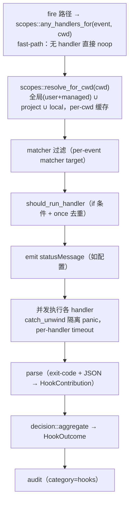

# Hooks 系统

事件 → 可拔插处理器。在工具调用、会话生命周期、上下文压缩、权限决策等关键节点执行用户自定义的命令 / HTTP / LLM / 子 Agent，**字段级对齐 Claude Code hooks 协议**——社区脚本 paste 即用。

本文是 hooks 子系统的**单一真相源**：协议契约、数据流、各 handler 行为、scope 模型、安全红线、配置 schema、测试，以及尚未落地能力的 [Roadmap](#15-roadmap未落地)。实现细节引用代码路径而非复制；以代码为准。

> 兼容性硬验收：`crates/ha-core/tests/hooks_compat.rs` 跑未改动的官方风格脚本（`tests/fixtures/hooks/claude-code-compat/`）证明字段级对齐。

---

## 1. 总览

- **28 事件协议面**（`types.rs::HookEvent`）：26 个真触发 + 2 个协议保留。
- **5 种 handler**：`command`（shell 子进程）/ `http`（SSRF-gated POST）/ `mcp_tool`（调 MCP 工具）/ `prompt`（一次性 LLM side-query）/ `agent`（spawn 子 Agent）。
- **四层配置 scope**（user / managed / project / local），全 UNION 无覆盖。
- **exit-code + JSON 双通道输出**：`exit 0` 解析 stdout JSON；`exit 2` 阻断 + stderr 回灌；其它非阻断。
- **配置热重载**：`config:changed` 重建全局 registry；project/local 文件按 mtime 失效。
- **JSONL transcript 镜像**：`transcript_path` 指向真实文件，官方脚本可 `jq` 读取。
- **零 Tauri 依赖**：全在 `crates/ha-core/src/hooks/`，desktop / `server` / ACP 三模式共用。

---

## 2. 事件矩阵（28 事件）

按落地状态分三组。**Matcher 目标**列说明触发时 matcher 与哪个字段比对。**可阻断**列说明 `exit 2` / `{"decision":"block"}` 是否真能拦住流程。**触发位置**是当前代码的埋点（以代码为准）。

### 2.1 真触发 · 阻断型（4）

| 事件 | Matcher 目标 | 触发位置 | 备注 |
|------|-------------|---------|------|
| `UserPromptSubmit` | 无（始终触发） | `agent::preflight::user_prompt_preflight` → `hooks::fire_user_prompt_submit`（`mod.rs`）| `block`/`deny`/`continue:false` 拦住 prompt；可注入 `additionalContext` |
| `PreToolUse` | `tool_name` | `tools::execution::fire_pre_tool_use_hook`（`execution.rs`，可见性闸后、权限引擎前）| `deny`/`ask`/`defer`/`allow` 决策 + `updatedInput` 改写入参 |
| `PreCompact` | `trigger` ∈ {auto, tool_loop} | `agent::context`（turn-start / tool-loop checkpoint 的 `run_compaction_with_options` 入口，使用率 ≥ `reactiveTriggerRatio` 时）| `block` 跳过本次压缩；使用率 ≥ `CACHE_TTL_EMERGENCY_RATIO` 强制覆盖；连续 block 超过上限后强制执行 |
| `WorktreeCreate` | `name` | `worktree::create_managed_worktree` → `hooks::dispatch_worktree_create` | 可 block/deny；若匹配 handler 接管创建，必须返回 `hookSpecificOutput.worktreePath` 绝对路径 |

> **async exec 的审批时序**：`PreToolUse` 一律在可见性闸后、引擎/审批前早早触发（与是否后台化无关，下述两档都不变）。`exec` 的命令级审批历来在 `tool_exec` 内部跑;R8 起按两条后台路径分开（详见 [tool-system.md「exec 命令审批：两条后台路径」](tool-system.md#exec-命令审批两条后台路径r8)）:**Auto-Background 档（Tier 3）审批前移**——`execute_tool_with_context` 在 detach 前跑完命令审批,审批/拒绝因果上恒在「后台化」之前;**显式后台 exec（`run_in_background` / `always-background`）R8 起不前移**——命令门下放后台 job 线程,命中审批时 job park 为 `AwaitingApproval`(模型先拿 job id,弹窗可在 synthetic `{status:"started"}` 之后出现,但此时 job 是 parked 非 running,刻意 supersede 旧 HOOKS-2 修复)。异步 job 的**终局** hook（PostToolUse/Failure + `job_id` 关联）见 §2.2「异步 job 终局可见性」。

### 2.2 真触发 · 观察型（22）

`block`/`deny` 决策被 `is_observation_only`（`types.rs`）降级为非阻断 + log。

| 事件 | Matcher 目标 | 触发位置 |
|------|-------------|---------|
| `SessionStart` | `source` ∈ {startup, resume, …} | `agent::context` / `hooks::fire_session_start_observation` |
| `SessionEnd` | `source` | `hooks::fire_session_end` / `dispatch_session_end`（`mod.rs`）|
| `UserPromptExpansion` | 命令名 | `hooks::fire_user_prompt_expansion`（`mod.rs`）|
| `PostToolUse` | `tool_name` | `streaming_loop::fire_post_tool_use_hook`（同步成功路径 + 异步提交时的 synthetic「started」占位 fire,`job_id` 缺省）+ `hooks::fire_async_job_terminal`（异步 job 终局，`job_id=Some`）|
| `PostToolUseFailure` | `tool_name` | 同上（`is_error=true`；异步取消 / 重启中断 `is_interrupt=true`）|
| `PostToolBatch` | 无 | `agent::streaming_loop`（每 API round 全部 tool settle 后一次）|
| `PermissionRequest` | `tool_name` | `hooks::fire_permission_request`（`mod.rs`）|
| `PermissionDenied` | `tool_name` | `hooks::fire_permission_denied`（`mod.rs`）|
| `Stop` | 无 | `hooks::fire_stop`（`mod.rs`，自然结束）|
| `StopFailure` | error type | `chat_engine::finalize`（最终分类错误）|
| `PostCompact` | `trigger` ∈ {auto, tool_loop} | `agent::context`（Tier ≥ 2 压缩完成后；同一 compaction dedup key 去重）|
| `Notification` | `notification_type` | `hooks::fire_notification`（`mod.rs`）|
| `SubagentStart` | agent type | `subagent::spawn::fire_subagent_start` |
| `SubagentStop` | agent type | `subagent::spawn::fire_subagent_stop` |
| `TaskCreated` / `TaskCompleted` | 无 | `tools::task`（fire_task_created / completed）|
| `ConfigChange` | `source` | `config::persistence::fire_config_change` |
| `CwdChanged` | 无 | `session::db::fire_cwd_changed` |
| `FileChanged` | 文件绝对路径 | `tools::{write,edit,apply_patch}::fire_file_changed` |
| `WorktreeRemove` | `worktree_path` | `worktree::archive_managed_worktree` clean remove 成功后 |
| `Elicitation` / `ElicitationResult` | 无 | `tools::ask_user_question`（原生问答触发，非 MCP）|

> `Stop` / `StopFailure` 当前 fire-and-forget（未实现 block-to-continue）；落地该语义时移出 `is_observation_only`。
> `Elicitation` / `ElicitationResult` 已重新用于原生 `ask_user_question`（payload 用 `request_id` / `question_count`，**非**官方 MCP elicitation schema）；MCP 落地后对齐官方 schema（见 Roadmap）。
> `CompactTrigger::Manual` 是序列化协议的保留枚举；当前桌面 / IM 的 `/compact` owner-plane 手动压缩路径直接调用 `compact_if_needed()`，不触发 hooks。

#### 异步 job 终局可见性

`async_capable` 工具被后台化后，真实结果在**离开当轮**之后才落地，同步路径的 `fire_post_tool_use_hook` 看不到它。`async_jobs::spawn::finalize_job` 在写完终局后调 `hooks::fire_async_job_terminal` 补发终局 hook，对齐 Claude Code 的 PostToolUse 覆盖面：

- **事件选择**：`Completed` → `PostToolUse`；`Failed` / `TimedOut` / `Cancelled` / `Interrupted` → `PostToolUseFailure`。映射单点在 `AsyncJobStatus::terminal_hook_flags()`（返回 `(is_error, is_interrupt)`）。
- **`job_id` 关联（红线）**：一个被后台化的 `tool_use_id` 实际 fire **三次**，不是两次:
  1. **提交时 `PreToolUse`**（`job_id` 字段不存在）——在 detach 之前。
  2. **synthetic「started」占位 `PostToolUse`**:detach 立即把 `{"job_id":..,"status":"started",..}` 当作 tool_result 返回,它不以 `Tool error:` 开头故 `is_error=false`,`fire_post_tool_use_hook` 照常发一条 `PostToolUse`,且 `job_id=None`。由于 `job_id` 带 `skip_serializing_if=Option::is_none`,**该条 JSON 里 `job_id` 字段缺省,与一次普通同步完成字节级同形**——单凭「`job_id` 有无」无法把它和真同步完成区分。要识别这条占位 fire 必须看 `tool_response.status == "started"`。
  3. **终局 `PostToolUse(Failure)`**（`job_id=Some`）——真实结果落地时由 `fire_async_job_terminal` 发。`tool_input` 为 `Null`(finalize 处只有 job id、没有原始入参),matcher 按 `tool_name` 命中。

  即:`job_id=Some` 唯一标识**终局** fire(把它与前两条都分开);要把 synthetic「started」占位与真同步完成分开,则看 `tool_response.status`。
- **取消可见(HOOKS-4)**：取消的 job 也 fire（`is_interrupt=true`），不再对 hooks 静默；但**不**走 `dispatch_injection`（取消多源于 turn-cancel / session-delete，注入会凭空起新回合 / 命中幽灵会话）。
- **重启补发(HOOKS-1)**：`replay_pending_jobs` 对 terminal-but-uninjected 行补发终局 hook，覆盖重启时被标 `interrupted` 的 job(进程死前从未 fire)。正常 finalize 过的 job 是 `injected=true`，被 `list_pending_injection` 排除，不重复 fire。
- **线程红线**：`fire_async_job_terminal` **强制走进程级 `fire_and_forget_runtime()`**，不用 `Handle::try_current()`——finalize 跑在 job OS 线程的 current-thread runtime 上，该 runtime 线程结束即 drop，spawn 在其上的 dispatch 会被静默杀掉。纯 fire-and-forget，不阻塞 finalize。

### 2.3 协议保留 · 不触发（2）

枚举完整、可配置，但当前无对应概念，永不 dispatch：`TeammateIdle`（依赖 team idle 检测）、`InstructionsLoaded`（依赖 system_prompt 组装埋点重构）。二者见 Roadmap。

### 2.4 协议差异红线

不能完全对齐官方的字段都登记于此，**不隐藏差异**。

| 字段 / 语义 | 官方 | TPA CoWork Agent | 影响 |
|------------|------|-----------|------|
| `tool_name`（payload） | `Bash` / `Write` / `Edit` / `Read` / `WebFetch` … | 内部名 `exec` / `write` / `edit` / `read` / `web_fetch`。**matcher 归一化别名**（写 `matcher:"Bash"` 能命中），但 **payload 的 `.tool_name` 是内部名** | 脚本若 `jq` 判 `.tool_name=="Bash"` 不命中——改判 `.tool_input.*`（已对齐）|
| `permission_mode` | `default\|plan\|acceptEdits\|auto\|dontAsk\|bypassPermissions` | 仅 `default\|plan\|bypassPermissions` | 硬 switch 5 值的脚本需兜底 `other` |
| `defer` 决策 | headless 阻塞流 | 降级为 `ask`（手工审批）+ 日志告警 | 收到 `defer` 等价 ask |
| `CLAUDE_ENV_FILE` | SessionStart / CwdChanged / FileChanged 可用 | **未实现**（`env.rs` 标注 out of phase）| 见 Roadmap |
| `if:` 字段 | Bash rule 细到子命令 | tool-name 级 + glob substring，不拆 Bash 子命令 | `Bash(rm *)` 走 glob，复杂 pipeline 不拆 |
| `transcript_path` | JSONL 文件 | §10 JSONL 镜像，值 = `~/.hope-agent/sessions/{id}/transcript.jsonl` | 无差异（用户透明）|

---

## 3. 架构 & 数据流

```
crates/ha-core/src/hooks/
  mod.rs        HookDispatcher::dispatch + fire_* 助手 + init
  types.rs      HookEvent(28) / HookInput / HookOutput / HookOutcome / HookDecision / PermissionMode
  config.rs     HooksConfig / HookMatcherGroup / 5×HookHandlerConfig / merge_from
  scopes.rs     四层 scope 解析 + per-cwd 缓存 + generation
  registry.rs   ArcSwap<HookRegistry> + reload_from_config
  matcher.rs    三语法 matcher + 别名归一化
  parse.rs      exit-code + JSON/plaintext → HookContribution
  decision.rs   多 hook 聚合（优先级 / continue / additionalContext / updatedInput）
  audit.rs      category="hooks" 日志 + 10K 注入上限 + overflow 文件
  env.rs        command 环境变量装配
  condition.rs  `if` 条件求值（ToolName(pattern)）
  transcript.rs JSONL 镜像（backfill + live append）
  runner/{mod,command,http,mcp_tool,prompt,agent}.rs   HookHandler trait + 5 种 handler
```

**dispatch 流**（`HookDispatcher::dispatch(event, input)`，唯一入口）：



**与既有 gate 的关系**：hook 层加在既有 gate **外侧**——先跑 hook，没拦住才走 Plan Mode / Approval / Dangerous 判定。`PostToolUse` 在结果回灌历史**之前**跑。业务代码只读 `HookOutcome`，**严禁 match 具体 handler 类型**。

---

## 4. 配置 Schema

### 4.1 结构

```jsonc
// AppConfig.hooks（config.rs::HooksConfig），28 个事件键，每个值是 matcher group 数组
{
  "<EventName>": [                       // PascalCase 事件名（SessionStart / PreToolUse / …）
    {
      "matcher": "Bash|Write",           // 可选；缺省 = 通配
      "hooks": [ <HandlerConfig>, … ]    // 一组 handler
    }
  ]
}
```

`HandlerConfig` 五型（`config.rs`），公共字段见 §7.6：

```jsonc
{ "type": "command",  "command": "...", "shell": "bash|powershell", "async": false, "asyncRewake": false, "timeout": 600 }
{ "type": "http",     "url": "https://…", "headers": {"Authorization": "Bearer ${TOKEN}"}, "allowedEnvVars": ["TOKEN"], "timeout": 30 }
{ "type": "mcp_tool", "server": "...", "tool": "...", "input": { "path": "${tool_input.file_path}" }, "timeout": 30 }
{ "type": "prompt",   "prompt": "...", "timeout": 60 }
{ "type": "agent",    "prompt": "...", "agent": "...", "allowedTools": [...], "async": false, "timeout": 120 }
```

**serde 命名**：事件键 PascalCase；handler 字段 camelCase（`asyncRewake` / `statusMessage` / `allowedEnvVars`）；`async` 是 Rust 关键字，`#[serde(rename="async")]` → `async_run`；`if` → `if_rule`。

### 4.2 读写 contract（强制）

- **读** `cached_config().hooks`（`Arc` 快照），详见 [`config-system.md`](config-system.md)。
- **写** user scope 走 `mutate_config(("hooks", source), |c| {…})`；project/local/managed 是独立 scope 文件（§5）。
- **`tpa-settings` 技能只读 hooks**：`get_settings` 含 `hooks`（http header 脱敏），写被 `BLOCKED_UPDATE_CATEGORIES` 拦截——hooks 能跑任意命令，可写 = 模型给自己装命令执行（特权升级）。

---

## 5. 四层 Scope 模型

| Scope | 位置 | 范围 |
|-------|------|------|
| **user** | `~/.hope-agent/config.json` 的 `hooks` | 全局，编进 `registry::global()` |
| **managed** | `/etc/hope-agent/hooks.json`（Win: `%PROGRAMDATA%\hope-agent\hooks.json`）| 全局（企业下发），合进 `registry::global()` |
| **project** | `<会话工作目录>/.hope-agent/hooks.json` | 随仓库共享，按 cwd 解析（默认关）|
| **local** | `<会话工作目录>/.hope-agent/hooks.local.json` | git-ignored 开发者私有，按 cwd 解析 |

- **UNION 语义**：所有命中 scope 的 hook 都跑，无覆盖。
- project/local 依赖会话工作目录（`sessions.working_dir`，无 home 回退），dispatch 时经 [`scopes::resolve_for_cwd`](../../crates/ha-core/src/hooks/scopes.rs) 合并到全局之上，**per-cwd 缓存**（mtime + 全局 reload generation 失效）；无 project/local 文件时返回全局 registry（≤2 次 stat）。
- **project/local 默认关闭**（`hooks_allow_project_scope`，`AppConfig` 字段，默认 `false`）：仓库 check-in 的 hooks 不应因会话 cwd 指向就自动跑 shell / HTTP / LLM / 子 Agent（供应链防护）。开关为 `false` 时 `resolve_for_cwd` 直接返回全局、**绝不读取** project/local 文件；用户在 Settings → Hooks 显式开启才加载。
- **已知限制 — 信任是全局而非按项目**（安全红线）：`hooks_allow_project_scope` 是单个全局布尔，**一旦开启便对所有工作目录生效**。为某个可信项目打开后，后续任意会话只要 cwd 指向另一个仓库，该仓库 check-in 的 project/local hooks 同样会执行——等于把"信任此项目"放大为"信任所有未来 cwd"。当前缓解仅靠**默认关闭** + 显式 opt-in；细粒度的 per-cwd / canonical-project 信任（首次发现即 TOFU 登记路径 + 可选文件 hash/mtime，解析前校验该 cwd 已单独授权，类比 VS Code workspace trust / `direnv allow`）属未落地项，见 [Roadmap](#15-roadmap未落地)。在该模型落地前，**只在信任所有可能进入的工作目录时才开启此开关**。
- **`disable_all_hooks` 主开关**：同步短路返回**空** registry（不依赖异步 `config:changed` 重载，避免开关刚翻、旧 registry 仍被用的窗口），关闭所有 scope。
- **热重载**：`config:changed` 触发 `registry::reload_from_config`（user+managed 合并 + bump generation），per-cwd 缓存随 generation 失效。

---

## 6. Matcher 引擎（`matcher.rs`）

三语法（自动判别）：

1. **通配**：matcher 缺省 / 空 → 命中该事件所有触发。
2. **精确或 pipe 列表**：纯 `[A-Za-z0-9_|]` → 按 `|` 拆成集合，目标精确相等任一即命中（`Edit|Write`）。
3. **正则**：含其它字符 → 编进 `^(?:…)$` 全匹配 regex（`mcp__memory__.*`）；无效 regex → never-match + warn。

**别名归一化**：matcher 编译期把 Claude Code 工具别名映射到内部名（`Bash`→`exec`、`Write`→`write`、`Edit`→`edit`、`Read`→`read`、`WebFetch`→`web_fetch`），所以 `matcher:"Bash"` 命中内部 `exec`。**注意**：归一化只作用于 matcher，payload 的 `.tool_name` 仍是内部名（§2.4 红线）。

matcher 目标按事件取：`tool_name`（PreToolUse / PostToolUse / …）、`source`（SessionStart / …）、`trigger`（PreCompact）、文件绝对路径（FileChanged）、命令名（UserPromptExpansion）等（`types.rs::matcher_target`）。

---

## 7. Handler 执行（`runner/`）

### 7.1 command（`runner/command.rs`）

- `bash -c '<command>'`（解析 PATH，非硬编码 `/bin/bash`）；Windows 走 PowerShell。
- hook 输入 JSON 序列化 + 换行喂 **stdin**（friendly for `read`/`jq`）；并发 drain stdout/stderr/wait。
- stdout/stderr 各 **bounded 1 MiB**（`drain_bounded`，防 OOM；内核管道继续 drain 避免子进程死锁）。
- exit 码：`status.code()`；exit 2 → Block（stderr 作 reason），exit 0 → 解析 stdout，其它 → 非阻断（§8）。
- 默认超时 **600s**；超时杀进程树（Unix 进程组 / Windows TerminateProcess），返回 `timed_out=true`。
- `async`：fire-and-forget，不影响决策；`asyncRewake` 见 §7.6。

### 7.2 http（`runner/http.rs`）

- **SSRF 闸 FIRST**：`security::ssrf::check_url`（Default policy + trusted_hosts）在建 client / 触网前；**不跟随重定向**（重定向只过同步 host 检查会漏）。
- POST hook 输入 JSON；配置 header 的 `$VAR` / `${VAR}` 按 `allowedEnvVars` 白名单插值（§9）；白名单 env 另以 `X-Hope-Env-<NAME>` 转发。
- **响应体 bounded streaming**（`read_body_bounded`，超 1 MiB 即丢弃断连，非缓冲后截断）。
- **阻断事件 fail-closed**：PreToolUse / UserPromptSubmit / PreCompact 上，SSRF 拒绝 / 传输错误 / 超时 / 非 2xx / 非协议 JSON / 超限 body 一律 `exit 2` → Block（避免鉴权过期的 401 静默放行）；观察事件保留宽松降级。**2xx body 须是含已知协议键的 JSON 对象**（`{}` = 沉默允许），否则阻断事件 fail-closed。
- identity 含 `url|timeout` + headers/allowedEnvVars 的排序 hash，避免同 URL 不同鉴权被去重折叠。

### 7.3 mcp_tool（`runner/mcp_tool.rs`）

- 调 `mcp::invoke::call_tool`（内部校验 MCP 就绪；未就绪 = 非阻断错误）。
- `input` 模板支持 `${dotted.path}` 占位符插值（`tool_input.*` / `tool_response.*` / `session_id` / `cwd` / `agent_id` / `tool_name` / `prompt`）；未解析占位符留字面量 + warn。identity 含 input hash，避免不同 input 误折叠。

### 7.4 prompt（`runner/prompt.rs`）

- 走 `crate::automation::run` 一次性 LLM 调用（purpose `hooks.prompt`）；结果作 `additionalContext`。模型链解析优先级：`PromptHookConfig.model_override`（新，`ModelChain`）→ deprecated `model`（单冒号 `provider:model` 字符串，惰性解析）→ `function_models.automation` 全局默认链 → 聊天全局模型；真跨模型降级 + 无重试 bug 已修，详见 [模型 vs Agent 统一配置](automation-model.md)。因 hook 配置本身不持有一个存活的主对话 Agent 实例，不复用主对话 system_prompt 的 cache 前缀。

### 7.5 agent（`runner/agent.rs`）

- `spawn_subagent` 起子 Agent（默认与 side_query 同能力，无沙箱——见 Roadmap）；`async` = fire-and-forget 返 run id，否则轮询至终态（受 deadline 限）。
- **超时取消**：deadline 命中调 `cancel_registry.cancel(run_id)` 翻原子 flag，避免子 Agent 后台继续烧 token。
- **级联防护**：hook-originated spawn 抑制 SubagentStart/Stop hook，防 `SessionStart`/`SubagentStart` agent hook 无限递归 spawn。

### 7.6 公共字段

每个 handler 可带（`asyncRewake` 仅 `command`）；过滤在 dispatch build 循环内、去重前完成：

| 字段 | 作用 |
|------|------|
| `timeout` | 单 handler 超时秒（默认：command 600 / http 30 / prompt 60 / agent 120）|
| `if` | 条件执行 `ToolName(pattern)`：**仅** PreToolUse / PostToolUse / PostToolUseFailure 求值，工具名 / 模式不符跳过（其余事件直接跳过，fail-safe）。复用权限引擎参数提取器 + glob（`*` 贪心、`**`≡`*`，不拆 Bash 子命令）；接受工具别名。例 `exec(rm *)` / `write(src/**)` / `web_fetch(*.github.com)` |
| `once` | 该 handler 每会话只跑一次（per-process 内存去重，按 type+identity，重启重置）|
| `statusMessage` | handler 即将运行时桌面 GUI 弹 toast（emit `hook:status`，App 全局监听）。慢 handler 才有感；IM 渠道暂不展示 |
| `asyncRewake` | （仅 `command`+`async`）后台 hook `exit 2` 时把 stderr 作 `<hook-async-result>` system-reminder 注入**下一轮对话**（复用 `subagent::injection::inject_and_run_parent`）。**会让后台 hook 自主起一轮 LLM（耗 token）**——需作者显式配 + hook 主动 `exit 2`，必埋审计 |

---

## 8. 输出协议（`parse.rs`）

| 返回 | 含义 |
|------|------|
| `timed_out` | 非阻断（inert）|
| `exit 2` | `HookDecision::Block`，stderr trim 作 reason |
| `exit 0` + stdout 为 JSON | 解析 `HookOutput`（§9）|
| `exit 0` + stdout 非 JSON | **仅** SessionStart / UserPromptSubmit 当作 `additionalContext`；其它忽略 |
| 其它非零 / `None` | 非阻断（inert）|

JSON stdout schema（`HookOutput`，camelCase）：`continue` / `stopReason` / `suppressOutput` / `systemMessage` / `decision`（top-level，block/deny/ask）/ `reason` / `hookSpecificOutput.{additionalContext, sessionTitle, permissionDecision, permissionDecisionReason, updatedInput}`。`permissionDecision`（allow/deny/ask）**仅 PreToolUse** 生效，优先于 top-level `decision`。

---

## 9. 决策聚合（`decision.rs`）

多个命中 hook 的 `HookContribution` 折叠成一个 `HookOutcome`：

- **决策优先级**（rank 高者胜，平手取先）：`deny(4) > block(3) > defer(2) > ask(1) > allow(0)`。
- **`continue:false`**：任一 hook 返回即 `outcome.continue_execution=false`（PreToolUse callsite 映射为硬 Deny；UserPromptSubmit preflight 映射为 Block）。
- **`permission_allow`** OR-fold（任一显式 `permissionDecision:"allow"` → true，仅跳软 Ask）。
- **`additionalContext`** 有序拼接（`---` 分隔），**10000 字符上限**，超出写 overflow 文件（`audit.rs::write_overflow`，0o600）。
- **`updatedInput`** last-writer-wins；`systemMessage` / `sessionTitle` 首个非空胜出。

**PreToolUse gate**（`tools::execution::pre_tool_gate_from_outcome`）：`continue:false`→Deny；`deny`/`block`→Deny；`allow`+`permission_allow`→跳软 Ask；`ask`/`defer`→强制弹窗。保护路径 / 危险命令 / Plan 永远弹窗，`permissionDecision:"allow"` 不能跳过。

---

## 10. 环境变量（`env.rs`）

`build_for_command` 注入给 command hook（覆盖父进程同名）：

| 变量 | 值 |
|------|-----|
| `CLAUDE_PROJECT_DIR` / `HOPE_PROJECT_DIR` | 会话 cwd / 项目根（**双注入，值一致**）|
| `HOPE_AGENT_VERSION` | `CARGO_PKG_VERSION` |
| `HOPE_SESSION_ID` | 当前 session_id |
| `HOPE_TRANSCRIPT_PATH` | JSONL 镜像路径 |
| `CLAUDE_CODE_REMOTE` | `"false"` 桌面 / `"true"` server·ACP（对齐官方）|
| `PATH` | 登录 shell PATH（`tools::exec::get_login_shell_path()`，避免 `npm`/`python` 找不到）|

http hook 的 header value 按 `allowedEnvVars` 白名单做 `$VAR`/`${VAR}` 插值（`resolve_allowed_env` 先查合成 env 再查进程 env，未解析留字面量 + warn）。

> `CLAUDE_ENV_FILE`（让 hook 持久化一批 session 级 env）**当前未实现**（`env.rs` 标注 out of phase），见 Roadmap。

---

## 11. Transcript 镜像（`transcript.rs`）

- `transcript_path` = `~/.hope-agent/sessions/{id}/transcript.jsonl`，官方脚本可 `jq` 读取。
- **启动期 backfill**：`app_init.rs` 调 `TranscriptMirror::backfill_all(&db)` 扫描无 transcript 的旧会话按 SQLite 回放重建（跳 incognito）。
- **live 追加**：消息持久化时 `append_persisted` 追加。仅在 user/managed scope 有 hook 时追加（避免每消息持久化热路径上的 stat）；project-only 会话退化为 backfill-only（允许 drift）。
- 行 schema 共享 `build_line`（type / message / timestamp / uuid / parentUuid / sessionId / cwd / version）。

---

## 12. 安全 & 审计

- **零 secret 入日志**：审计日志里 `tool_input` / `prompt` 截断（`truncate_utf8`）+ 走 `redact_sensitive`；API Key / OAuth token 禁止进 hook input / env（AGENTS.md 红线）。
- **SSRF 统一**：http hook URL 必走 `security::ssrf::check_url`，不跟随重定向（§7.2）。
- **阻断事件 fail-closed**：http hook 在 PreToolUse / UserPromptSubmit / PreCompact 上，降级路径一律 Block（§7.2），防鉴权过期静默放行。
- **供应链防护**：project/local 默认关（§5），仓库 hooks 不因 cwd 指向自动跑。**已知限制**：opt-in 是全局而非按项目——开启后所有 cwd 一律生效（详见 §5「信任是全局而非按项目」），per-cwd 细粒度信任见 Roadmap。
- **kill switch 同步**：`disable_all_hooks` 同步短路空 registry，不留异步重载窗口。
- **shell 注入**：hook 配置本身是 shell 字符串，用户自行 quote（GUI placeholder 预填 `"$CLAUDE_PROJECT_DIR"` + 空格路径警示）；stdin JSON 经 serde 编码无注入；stdout 用 `serde_json` 解析不 eval。
- **审计埋点**（category=`hooks`，`audit.rs`）：`dispatch`（event/handler 数/决策/耗时）、各 `runner.*`、`decision`、`config`、`transcript`、`env`、`security`（SSRF 拒绝 / 未授权 env 引用）。

---

## 13. 入口契约

- **四入口统一 preflight**：Tauri / HTTP / IM / ACP 的 user message 持久化前过 [`agent::preflight::user_prompt_preflight`](../../crates/ha-core/src/agent/preflight.rs)（UserPromptSubmit 阻断点）。**新增 user message 入口必须走它**；block 的 prompt 不入会话 / LLM 上下文，落一条 `event` 行。
- **新增 hook 事件**：阻断型构造 `HookInput` 调 `dispatch`，观察型走 `hooks::fire_*`；同步更新 `types.rs` 三处 match（`common` / `matcher_target` / `is_observation_only`）+ 测试。

---

## 14. 测试 & 验证

- **单元**（inline `#[cfg(test)]`）：matcher / config / parse / condition / decision / 各 runner。
- **集成**（`crates/ha-core/tests/`）：`hooks_e2e.rs`（config→reload→dispatch 全链）、`hooks_project_scope.rs`（project-scope opt-in 闸）、`hooks_pre_tool_continue_false.rs`（continue:false 聚合）、`hooks_compat.rs`（**§17.4 官方脚本兼容套件**，见下）。
- **兼容套件**（`hooks_compat.rs` + `tests/fixtures/hooks/claude-code-compat/`）：跑未改动的官方风格 jq 脚本（block_rm / pretooluse_deny / prompt_context / projectdir_env），证明字段级对齐（G1）。`jq` 缺失自动跳过；CI Unix legs 装 jq 确保真跑。
- 跑：`cargo test -p ha-core --test hooks_compat`（需 jq）。

---

## 15. Roadmap（未落地）

实质引擎、协议、5 handler、4 scope、决策聚合、transcript、env、审计、编辑型 GUI 均已落地。以下为设计规划但尚未建的能力，按优先级：

### GUI / 传输面
- **GUI Tab**：当前仅 By Event 编辑视图 + `disableAllHooks` / `allowProjectScope` 开关；缺 **Overview**（24h 指标）/ **Test Runner**（手动 dispatch 试跑）/ **Emergency**（overflow 文件查看 + 导出）/ **Scope**（多源合并视图带来源标签）。
- **传输命令**：当前仅 `get_hooks_config` / `save_hooks_config`（Tauri + HTTP 各 2）；缺 `hooks_test_run` / `hooks_metrics_24h` / `hooks_set_scope` / `hooks_emergency_disable` / `hooks_overflow_list` / `hooks_export` / `hooks_list_all`。
- **前端测试**：HooksPanel 的 Vitest / RTL 渲染 + 保存 + invoke 用例。

### 事件补全
- **`TeammateIdle`**：依赖 team runtime idle 检测（上游单独立项）。
- **`InstructionsLoaded`**：依赖 system_prompt 组装埋点重构（记录每次 CLAUDE.md / AGENTS.md 加载）。
- **`Elicitation` / `ElicitationResult` 官方 schema**：当前用原生 `ask_user_question` 的非标 payload；MCP server 本体落地后对齐官方 `mcp_server_name` / `elicitation_form`。

### 可观测 / 基础设施
- **Dashboard `hooks_health` 区块** + **Learning Tracker `hook_*` 事件** + **metrics rolling-window**（SQLite metrics + 自动清理窗口）。
- **`CLAUDE_ENV_FILE` 机制**：让 hook 在 SessionStart / CwdChanged / FileChanged 持久化 session 级 env（`env.rs` 已留位）。
- **并发 / 资源上限可调**：`max_parallel_handlers` / `http_max_concurrent` 等 tunable。

### 安全模型
- **per-cwd / per-project 信任存储**：把当前全局的 `hooks_allow_project_scope` 升级为细粒度信任——首次在某 cwd 发现 project/local hooks 时 TOFU 登记 canonical 路径（可选文件 hash/mtime），解析 project/local scope 前校验该 cwd 已单独授权；类比 VS Code workspace trust / `direnv allow`。解决 §5 / §12 登记的"信任放大到所有未来 cwd"限制。需配套 GUI 授权入口 + 传输命令。

### 协议深化
- **`defer` headless 流**：需先做 `-p` 非交互模式（当前降级为 ask）。
- **`if:` Bash 子命令真拆**：当前 glob substring，不拆 pipeline 子命令。
- **agent hook 工具沙箱**：当前与 side_query 同能力，无隔离。
