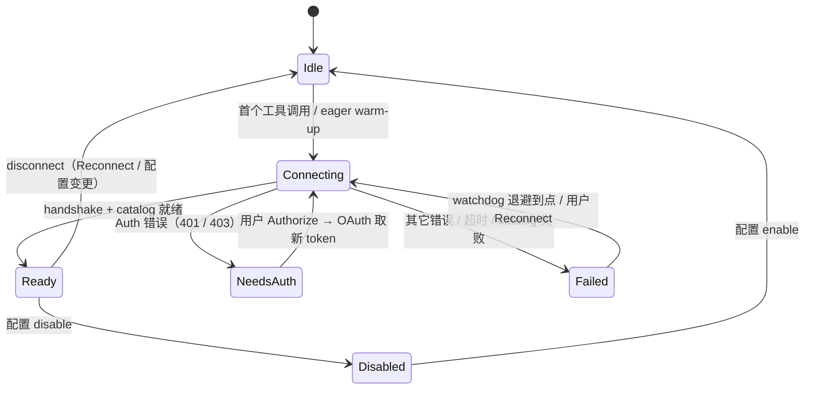

# MCP 客户端架构文档

> 返回 [文档索引](../README.md)

> TPA CoWork Agent 的 Model Context Protocol 客户端 — 接入任意 MCP Server，把工具 / 资源 / 提示词注入主对话循环
>
> 反向（TPA CoWork Agent **当** MCP server，把自身子系统暴露给外部 agent）见 [`mcp-server.md`](mcp-server.md)。

## 目录

- [概述](#概述)
- [设计目标](#设计目标)
- [模块拆分](#模块拆分)
- [生命周期与状态机](#生命周期与状态机)
- [传输层（stdio / HTTP / SSE / WebSocket）](#传输层)
- [工具注入主对话循环](#工具注入主对话循环)
- [Resources 与 Prompts](#resources-与-prompts)
- [OAuth 2.1 + PKCE](#oauth-21--pkce)
- [凭据存储](#凭据存储)
- [安全模型（SSRF · 审批 · 沙盒）](#安全模型)
- [Dashboard Learning 埋点](#dashboard-learning-埋点)
- [GUI 与前后端通信](#gui-与前后端通信)
- [事件总线](#事件总线)
- [配置 schema](#配置-schema)
- [故障排查 playbook](#故障排查-playbook)
- [与 openclaw · claude-code 的差异](#与-openclaw--claude-code-的差异)

---

## 概述

MCP 客户端把 hope-agent 变成一个 **MCP Host**——就像 Claude Desktop / Cursor 一样，可以连接任意 [Model Context Protocol](https://modelcontextprotocol.io/) 服务器，让它们暴露的 tools / resources / prompts 直接进入主对话循环。

设计范围覆盖：

- **四种 transport**：stdio、Streamable HTTP、SSE（legacy HTTP+SSE handshake，`build_sse_client` 手写）、WebSocket
- **完整 OAuth 2.1 + PKCE**：discovery（RFC 8414）、Dynamic Client Registration（RFC 7591）、loopback callback（RFC 8252）、refresh 自动执行
- **凭据安全**：0600 原子写 + ErrorKind::NotFound 无 TOCTOU；删除 server 自动清理
- **三种使用形态**：MCP 工具通过 `mcp__<server>__<tool>` 命名空间调度；`mcp_resource(action=list|read)` / `mcp_prompt(action=list|get)` 作为独立 internal tool 访问被动数据
- **SSRF 全路径硬约束**：所有出站 URL（transport handshake + OAuth discovery/register/token/refresh）都过 `security::ssrf::check_url`
- **async 后台化**：rmcp `ToolExecution.task_support=Required/Optional` → `async_capable=true`，由主 tool loop 的"同步预算超时自动后台化"接管
- **Dashboard Learning**：每次 MCP 工具调用/失败落 `learning_events`，供 Dashboard Learning Tab 聚合

---

## 设计目标

| 目标 | 具体表现 |
|---|---|
| **零 Tauri 依赖** | `crates/ha-core/src/mcp/` 不 `use tauri::*`；Tauri shell 和 axum server 通过 EventBus + `mcp::api` 调用 |
| **最小握手延迟** | Lazy connect（首次工具调用触发）+ `eager: bool` opt-in 预热 |
| **可恢复性** | Watchdog 指数退避 + 401 → `NeedsAuth` 分流 + user-triggered Reconnect |
| **成本意识** | MCP 工具默认 eager 注入，单个 server 可设置 `deferredTools=true` 后改走 `tool_search` 发现，避免大型 server 把数十/上百工具一次性塞进每轮请求 |
| **审计留痕** | 每次连接/断开/失败/健康检查走 `app_*!` 宏，category=`mcp`，source=`<server>:<event>` |

---

## 模块拆分

```
crates/ha-core/src/mcp/
  mod.rs               // 公共 API; pub use McpManager, McpServerConfig, ..., 模块级 locate_server()
  config.rs            // McpServerConfig / McpTransportSpec / McpOAuthConfig / McpGlobalSettings 反序列化
  registry.rs          // McpManager (全局 OnceLock), ServerHandle, ServerState, tool_index, ArcSwap<Vec<ToolDefinition>>
  client.rs            // ensure_connected / connect_now / refresh_catalog / disconnect / stderr tailer
  transport.rs         // 四种 transport 工厂 + 共享 helper (ssrf_gate_url / authorized_headers / classify_network_error)
  watchdog.rs          // 健康检查 + 指数退避
  catalog.rs           // rmcp Tool → ToolDefinition 转换 + input_schema 扁平化 + system_prompt_snippet
  invoke.rs            // call_tool dispatch + emit_learning 埋点 + 结果归一化
  resources.rs         // list_resources / read_resource + mcp_resource 工具 handler
  prompts.rs           // list_prompts / get_prompt + mcp_prompt 工具 handler
  oauth.rs             // OAuth 2.1 + PKCE 全流程编排 + 独立 reqwest client
  credentials.rs       // McpCredentials 持久化（load/save/clear/needs_refresh）
  events.rs            // EventBus 事件常量 + emit 助手
  errors.rs            // McpError 分类（NotReady / Transport / Protocol / Auth / Timeout / ToolFailed / Blocked / Config）
  api.rs               // Tauri/HTTP 共享 CRUD + OAuth trigger 入口（凭 `mcp::api::*` 在两侧对齐）
```

**硬规则**：
- 模块内禁止 `use tauri::*`
- 配置读统一 `cached_config().mcp_servers`；写统一 `mutate_config(("mcp.<op>", "<source>"), |cfg| { ... })`
- `mcp::locate_server(name_or_id)` 是唯一 id-or-name fallback 入口，其它路径走 `McpManager::{get_by_id, get_by_name}`

---

## 生命周期与状态机



> 真实恢复路径经 `connect_now()` 直接进 `Connecting`（watchdog / 用户 Reconnect / OAuth 取新 token 后），`Idle` 仅由 `disconnect()` 或初始态到达；`Failed { retry_at }` 的退避调度在 [`watchdog.rs`](../../crates/ha-core/src/mcp/watchdog.rs)。

- **Ready** 携带 `tools: Vec<rmcp::Tool>`、`resources: Vec<rmcp::Resource>`、`prompts: Vec<rmcp::Prompt>` 三个 catalog 快照
- **NeedsAuth** 的 `auth_url` 字段保留为空字符串；真实 PKCE URL 由 `oauth::authorize_server` 按点击动态生成
- **Failed** 带 `retry_at: i64`，watchdog 超时后自动触发一次 reconnect；连续失败 ≥ 10 次 → `retry_at = now + 30min` 熔断

**启动策略**：
- 默认 lazy connect（省冷启时间）
- `McpServerConfig.eager = true` → watchdog tick 在该 server 仍 `Idle` 时自动 `client::connect_now` 预热
- `src-tauri/src/lib.rs::run` + `crates/ha-server/src/main.rs` 两个入口都调 `McpManager::init_global()`

**健康检查 + 指数退避**：`watchdog.rs` 固定每 `TICK_INTERVAL_SECS`（15s）tick，对每个 `Ready` server 检查 `RunningService::is_closed()`（**无网络 `ping`**——主动探测只增稳态流量收益甚微），断开即翻 `Failed` 触发退避；失败 `consecutive_failures++`，重连间隔 `min(2^n × 5s, 300s)`，n ≤ 6。`health_check_interval_secs` 不驱动 tick 周期。

**断开 / 关闭**：`client::disconnect(handle)` 取出 `RunningService` 后 `running.cancel().await` 关连接。stdio 子进程的终止由 rmcp 的 `TokioChildProcess` 负责，mcp 模块不自己发 SIGTERM/SIGKILL。

**并发上限**：
- 全局：`McpGlobalSettings.max_concurrent_calls`（默认 8）
- 每 server：`McpServerConfig.max_concurrent_calls`（默认 4）
- 两层独立 semaphore，`invoke::call_tool` 依次 `acquire_owned`

---

## 传输层

四种 transport 在 [`transport.rs`](../../crates/ha-core/src/mcp/transport.rs) 里并列实现，分享三个 helper：`ssrf_gate_url` / `authorized_headers` / `classify_network_error`。

### stdio

- `build_stdio_client` 通过 `rmcp::transport::TokioChildProcess` 启动子进程
- 子进程只继承白名单 env（`HOME`/`USER`/`PATH`/`LANG`/`LC_ALL`/`TZ`/`TMPDIR`/`TEMP`/`TMP`）+ `cfg.env` 显式声明
- 支持 `${VAR}` 占位符展开
- stderr 独立 tailer → `app_warn!` 输出 server 日志（行截断 4 KiB、每 10s 最多 100 行、超出"suppressed N lines"汇总）

### Streamable HTTP

- rmcp 1.5 首选的远程协议（2025-03-26 spec）：直接 POST `initialize`，session 走 `Mcp-Session-Id` 响应头
- 出站前 `ssrf_gate_url` — `Trusted` 用 `default_policy`，`Untrusted` 用 `Strict`
- `authorized_headers` 注入 user headers + OAuth Bearer（若 `cfg.oauth.is_some()` 且磁盘有凭据且用户未显式设 `Authorization`）
- handshake 401/403/unauthorized/invalid_token → `McpError::Auth` → `ServerState::NeedsAuth`

### SSE（legacy HTTP+SSE，2024-11-05 spec）

- **与 Streamable HTTP 是两套 wire 协议**：rmcp 1.5 退役了独立 SSE client（只留 `client-side-sse` 帧解析器），但 `Sse` **不能**路由到 Streamable HTTP client——后者直接 POST `initialize`，legacy SSE server 无 session 会回 `400 session_id is required`
- `build_sse_client` 手写握手：GET SSE URL → 读到 `endpoint` 事件拿 session-scoped POST URL → 之后 client→server 走 POST 到该 URL、server→client 走 SSE `message` 帧；用 `sse-stream` 解析帧，桥接到 rmcp 的 `IntoTransport for (Si, St)`（Stream 半 = `message` 帧 → `RxJsonRpcMessage`；Sink 半 = `PollSender` + 后台 POST 任务，`start_send` 同步 / POST 异步）
- **SSRF 两道门（红线）**：① GET URL 出站前 `ssrf_gate_url`；② server 返回的 `endpoint` URL 是 server-controlled、首次 POST 前经 `resolve_sse_endpoint`（相对路径按 base 解析）后**再过一次** `ssrf_gate_url`——防恶意 server 把 POST 引到内网
- handshake 错误经 `classify_network_error(cfg_name, "SSE handshake", e)`，401/403 → `Auth` → `NeedsAuth`
- 整个握手在 `do_connect` 的 `connect_timeout_secs` 内：server 不发 `endpoint` 就超时（`Timeout`），不会挂死
- **代理绕行（loopback/私网）**：reqwest 会抓系统/环境代理但**不遵守 OS bypass 列表**（macOS `ExceptionsList` / `ExcludeSimpleHostnames`），导致「开代理连云端 LLM」时本地 MCP（`http://localhost:PORT`）被代理劫持 → 503。`build_mcp_http_client` 按 `host_bypasses_proxy(host)`（`localhost`/`*.localhost` + IPv4 loopback/private/link-local + IPv6 loopback/ULA/link-local）对本地目标 `.no_proxy()`，远程目标仍走代理。**仅 SSE 路径**——Streamable HTTP 走 rmcp 自带 reqwest（0.13，ha-core 是 0.12），无注入点，本地 Streamable HTTP + 代理仍会被劫持（已知限制，本地 MCP 绝大多数是 stdio / SSE，不为此引入第二个 reqwest 大版本）

### WebSocket

- 基于 `tokio-tungstenite` 0.29，通过 `WsJsonRpcTransport<S>` adapter 桥接到 rmcp 的 `IntoTransport for (Si, St)`
- 手写 `Sink<TxJsonRpcMessage<RoleClient>> + Stream<Item = RxJsonRpcMessage<RoleClient>>`（SinkExt::with + filter_map 的 async closure future 是 !Unpin，违反 rmcp 的 Sink+Stream Unpin bound，手写 impl 绕过）
- **scheme rewrite**：ws→http / wss→https 供 SSRF 分类（`security::ssrf` 只认 http/https）
- **帧大小硬上限**：`max_message_size=4 MiB`、`max_frame_size=1 MiB`（tungstenite 默认 64/16 MiB 对 JSON-RPC 太宽松）
- **`poll_next` yield budget**：连续 64 帧被丢弃（ping/pong/close/frame/malformed）后 `wake_by_ref() + Pending`，防止恶意 server 饿死调度器
- **每读 5s timeout**：`tokio::time::timeout(5s, stream.read)`，防 localhost 恶意客户端 dribble 字节卡住 listener

### 共享 helper

- `ssrf_gate_url(cfg, url)` — 根据 `trust_level` 选 policy，check_url 失败 → `McpError::Blocked`
- `authorized_headers(cfg)` — 构造 `HashMap<HeaderName, HeaderValue>`，OAuth Bearer 注入 + 用户 `Authorization` 优先
- `classify_network_error(cfg_name, verb, err)` — substring 匹配 401/403/unauthorized 分类为 `Auth`，其它归 `Transport`
- `is_auth_challenge(msg)` — 纯函数，`app_core` 内多处复用

---

## 工具注入主对话循环

### 命名空间

- **Format**：`mcp__<server>__<tool>`（与 openclaw / claude-code 对齐，方便用户迁移配置）
- **Server name 校验**：`^[a-z0-9_-]{1,32}$`，全配置唯一
- **Tool name 归一化**：非 `[a-zA-Z0-9_-]` 剔除、截断到 64 字符（Claude / OpenAI 工具名上限）；碰撞后 `_2` `_3` 后缀

### Schema 转换（[`catalog::rmcp_tool_to_definition`](../../crates/ha-core/src/mcp/catalog.rs)）

- `inputSchema` 经 `normalize_input_schema` 处理：
  - `null` / 空 → 合成 `{ "type":"object", "properties":{} }`
  - 已是 object 无 `type` → 注入 `type:"object"`
  - 顶层 `anyOf` / `oneOf` of object variants → 合并 `properties`（`required` 取交集）
- `description` 前缀 `[<server>] ` 方便 LLM 归因
- `deferredTools` 默认 `false` — 动态 MCP 工具默认直接注入，用户可在单个 server 上开启后改为通过 `tool_search` 按需发现（MCP server 可能暴露几十个工具）
- `async_capable` 根据 `ToolExecution.task_support` 映射：
  - `Required` / `Optional` → `true`（让 tool loop 的"同步预算超时自动后台化"分支可触发）
  - `Forbidden` / 缺省 → `false`

### Dispatch 路径（[`tools/execution.rs`](../../crates/ha-core/src/tools/execution.rs)）

```rust
name if crate::mcp::catalog::is_mcp_tool_name(n) => {
    crate::mcp::invoke::call_tool(n, args, ctx).await
}
```

[`invoke::call_tool`](../../crates/ha-core/src/mcp/invoke.rs) 执行：
1. 反查 `tool_index` → `(server_id, original_tool_name)`；找不到 → 带恢复指引的错误（"可能 server 离线"）
2. 检查 server state — `Disabled` / `NeedsAuth` / `Failed` 都返回 actionable error
3. 全局 + per-server semaphore acquire
4. `handle.peer()` 调 `call_tool`；`call_timeout_secs > 0` 时外包 `tokio::time::timeout`，`0` 表示不加 call-level timeout
5. 结果归一化（`normalize_content`）：`text` 直接拼；`image` 走 [`tools/image.rs`](../../crates/ha-core/src/tools/image.rs) 的持久化路径；`resource_link` → markdown 链接
6. `emit_learning` 发 `mcp_tool_called` / `mcp_tool_failed` 事件

### 与现有过滤体系整合

MCP 工具的可见性分两层：
- Agent 级 MCP master switch：`agent.json capabilities.mcpEnabled=false` 时，MCP 元工具和动态 `mcp__<server>__<tool>` 都不注入，也不进入 `tool_search`
- 全局 / server 级启用条件：`mcpGlobal.enabled=false` 时 MCP 元工具和动态工具都隐藏；动态 MCP 工具只有在 `mcpGlobal.enabled && server.enabled && !mcpGlobal.deniedServers.contains(server.name)` 时进入 live registry；任一条件变为 false 会从 schema cache / `tool_search` / 执行反查表中同步移除
- Server 级工具过滤：`allowedTools` / `deniedTools` 以原始 MCP tool name 配置，catalog refresh 和配置热更新都会立刻重建该 server 的 schema cache 与执行反查表
- Server 级 deferred：单个 MCP server 配置 `deferredTools=true` 时，该 server 的动态工具改由 `tool_search` 按需发现
- 上下文级收紧：`denied_tools` / `skill_allowed_tools` / `plan_mode_allowed_tools` 通过 [`tools::tool_visible_with_filters`](../../crates/ha-core/src/tools/mod.rs) 生效

`capabilities.tools.allow/deny` 只表示非 Core 内置工具的开关覆盖，不再通过 `mcp__<server>__<tool>` 全限定名过滤动态 MCP 工具。

---

## Resources 与 Prompts

**Resources** 和 **Prompts** 是 MCP 服务器暴露的**被动数据**（不是工具调用）。客户端需要主动 `list` 发现、`read`/`get` 拉取。

### Resources — [`resources.rs`](../../crates/ha-core/src/mcp/resources.rs)

- `list_resources(server)` 读 `ServerState::Ready.resources` 缓存快照（不触发 network round-trip）
- `read_resource(server, uri)` 通过 `handle.peer().read_resource(...)` 调远端 `resources/read`
- 归一化 `rmcp::ResourceContents::{TextResourceContents, BlobResourceContents}` → `{ uri, mimeType, text | blobBase64 }`
- **blob 零分配验证**：`maybe_reencode` 用 charset-only scan 判断是否已合规 base64，避免 `BASE64.decode` 为 10 MiB blob 分配 7.5 MiB 临时缓冲
- 内部 tool `mcp_resource(action=list|read, server, uri?)` 暴露给主对话

### Prompts — [`prompts.rs`](../../crates/ha-core/src/mcp/prompts.rs)

- `list_prompts(server)` 读 cached 快照
- `get_prompt(server, name, arguments)` 调 `prompts/get` RPC；`arguments` 非字符串值会显式返回错误（而不是静默 drop）
- 归一化 PromptMessageContent 的 4 个 variant（Text / Image / Resource / ResourceLink）为 `{ role, text }`
- 内部 tool `mcp_prompt(action=list|get, server, name?, arguments?)`

### System prompt 注入

[`catalog::system_prompt_snippet()`](../../crates/ha-core/src/mcp/catalog.rs) 在 `build_full_system_prompt` 末尾追加一小段 `# MCP Capabilities`，列出有 Ready catalog 的 server 名 + 指向 `mcp_resource` / `mcp_prompt` 工具。sync-safe 通过 `cached_tool_defs` ArcSwap 读取，不 await 任何锁；无 MCP server 时完全不注入。

---

## OAuth 2.1 + PKCE

[`oauth.rs`](../../crates/ha-core/src/mcp/oauth.rs) 独立实现，不依赖 `rmcp::auth_client`（rmcp 自带 reqwest 0.13，和 ha-core 的 reqwest 0.12 trait 冲突）。

### Flow 时序

```text
1. bind loopback listener (127.0.0.1:0)
2. GET /.well-known/oauth-authorization-server  ── RFC 8414 discovery
3. POST registration_endpoint (if no client_id) ── RFC 7591 DCR
4. build authorize URL with PKCE (S256) + CSRF state
5. emit mcp:auth_required { authUrl }
6. open browser (open::that) + await callback
7. POST /token with code + code_verifier
8. persist credentials (0600) + emit mcp:auth_completed
9. client.rs reconnects with Bearer header
```

### 关键安全细节

- **Default policy for SSRF**：所有 OAuth 出站 URL（discovery / registration / token / refresh）都过 `security::ssrf::check_url(url, SsrfPolicy::Default, &trusted_hosts)`。metadata IP 仍被拒绝。
- **proxy-aware**：`oauth::http_client()` 经 `provider::apply_proxy` 包装，和 weather / web_fetch / LLM providers 一致。
- **PKCE S256**：48 字节 CSPRNG → base64url verifier → SHA-256 → base64url challenge，`code_challenge_method=S256` 提交给授权端。discovery 返回 `code_challenge_methods_supported` 不含 `S256` 时拒绝（防降级）。
- **CSRF state**：32 字节 CSPRNG → base64url；callback 对不匹配的 state 返 `CallbackOutcome::Ignored`（不报错，兼容浏览器 prefetch）。
- **per-read 5s timeout**：callback listener 的 `stream.read` 走 `tokio::time::timeout`，防恶意 localhost 客户端 dribble 字节。
- **shared cancellation**：callback listener 的 spawned task 用 `tokio::select! { _ = tx.closed() => ..., res = accept => ... }`，orchestrator 超时立刻释放 loopback 端口。
- **token refresh 前置**：每次 `build_http_client` / `build_ws_client` 前 `refresh_if_stale` — `expires_at - now < 60s` 即刷新。
- **redact_sensitive**：所有 token 端点错误响应在日志中脱敏。
- **no raw tokens in logs**：`app_*!` 调用前必经 `redact_sensitive`。

### 失败分类

| 错误 | 表现 | 恢复路径 |
|---|---|---|
| Discovery 非 2xx | `McpError::Auth("discovery <status> at <url>")` | 重新配置 server URL |
| DCR 失败 | `McpError::Auth("DCR <status>: <redacted>")` | 查 server 是否支持 RFC 7591 / 提前配置 `client_id` |
| state 不匹配 | `CallbackOutcome::Ignored` + warn | 兼容行为，不终止流程 |
| 用户未完成授权 | `McpError::Auth("user did not complete authorization within 600s")` | 点击"授权"重试 |
| refresh 失败 | `McpError::Auth` → `NeedsAuth` | GUI 弹 toast 提示重新授权 |

### 调用方式

- Tauri：`invoke('mcp_start_oauth', { id })` → 后台 spawn `oauth::authorize_server`
- HTTP：`POST /api/mcp/servers/{id}/oauth/start`
- 退出登录：Tauri `mcp_sign_out(id)` / `POST /api/mcp/servers/{id}/oauth/sign-out` → `credentials::clear` + disconnect

---

## 凭据存储

[`credentials.rs`](../../crates/ha-core/src/mcp/credentials.rs) + [`platform::write_secure_file`](../../crates/ha-core/src/platform/mod.rs) 配合。

### 文件布局

```
~/.hope-agent/credentials/
├── auth.json                    # Provider OAuth（Claude / Codex）
└── mcp/
    ├── <server-id-1>.json       # 0600 on Unix
    ├── <server-id-2>.json
    └── ...
```

### 原子写流程

Unix 版本：
1. `fs::create_dir_all(parent)` 确保父目录
2. `OpenOptions::new().create_new(true).mode(0o600).open(tmp_path)` 写同目录临时文件
3. `f.write_all() + f.sync_all()`
4. 再次 `fs::set_permissions(tmp, 0o600)` 防 umask 干扰
5. `fs::rename(tmp, target)` 原子替换

Windows 版本：
- 继承 `~/.hope-agent/` 的 DACL；依赖用户 profile 目录默认的"仅 owner + SYSTEM/Administrators 可读"
- 注释里标注 "stronger ACL pass 可后续加"，目前未实现

### load / clear 语义

- `load(server_id)` → `Ok(None)` when file 不存在（`io::ErrorKind::NotFound`），`Ok(Some(..))` when 合法，`Err` 仅对 I/O / parse 失败抛出 — 无 TOCTOU stat-then-open
- `clear(server_id)` 同样 match `ErrorKind::NotFound` → `Ok(())`
- `save(server_id, &creds)` 直接走 `write_secure_file` — 内部已 `create_dir_all`

### 数据字段

```rust
struct McpCredentials {
    client_id: String,              // DCR 分配或用户预配置
    client_secret: Option<String>,  // 公共客户端为 None
    access_token: String,
    refresh_token: Option<String>,
    expires_at: i64,                // unix ts; 0 = 不主动刷新
    token_endpoint: String,
    authorization_endpoint: String, // 保留供 GUI re-auth
    granted_scopes: Vec<String>,
    issued_at: i64,
}
```

---

## 安全模型

### SSRF

按 AGENTS.md "出站 HTTP 必须走 `security::ssrf::check_url`" 硬规则：

| 出站点 | Policy | 备注 |
|---|---|---|
| HTTP / SSE transport handshake | `Trusted` → `default_policy`; `Untrusted` → `Strict` | `check_url` 失败 → `McpError::Blocked` |
| SSE server-provided `endpoint` URL | 同上 | server-controlled，首次 POST 前 `resolve_sse_endpoint` + **再过一次** `check_url`（红线） |
| WebSocket handshake | 同上 | ws→http / wss→https 重写给 `check_url` 理解 |
| OAuth discovery / DCR / token / refresh | **固定 `Default`** | OAuth server 必然是公网，`Strict` 会误伤；metadata IP 仍拒 |
| stdio transport | 不涉网络 | 跳过 SSRF |

所有 URL 先过 `expand_placeholders(${VAR})` 再 check，防绕过。

### 进程沙盒（stdio）

stdio server 是任意 binary，潜在命令执行入口：

- **默认 `trust_level=Untrusted`**：工具调用 100% 走审批门；`auto_approve=true` 只在 `Trusted` 下生效（double gate）
- **`trust_acknowledged_at` 字段**：配置里预留的信任声明时间戳；v1 仅作数据结构存在，**GUI 端的显式弹窗确认流程尚未实现**（后续补；现阶段靠 `trust_level` 下拉 + `auto_approve` 互斥约束作为屏障）
- **env 白名单**：子进程只继承 9 个白名单 env（`HOME` / `USER` / `PATH` / `LANG` / `LC_ALL` / `TZ` / `TMPDIR` / `TEMP` / `TMP`）+ `cfg.env` 显式声明
- **deny list**：`mcp_global.denied_servers: Vec<String>` 可按名黑名单（企业部署）

### 审批

- MCP 工具 `internal=false` → 默认走现有工具审批门
- `cfg.auto_approve=true` 可跳过普通工具审批（仅 `trust_level=Trusted` 生效，double gate）；Plan Mode 的 `ask_tools` 仍优先，不能被该开关绕过
- Dangerous Mode (`--dangerously-skip-all-approvals`) 与 `auto_approve` 正交，都会放行
- `ChannelAccountConfig.auto_approve_tools=true` 在 IM 渠道场景跳门控

### redirect 处理

- **SSE**：`build_mcp_http_client` 用 `redirect::Policy::none()` **不跟 redirect**——SSRF 只校验了 pre-redirect 的 GET URL 与 server 返回的 endpoint，30x 可绕过 gate 弹到内网；reqwest 的 redirect 回调是同步的、跑不了异步 DNS 解析的 `check_url`，故直接不跟（GET 拿到 3xx 显式报错）。与 WebSocket 一致
- **Streamable HTTP**：走 rmcp 自带 reqwest client（default redirect），每跳不重跑 SSRF（**已知 gap**——ha-core 无法配置 rmcp 内部 client 的 redirect policy，见上文「代理绕行」同源的 0.12/0.13 版本墙）
- **WebSocket**：`connect_async` **不**跟 HTTP redirect — RFC 6455 要求 101 Switching Protocols，3xx 直接算 handshake 失败，所以单次 SSRF 覆盖了全部 dial-out

---

## Dashboard Learning 埋点

[`invoke::emit_learning`](../../crates/ha-core/src/mcp/invoke.rs) 在每次 MCP 工具调用完成后发一条 `learning_events` 记录，供 Dashboard Learning Tab 聚合。

### 事件类型

- `EVT_MCP_TOOL_CALLED`（成功）
- `EVT_MCP_TOOL_FAILED`（失败 / 超时 / `isError=true` / 协议错误）

定义在 [`dashboard/learning.rs`](../../crates/ha-core/src/dashboard/learning.rs)。

### Payload 约定

| 字段 | 类型 | 说明 |
|---|---|---|
| `session_id` | `Option<&str>` | 从 `ToolExecContext.session_id` 取 |
| `ref_id` | `Some(&str)` | namespaced name `mcp__<server>__<tool>` |
| `meta` | JSON | 见下 |

**成功路径 meta**:
```json
{ "server": "notion", "tool": "search_pages", "durationMs": 1234 }
```

**失败路径 meta**:
```json
{ "server": "notion", "tool": "search_pages", "durationMs": 5678, "error": "timeout after 120s" }
```

成功路径故意**不含** `error` 字段（而不是 `"error": null`），让消费方不用特判 null 哨兵。

### emit 语义

- 通过 `dashboard::learning::emit` 的 `spawn_blocking` 路径写 SessionDB —— 不阻塞调用方
- 按 `session_id` 过滤后在 Dashboard Learning Tab 的"MCP 工具使用"卡片展示 Top-N server / tool / 平均 duration / 失败率
- 无 session（e.g. cron 触发）事件仍落盘，只是 `session_id=NULL`

---

## GUI 与前后端通信

### 设置面板

[`McpServersPanel.tsx`](../../src/components/settings/mcp-panel/McpServersPanel.tsx) 参考 `ProviderSettings.tsx` 的双栏列表 + 编辑视图结构：

- **左栏**：已配置 server 列表
  - `status` dot（绿=Ready / 黄=Connecting / 黄=NeedsAuth / 红=Failed / 灰=Disabled）
  - Transport 徽章（stdio / streamableHttp / sse / websocket）
  - `toolCount` 标记
- **右栏编辑页**（`McpServerEditDialog`）：
  - Name（唯一性校验）/ enabled / trust level / scope
  - Transport 下拉切 4 种，动态渲染对应字段
  - 工具白/黑名单（连接后自动拉 `tools/list`）
  - **测试连接** 按钮 → `mcp_test_connection(id)` 实时显示结果 + 工具数
  - 高级：`timeout` / `auto_approve` / `project_paths` / `deferredTools`
  - 保存走统一三态按钮（idle / saving / saved / failed）
- **OAuth 子流程**：状态 `NeedsAuth` → 显示 **Authorize** 按钮 → 调 `mcp_start_oauth(id)`，后端 spawn 浏览器流程；成功后 panel 自动显示 **Sign out**
- **从 JSON 导入**：粘贴 `claude_desktop_config.json` 的 `mcpServers` 对象，一键导入（跳过已存在 server 名）

### Transport 抽象（前端）

新增 invoke（[`src/lib/mcp.ts`](../../src/lib/mcp.ts) + [`src/lib/transport-http.ts`](../../src/lib/transport-http.ts)）：

| 前端 API | Tauri 命令 | HTTP 路径 | 方法 |
|---|---|---|---|
| `listServers()` | `mcp_list_servers` | `/api/mcp/servers` | GET |
| `addServer(cfg)` | `mcp_add_server` | `/api/mcp/servers` | POST |
| `updateServer(id, patch)` | `mcp_update_server` | `/api/mcp/servers/{id}` | PUT |
| `removeServer(id)` | `mcp_remove_server` | `/api/mcp/servers/{id}` | DELETE |
| `reorderServers(ids)` | `mcp_reorder_servers` | `/api/mcp/servers/reorder` | POST |
| `getServerStatus(id)` | `mcp_get_server_status` | `/api/mcp/servers/{id}/status` | GET |
| `testConnection(id)` | `mcp_test_connection` | `/api/mcp/servers/{id}/test` | POST |
| `reconnectServer(id)` | `mcp_reconnect_server` | `/api/mcp/servers/{id}/reconnect` | POST |
| `startOauth(id)` | `mcp_start_oauth` | `/api/mcp/servers/{id}/oauth/start` | POST |
| `signOut(id)` | `mcp_sign_out` | `/api/mcp/servers/{id}/oauth/sign-out` | POST |
| `listServerTools(id)` | `mcp_list_tools` | `/api/mcp/servers/{id}/tools` | GET |
| `getRecentLogs(id, limit)` | `mcp_get_recent_logs` | `/api/mcp/servers/{id}/logs` | GET |
| `importClaudeDesktopConfig(json)` | `mcp_import_claude_desktop_config` | `/api/mcp/import/claude-desktop` | POST |
| `getGlobalSettings()` | `mcp_get_global_settings` | `/api/mcp/global` | GET |
| `updateGlobalSettings(settings)` | `mcp_update_global_settings` | `/api/mcp/global` | PUT |

### 事件订阅 + debounce

`McpServersPanel` 在 `useEffect` 中订阅 4 条事件；`refresh` 被 trailing-edge debounce（150ms）包装，避免 5-server eager-connect 期间 10+ 次 `listServers` IPC：

- `MCP_EVENTS.SERVERS_CHANGED` → `scheduleRefresh()`
- `MCP_EVENTS.SERVER_STATUS_CHANGED` → `scheduleRefresh()`
- `MCP_EVENTS.AUTH_REQUIRED` → `toast.info(authUrl)`
- `MCP_EVENTS.AUTH_COMPLETED` → `toast.success | toast.error`（不再叠加 refresh；留给 `SERVER_STATUS_CHANGED` 触发）

### 工具调用展示

[`ToolCallBlock.tsx`](../../src/components/chat/message/ToolCallBlock.tsx) 识别 `mcp__` 前缀，拆出 `<server>` 作为标题；MCP server 的自定义 icon（`McpServerConfig.icon`）在此处生效，缺省用 `Plug` 图标。结果里的 image / resource_link 复用现有 rendering。

---

## 事件总线

MCP 子系统 emit 的事件（[`mcp/events.rs`](../../crates/ha-core/src/mcp/events.rs)）：

| 事件名 | 触发点 | Payload |
|---|---|---|
| `mcp:server_status_changed` | `set_state` 之后 | `{ id, name, state, reason? }` |
| `mcp:catalog_refreshed` | `refresh_catalog` 完成 | `{ id, name, tools, resources, prompts }` 计数 |
| `mcp:auth_required` | `oauth::authorize_server` 生成 authorize URL 后 | `{ id, name, authUrl }` |
| `mcp:auth_completed` | OAuth 全流程结束 | `{ id, name, ok: bool, error? }` |
| `mcp:servers_changed` | CRUD 写入完成 | `{}`（触发前端重拉列表） |
| `mcp:server_log` | 预留；stderr / 生命周期日志 | `{ id, name, level, line }` |

**事件名约定**：已发布事件名就是跨进程契约，新类型用新名，不复用。

**Tauri 桥**：`src-tauri/src/setup.rs` 订阅 `EventBus` 后转 `app_handle.emit(name, payload)`。
**HTTP 桥**：`crates/ha-server/src/ws/events.rs` 转 `/ws/events` 文本帧。

---

## 配置 schema

### `AppConfig` 新增字段（[`config/mod.rs`](../../crates/ha-core/src/config/mod.rs)）

```rust
#[serde(default)]
pub mcp_servers: Vec<McpServerConfig>,        // 全局 scope，落 ~/.hope-agent/config.json
#[serde(default)]
pub mcp_global: McpGlobalSettings,            // 全局开关、并发上限等
```

### `McpServerConfig`（[`mcp/config.rs`](../../crates/ha-core/src/mcp/config.rs)）

| 字段 | 类型 | 说明 |
|---|---|---|
| `id` | `String` | UUID v4，不变，用于凭据文件名 |
| `name` | `String` | `^[a-z0-9_-]{1,32}$`，全配置唯一，命名空间 `mcp__<name>__<tool>` 前缀 |
| `enabled` | `bool` | `false` 不连接、工具不可见 |
| `transport` | `McpTransportSpec` | tagged union：`Stdio` / `StreamableHttp` / `Sse` / `WebSocket` |
| `env` | `BTreeMap<String, String>` | stdio 子进程 env；支持 `${ENV}` 占位 |
| `headers` | `BTreeMap<String, String>` | HTTP/SSE/WS 请求头；支持 `${ENV}`；`Authorization` 优先于 OAuth 注入 |
| `oauth` | `Option<McpOAuthConfig>` | OAuth 配置（仅网络 transport 有意义） |
| `allowed_tools` / `denied_tools` | `Vec<String>` | 工具白/黑名单（针对**原始** tool name，即 namespace 前缀之前） |
| `connect_timeout_secs` | `u64`（默认 30） | handshake 上限 |
| `call_timeout_secs` | `u64`（默认 0） | 单 tool call 上限；`0` = 不加 call-level timeout |
| `health_check_interval_secs` | `u64`（默认 60） | 历史字段，当前 watchdog 不读取（tick 周期固定 `TICK_INTERVAL_SECS`、无网络 ping） |
| `max_concurrent_calls` | `u32`（默认 4） | per-server semaphore |
| `auto_approve` | `bool` | 跳过工具审批（仅 `Trusted` 时生效） |
| `trust_level` | `Untrusted` / `Trusted` | 影响 SSRF policy 和 `auto_approve` 门控 |
| `eager` | `bool` | app 启动时预热连接；默认 lazy |
| `project_paths` | `Vec<String>` | 预留字段；当前不参与 live registry / tool_search / 执行层过滤 |
| `description` / `icon` | `Option<String>` | GUI 展示 |
| `created_at` / `updated_at` | `i64` | timestamp |
| `trust_acknowledged_at` | `Option<i64>` | 用户点过"信任子进程"确认的时间 |

### `McpOAuthConfig`

```rust
pub struct McpOAuthConfig {
    pub client_id: Option<String>,               // None → 触发 DCR
    pub client_secret: Option<String>,           // 公共 PKCE 客户端为 None
    pub authorization_endpoint: Option<String>,  // None → discovery
    pub token_endpoint: Option<String>,          // None → discovery
    pub scopes: Vec<String>,                     // 空 = server default
    pub extra_params: BTreeMap<String, String>,  // authorize 额外 query（例如 audience）
}
```

### `McpGlobalSettings`

| 字段 | 默认 | 说明 |
|---|---|---|
| `enabled` | `true` | 全局 kill switch；改为 `false` 会从 live registry 移除所有 MCP server，并清空动态工具 cache / 反查表 |
| `maxConcurrentCalls` | `8` | 全局 semaphore |
| `backoffInitialSecs` | `5` | 失败后首次重连退避；每次失败翻倍直到 `backoffMaxSecs` |
| `backoffMaxSecs` | `300` | 退避上限 |
| `consecutiveFailureCircuitBreaker` | `10` | 连续失败达到该值触发熔断；`0` 关闭熔断（无限重试） |
| `autoReconnectAfterCircuitSecs` | `1800` | 熔断后多久系统自动再试；用户点 Reconnect 立即绕过 |
| `deniedServers` | `[]` | 按 name 黑名单（企业预设）；运行时热更新会移除对应 server 和其动态工具 |
| `deferredTools` | `false` | per-server 设置；`true` 时该 server 的动态工具不 eager 注入，改由 `tool_search` 发现 |

### Scope 分层

最终 server 列表 = **全局** ∪ **项目**（`projects/{id}/mcp.json`，预留）∪ **临时**（CLI flag，进程内不持久化，预留）。同名优先级 **临时 > 项目 > 全局**。当前实现只包含**全局**源；项目 + 临时作为未来扩展预留。

### 配置读写 contract

- **读** `cached_config().mcp_servers` / `.mcp_global`（`Arc<AppConfig>` 快照）
- **写** `mutate_config(("mcp.<op>", "settings_panel"), |cfg| { ... })`
  - `op` ∈ `add` / `update` / `remove` / `reorder` / `global` / `import`
  - 写入后调用 `McpManager::reconcile`：新增有效 server → Idle 等待 lazy/eager 连接；禁用 / deny / 删除 → 断开并移除；Ready server 的 `allowedTools` / `deniedTools` 等 catalog 过滤变化 → 用已有原始 catalog 立即重建 schema cache 和执行反查表
  - `update_settings(category="mcp_global")` 与 Settings UI 走同一条 reconcile 路径；不要假设 dispatch 会直接读取 `cached_config().mcp_global`

---

## 故障排查 playbook

### 症状矩阵

| 现象 | 可能原因 | 排查 |
|---|---|---|
| Server 常亮红灯（Failed） | handshake 超时 / 命令找不到 / env 缺失 | Settings → MCP → 查看日志（`mcp_get_recent_logs`）；stdio 看 stderr tailer；HTTP 看 SSRF 策略 |
| 连接成功但工具 0 个 | 黑/白名单把所有工具过滤掉 / server 未实现 `tools/list` | 清空 `allowed_tools` / `denied_tools`；`mcp_list_tools(id)` 看原始 catalog |
| 401/403 handshake → NeedsAuth | Bearer 过期 / scope 不匹配 / server 限制 IP | 点 **Authorize** 重跑 OAuth；必要时 **Sign out** 后重新授权 |
| `Blocked: SSRF policy blocked...` | URL 指向私网或 metadata IP | 1. 把 host 加入 `ssrf.trusted_hosts`；2. 把 server `trust_level` 改为 `Trusted`；3. 确认 URL 确实是公网 |
| `refresh_access_token failed: refresh_token invalid` | refresh token 过期 / server 轮换失败 | 自动 Sign out + NeedsAuth；重点是把孤儿凭据清掉（`remove_server` 已兜底） |
| 子进程僵尸 | stdio server crash 但没被清理 | 退出应用；子进程终止由 rmcp `TokioChildProcess` 负责，若残留可手动 kill |
| 浏览器不自动打开 | `open::that` 失败 | 查 `mcp:auth_required` 事件 payload 里的 `authUrl`，手动复制 |
| WebSocket 断流后不重连 | watchdog 只对 `Ready` server 查 `is_closed()`（无网络 ping）；WS 长连接断流未必翻 closed | v1 接受；v2 考虑给 `poll_next` 增加空闲计数 |

### 日志聚合入口

- 桌面：Settings → MCP → 单 server "查看日志" dialog（`mcp_get_recent_logs` 取最近 200 行 `category=mcp` + `source=<name>:*`）
- HTTP：`GET /api/mcp/servers/{id}/logs?limit=200`
- 全局：`app_*!("mcp", "<server>:<event>", ...)` — logger 双写 SQLite + 文本日志文件

### Learning 聚合

Dashboard Learning Tab → 时间窗口选择（7/14/30/60/90 天）→ 按 `ref_id` 前缀 `mcp__` 过滤，展示：
- 每个 server 的调用次数
- 成功率
- p50 / p95 duration
- Top failing tools

---

## 与 openclaw · claude-code 的差异

| 维度 | hope-agent | openclaw | claude-code |
|---|---|---|---|
| SDK | `rmcp` 1.5（Rust） | `@modelcontextprotocol/sdk` v1.29（TS） | 同 openclaw |
| Transport | stdio / HTTP / SSE / WebSocket（4 种） | stdio / Streamable HTTP（2 种） | stdio / SSE / HTTP / WebSocket（4 种） |
| 工具命名 | `mcp__<server>__<tool>` | 同 | 同 |
| Scope 分层 | 全局（项目 / 临时预留） | 单层 | project / user / local（3 层） |
| OAuth | 本实现（PKCE+DCR+loopback） | 无 | 有（+ Cross-App Access / XAA） |
| 凭据 | 文件 0600 + 原子写（`~/.hope-agent/credentials/mcp/`） | — | 系统 keychain |
| SSRF | 全路径硬约束 | 无 | 有限（部分路径） |
| 审批集成 | 复用现有工具审批门 | — | 有（批准流） |
| Learning / 遥测 | `learning_events` 表 | — | 云端遥测 |
| 进程 env | 白名单 9 个 + 显式 | 继承 | 继承 |
| 自动重启 | 指数退避 + 熔断 | 无 | 有 |
| Schema 扁平化 | 顶层 `anyOf` / `oneOf` union 合并 | 有 union 处理 | 有 |
| WebSocket 帧大小 | 1 MiB frame / 4 MiB message cap | — | — |
| `ToolExecution.task_support` | 识别并映射到 `async_capable` | — | — |

**核心区分**：hope-agent 一套原生 Rust 实现 + 零 Tauri 依赖，同时在桌面 + HTTP + ACP 三种运行模式下跑同一代码路径；OAuth 凭据走文件 + 0600（不依赖系统 keychain，便于跨平台统一）；Dashboard Learning 埋点让用户能看到"哪个 MCP server 用得最多、失败率最高"。
