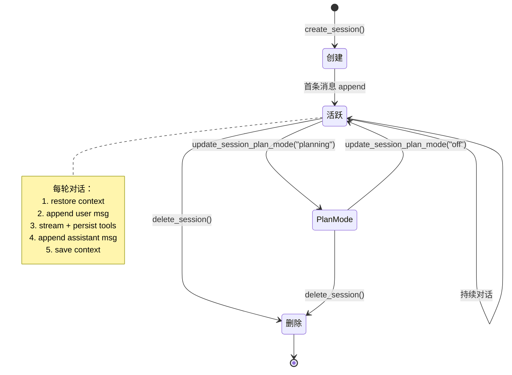
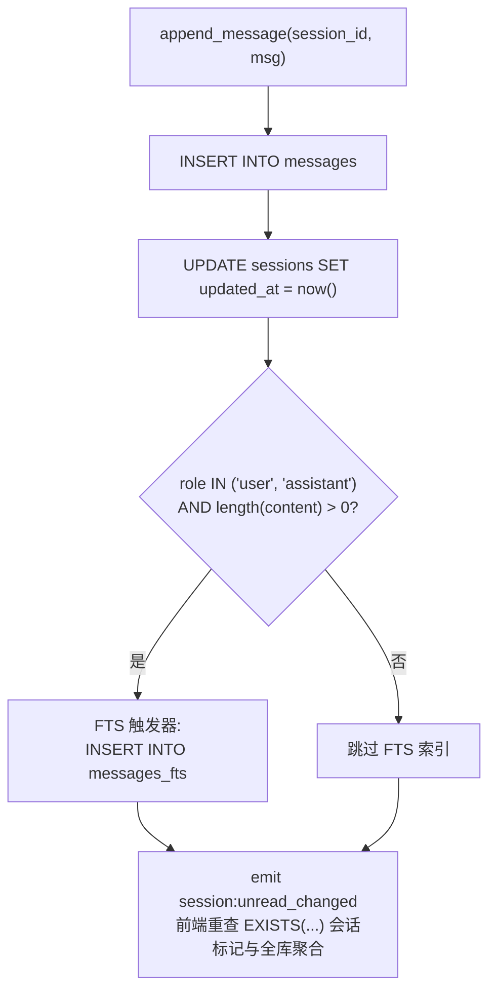

# Session 会话系统架构

> 返回 [文档索引](../README.md) | 更新时间：2026-04-28

## 目录

- [概述](#概述)
- [数据模型](#数据模型)
  - [SessionMeta](#sessionmeta)
  - [SessionMessage](#sessionmessage)
  - [MessageRole](#messagerole)
  - [NewMessage Builder](#newmessage-builder)
- [SQLite Schema](#sqlite-schema)
- [核心 API](#核心-api)
  - [会话管理](#会话管理)
  - [消息 CRUD](#消息-crud)
  - [元数据更新](#元数据更新)
  - [上下文持久化](#上下文持久化)
  - [Plan Mode 崩溃恢复](#plan-mode-崩溃恢复)
  - [已读状态](#已读状态)
  - [全文搜索](#全文搜索)
  - [Subagent 运行记录](#subagent-运行记录)
  - [ACP 运行记录](#acp-运行记录)
- [会话生命周期](#会话生命周期)
- [会话 Fork / 在新会话中继续](#会话-fork--在新会话中继续)
- [无痕会话（Incognito）](#无痕会话incognito)
- [会话级工作目录](#会话级工作目录)
- [会话级 Awareness 与 Agent 切换](#会话级-awareness-与-agent-切换)
- [自动会话标题](#自动会话标题)
- [特殊设计](#特殊设计)
- [关联文档](#关联文档)
- [文件清单](#文件清单)

---

## 概述

Session 模块是 TPA CoWork Agent 的会话与消息持久化系统，基于 SQLite WAL 模式实现高并发读写。所有对话数据（会话元信息、消息内容、工具调用记录、Agent 上下文快照、子 Agent 运行记录、ACP 运行记录）统一存储在 `~/.hope-agent/sessions.db`。

核心职责：

1. **会话生命周期管理** — 创建、列表（分页）、删除、元数据更新
2. **消息持久化** — user / assistant / tool / event / text_block / thinking_block 六种角色
3. **上下文快照** — conversation_history JSON 序列化存储，支持跨重启恢复
4. **全文搜索** — FTS5 虚拟表 + unicode61 分词器，自动触发器同步
5. **未读追踪** — 基于 `last_read_message_id` 水位线的轻量已读/未读机制
6. **子系统记录** — Subagent 运行和 ACP 运行的完整 CRUD

## 数据模型

### SessionMeta

会话元信息，用于列表展示和路由。源：`SessionMeta`（[crates/ha-core/src/session/types.rs](../../crates/ha-core/src/session/types.rs)）。

| 字段 | 类型 | 说明 |
|---|---|---|
| `id` | `String` | UUID v4 主键 |
| `title` | `Option<String>` | 会话标题 |
| `title_source` | `String` | 标题来源：`"manual"` / `"first_message"` / `"llm"`（默认 manual） |
| `agent_id` | `String` | 关联 Agent ID，默认 `"ha-main"`（`agent_loader::DEFAULT_AGENT_ID`） |
| `provider_id` | `Option<String>` | 当前使用的 Provider ID |
| `provider_name` | `Option<String>` | Provider 显示名称 |
| `model_id` | `Option<String>` | 当前使用的模型 ID |
| `reasoning_effort` | `Option<String>` | 会话级 Think / 推理强度覆盖；`None` 回退运行时默认 |
| `created_at` | `String` | RFC 3339 创建时间 |
| `updated_at` | `String` | RFC 3339 最后更新时间 |
| `pinned_at` | `Option<String>` | 置顶时间戳；非空时 sidebar 将该会话排在未置顶会话之上 |
| `message_count` | `i64` | 消息总数（子查询计算） |
| `unread_count` | `i64` | 普通会话未读标记（仅 `0/1`）；普通会话的聚合数按 session 求和，不按消息数 |
| `channel_unread_count` | `i64` | IM 会话未读标记（仅 `0/1`）；与普通会话分离，非 channel 会话恒 `0` |
| `has_error` | `bool` | 最新持久化消息是否标记为错误（sidebar 红色感叹号指示） |
| `pending_interaction_count` | `i64` | 待用户交互数（pending 工具审批 + ask_user 组数）；由 command/route 层填充，`list_sessions_paged` 不计算 |
| `is_cron` | `bool` | 是否为定时任务创建的会话 |
| `parent_session_id` | `Option<String>` | 父会话 ID（子 Agent 会话） |
| `forked_from_session_id` | `Option<String>` | Fork 来源会话 ID；用于“在新会话中继续”的用户可见 lineage，**不得**复用 `parent_session_id` |
| `forked_from_message_id` | `Option<i64>` | Fork 来源消息边界；复制到该消息（含）为止，`None` 表示复制完整 transcript |
| `forked_from_session_title` | `Option<String>` | 来源会话当前标题的只读 JOIN 投影；来源删除或无标题时为空 |
| `plan_mode` | `PlanModeState` | Plan Mode 状态（snake_case 序列化）：`off` / `planning` / `review` / `executing` / `completed`（默认 off） |
| `permission_mode` | `SessionMode` | 会话级权限模式（snake_case 序列化）：`default` / `smart` / `yolo`（默认 default） |
| `sandbox_mode` | `SandboxMode` | 会话级沙箱模式（snake_case 序列化）：`off` / `standard` / `isolated` / `workspace` / `trusted`（默认 off） |
| `project_id` | `Option<String>` | 所属项目 ID；项目作用域记忆/文件在该项目内全部会话间共享 |
| `channel_info` | `Option<ChannelSessionInfo>` | IM Channel 关联信息（LEFT JOIN channel_conversations） |
| `incognito` | `bool` | 无痕模式开关：true 时不注入被动记忆/awareness、不做自动记忆提取，且关闭即焚 |
| `working_dir` | `Option<String>` | 会话级工作目录绝对路径（注入 system prompt + 作为 `exec`/`read` 默认 cwd）；server 模式下指 server 机器路径 |
| `kind` | `SessionKind` | 会话分类：`regular`（普通对话）/ `knowledge`（知识空间侧边栏对话，从主 sidebar / picker 隐藏、精简工具集） |

### SessionMessage

单条消息记录，涵盖所有消息类型的超集字段。

| 字段 | 类型 | 说明 |
|---|---|---|
| `id` | `i64` | 自增主键 |
| `session_id` | `String` | 所属会话 ID |
| `role` | `MessageRole` | 消息角色 |
| `content` | `String` | 消息内容 |
| `timestamp` | `String` | RFC 3339 时间戳 |
| `attachments_meta` | `Option<String>` | 附件元信息 JSON（User 消息） |
| `model` | `Option<String>` | 响应模型名（Assistant 消息） |
| `tokens_in` / `tokens_out` | `Option<i64>` | Token 用量统计 |
| `tokens_in_last` | `Option<i64>` | 末轮输入 token（`ChatUsage::last_input_tokens`，用于压缩判定） |
| `tokens_cache_creation` | `Option<i64>` | Anthropic prompt cache 写入 token |
| `tokens_cache_read` | `Option<i64>` | prompt cache 读命中 token（OpenAI: `cached_tokens`） |
| `reasoning_effort` | `Option<String>` | 推理强度设置 |
| `ttft_ms` | `Option<i64>` | Time To First Token（毫秒） |
| `tool_call_id` | `Option<String>` | 工具调用 ID |
| `tool_name` | `Option<String>` | 工具名称 |
| `tool_arguments` | `Option<String>` | 工具参数 JSON |
| `tool_result` | `Option<String>` | 工具执行结果 |
| `tool_duration_ms` | `Option<i64>` | 工具执行耗时（毫秒） |
| `is_error` | `Option<bool>` | 工具是否执行失败 |
| `thinking` | `Option<String>` | 旧路径思考内容（Assistant 消息内联）；新路径用独立 `ThinkingBlock` 行存储以保持工具调用前后顺序，详见下方 `MessageRole` |
| `source` | `Option<String>` | 触发该 turn 的入口（`ChatSource::as_str()` lowercase：`desktop` / `http` / `channel` / `subagent` / `parent_injection` / `cron`）。NULL 视作 `desktop`（保守，不破坏老会话已有未读）。Unread badge / GUI→IM 镜像引用前缀都按此字段分流 |

### MessageRole

6 种消息角色枚举：

```
User          — 用户输入
Assistant     — 模型响应
Event         — 系统事件（错误通知、模型降级等）
Tool          — 工具调用及结果
TextBlock     — 中间文本块（工具调用前的文本输出，保持顺序）
ThinkingBlock — 中间思考块（工具调用前的思考输出，保持多轮思考顺序）
```

`TextBlock` 和 `ThinkingBlock` 是流式输出中的中间态消息。当模型在输出过程中穿插工具调用时，引擎会将已累积的文本/思考 flush 为独立消息，确保 UI 展示顺序与模型输出顺序一致。

### NewMessage Builder

`NewMessage` 提供 6 个便捷构造函数，统一设置时间戳和角色：

| 构造函数 | 角色 | 说明 |
|---|---|---|
| `NewMessage::user(content)` | User | 简单用户消息 |
| `NewMessage::assistant(content)` | Assistant | 模型响应 |
| `NewMessage::tool(call_id, name, args, result, duration, is_error)` | Tool | 工具调用记录 |
| `NewMessage::text_block(content)` | TextBlock | 中间文本块 |
| `NewMessage::thinking_block(content)` | ThinkingBlock | 中间思考块 |
| `NewMessage::thinking_block_with_duration(content, duration_ms)` | ThinkingBlock | 带耗时的思考块 |
| `NewMessage::event(content)` | Event | 系统事件 |

## SQLite Schema

数据库在 `SessionDB::open()` 时自动创建表和索引，并通过渐进式 Migration 添加新列。

### 主表

实际 DDL 由 `CREATE TABLE` + 多次 `ALTER TABLE ADD COLUMN` 组合构成（`db.rs::open` 末尾的渐进 migration）。下列是合并后的"逻辑视图"：

```sql
-- 会话表（合并所有迁移列）
CREATE TABLE sessions (
    id                       TEXT PRIMARY KEY,
    title                    TEXT,
    title_source             TEXT NOT NULL DEFAULT 'manual',  -- manual / first_message / llm
    agent_id                 TEXT NOT NULL DEFAULT 'ha-main',
    provider_id              TEXT,
    provider_name            TEXT,
    model_id                 TEXT,
    created_at               TEXT NOT NULL,
    updated_at               TEXT NOT NULL,
    context_json             TEXT,                            -- Agent conversation_history 快照
    context_revision         INTEGER NOT NULL DEFAULT 0,      -- 上下文 CAS revision
    context_run_id           TEXT,                            -- 最近一次成功写 context 的 persistence run
    last_read_message_id     INTEGER DEFAULT 0,
    is_cron                  INTEGER NOT NULL DEFAULT 0,
    parent_session_id        TEXT,
    forked_from_session_id   TEXT,                            -- 普通会话 fork 来源
    forked_from_message_id   INTEGER,                         -- fork 消息边界（源消息 id）
    plan_mode                TEXT DEFAULT 'off',
    plan_steps               TEXT,                            -- Plan 步骤进度 JSON（崩溃恢复）
    permission_mode          TEXT NOT NULL DEFAULT 'default', -- 会话级权限模式（default/smart/yolo）
    sandbox_mode             TEXT NOT NULL DEFAULT 'off',     -- 会话级沙箱模式（off/standard/isolated/workspace/trusted）
    project_id               TEXT,                            -- 所属项目（外部表 projects）
    awareness_config_json    TEXT,                            -- per-session awareness override
    incognito                INTEGER NOT NULL DEFAULT 0,      -- 无痕模式
    working_dir              TEXT                             -- 会话级工作目录
);

-- 消息表
CREATE TABLE messages (
    id                       INTEGER PRIMARY KEY AUTOINCREMENT,
    session_id               TEXT NOT NULL,
    role                     TEXT NOT NULL,                   -- user/assistant/event/tool/text_block/thinking_block
    content                  TEXT NOT NULL DEFAULT '',
    timestamp                TEXT NOT NULL,
    attachments_meta         TEXT,
    model                    TEXT,
    tokens_in                INTEGER,
    tokens_out               INTEGER,
    reasoning_effort         TEXT,
    tool_call_id             TEXT,
    tool_name                TEXT,
    tool_arguments           TEXT,
    tool_result              TEXT,
    tool_duration_ms         INTEGER,
    is_error                 INTEGER DEFAULT 0,
    thinking                 TEXT,                            -- 旧路径内联思考；新路径用 thinking_block 行
    ttft_ms                  INTEGER,
    tokens_in_last           INTEGER,
    tokens_cache_creation    INTEGER,
    tokens_cache_read        INTEGER,
    tool_metadata            TEXT,                            -- JSON: 工具结构化副输出（diff/before-after）
    stream_status            TEXT,                            -- streaming/completed/orphaned，NULL 视为 completed
    queue_request_id         TEXT,                            -- 持久发送队列 exactly-once 幂等键（partial unique）
    persistence_run_id       TEXT,                            -- durable stream 物化来源
    logical_block_seq        INTEGER,                         -- run 内逻辑块序号（重放幂等）
    FOREIGN KEY (session_id) REFERENCES sessions(id) ON DELETE CASCADE
);

-- 追加式流运行与尝试状态
CREATE TABLE chat_stream_runs (
    run_id                   TEXT PRIMARY KEY,
    session_id               TEXT NOT NULL,
    source                   TEXT NOT NULL,
    stream_id                TEXT,
    turn_id                  TEXT,
    status                   TEXT NOT NULL,
    accepted_seq             INTEGER NOT NULL DEFAULT 0,
    durable_seq              INTEGER NOT NULL DEFAULT 0,
    checkpoint_seq           INTEGER NOT NULL DEFAULT 0,
    committed_seq            INTEGER NOT NULL DEFAULT 0,
    provider_shape           TEXT,
    started_at               TEXT NOT NULL,
    ended_at                 TEXT,
    error                    TEXT
);

CREATE TABLE chat_stream_attempts (
    run_id                   TEXT NOT NULL,
    attempt_no               INTEGER NOT NULL,
    provider_id              TEXT,
    model_id                 TEXT,
    provider_shape           TEXT,
    status                   TEXT NOT NULL,
    accepted_seq             INTEGER NOT NULL DEFAULT 0,
    durable_seq              INTEGER NOT NULL DEFAULT 0,
    checkpoint_seq           INTEGER NOT NULL DEFAULT 0,
    started_at               TEXT NOT NULL,
    ended_at                 TEXT,
    error                    TEXT,
    PRIMARY KEY (run_id, attempt_no)
);

CREATE TABLE chat_stream_journal (
    run_id                   TEXT NOT NULL,
    attempt_no               INTEGER NOT NULL,
    block_no                 INTEGER NOT NULL,
    seq_start                INTEGER NOT NULL,
    seq_end                  INTEGER NOT NULL,
    checksum                 TEXT NOT NULL,
    payload                  BLOB NOT NULL,
    created_at               TEXT NOT NULL,
    PRIMARY KEY (run_id, attempt_no, block_no)
);

-- 忙时用户消息持久队列（UI 只保存投影）
CREATE TABLE queued_turn_user_messages (
    id                       INTEGER PRIMARY KEY AUTOINCREMENT,
    request_id               TEXT NOT NULL UNIQUE,
    session_id               TEXT NOT NULL,
    turn_id                  TEXT,
    message                  TEXT NOT NULL,
    display_text             TEXT,
    attachments_json         TEXT NOT NULL DEFAULT '[]',
    is_plan_trigger          INTEGER NOT NULL DEFAULT 0,
    goal_trigger             INTEGER NOT NULL DEFAULT 0,
    plan_comment_json        TEXT,
    options_json             TEXT,                            -- planMode / workflowMode 等重放参数
    mode                     TEXT NOT NULL DEFAULT 'queue',
    status                   TEXT NOT NULL DEFAULT 'queued',
    created_at               TEXT NOT NULL,
    updated_at               TEXT NOT NULL,
    FOREIGN KEY (session_id) REFERENCES sessions(id) ON DELETE CASCADE
);
```

`stream_status` 仅是一个 minor 的旧版本读取/恢复兼容字段，新流不再创建 placeholder：

- `streaming` — 旧版本中由 `StreamPersister` 节流写入的 placeholder 行
- `completed` — 流式块已 finalize，content 是最终内容
- `orphaned` — 启动扫尾把上次崩溃残留的 `streaming` 行批量改成此状态；前端按"上次未完成"渲染
- `NULL` — 旧版本数据库残留，所有 reader 视为 `completed`

新流以 `chat_stream_*` journal + spool 为崩溃真相源，详见
[`chat-engine.md` Durable Stream Coordinator](chat-engine.md#durable-stream-coordinator)。
`load_context_with_revision` + `save_context_at_revision` 是运行时上下文写入协议；兼容
`save_context` 也会先读取 revision 再 CAS，冲突返回错误，任何入口都不得盲写覆盖。

### 索引

```sql
CREATE INDEX idx_messages_session_id  ON messages(session_id);
CREATE INDEX idx_sessions_agent_id    ON sessions(agent_id);
CREATE INDEX idx_sessions_updated_at  ON sessions(updated_at DESC);
CREATE INDEX idx_sessions_project_id  ON sessions(project_id);
-- 部分索引：仅覆盖 streaming 行，让 mark_orphaned_streaming_rows() 启动扫尾走 O(streaming-count)
CREATE INDEX idx_messages_stream_active
  ON messages(session_id, stream_status) WHERE stream_status = 'streaming';
CREATE UNIQUE INDEX idx_messages_persistence_block
  ON messages(persistence_run_id, logical_block_seq)
  WHERE persistence_run_id IS NOT NULL AND logical_block_seq IS NOT NULL;
```

### FTS5 全文搜索

```sql
-- 虚拟表（unicode61 分词器支持 CJK）
CREATE VIRTUAL TABLE messages_fts USING fts5(
    content,
    content='messages',
    content_rowid='id',
    tokenize='unicode61'
);

-- 自动同步触发器（仅索引 user/assistant 非空消息）
CREATE TRIGGER messages_fts_ai AFTER INSERT ON messages
WHEN new.role IN ('user', 'assistant') AND length(new.content) > 0
BEGIN
    INSERT INTO messages_fts(rowid, content) VALUES (new.id, new.content);
END;

CREATE TRIGGER messages_fts_ad AFTER DELETE ON messages
WHEN old.role IN ('user', 'assistant') AND length(old.content) > 0
BEGIN
    INSERT INTO messages_fts(messages_fts, rowid, content) VALUES('delete', old.id, old.content);
END;
```

### 子 Agent / ACP 运行表

```sql
-- 子 Agent 运行记录
CREATE TABLE subagent_runs (
    run_id TEXT PRIMARY KEY,
    parent_session_id TEXT NOT NULL,
    parent_agent_id TEXT NOT NULL,
    child_agent_id TEXT NOT NULL,
    child_session_id TEXT NOT NULL,
    task TEXT NOT NULL,
    status TEXT NOT NULL DEFAULT 'spawning',  -- spawning/running/completed/error
    result TEXT,
    error TEXT,
    depth INTEGER NOT NULL DEFAULT 1,
    model_used TEXT,
    started_at TEXT NOT NULL,
    finished_at TEXT,
    duration_ms INTEGER,
    label TEXT,
    attachment_count INTEGER DEFAULT 0,
    input_tokens INTEGER,
    output_tokens INTEGER
);

-- ACP 运行记录
CREATE TABLE acp_runs (
    run_id TEXT PRIMARY KEY,
    parent_session_id TEXT NOT NULL,
    backend_id TEXT NOT NULL,
    external_session_id TEXT,
    task TEXT NOT NULL,
    status TEXT NOT NULL DEFAULT 'starting',  -- starting/running/completed/error/timeout/killed
    result TEXT,
    error TEXT,
    model_used TEXT,
    started_at TEXT NOT NULL,
    finished_at TEXT,
    duration_ms INTEGER,
    input_tokens INTEGER,
    output_tokens INTEGER,
    label TEXT,
    pid INTEGER
);
```

## 核心 API

### 会话管理

| 方法 | 说明 |
|---|---|
| `create_session(agent_id)` | 创建新会话，返回 `SessionMeta` |
| `create_session_with_parent(agent_id, parent_id)` | 创建子 Agent 会话 |
| `create_session_with_project(agent_id, project_id)` | 创建项目作用域会话；`project_id` 非空时强制 `incognito=false`（互斥防御） |
| `fork_session(source_session_id, source_message_id)` | 将普通顶层会话复制派生为新的普通会话；复制 transcript + 稳定会话配置，不复制 goal/loop/workflow/task/job 运行态 |
| `get_session(session_id)` | 获取单个会话元信息（含 Channel LEFT JOIN） |
| `list_sessions(agent_id)` | 列出所有会话（按 updated_at DESC） |
| `list_sessions_paged(agent_id, project_filter, limit, offset, active_session_id)` | 分页列表，返回 `(Vec<SessionMeta>, total_count)`。**5 参签名**：见下方 `ProjectFilter` 与 incognito 例外 |
| `list_sessions_paged_for_sidebar(agent_id, project_filter, parent_filter, limit, offset, active_session_id)` | 侧边栏分页列表；在 SQL `LIMIT/OFFSET` 前同时应用项目归属、顶层/子会话与 Agent 过滤，避免项目会话或另一类会话占满页面后再被前端丢弃 |
| `delete_session(session_id)` | 删除会话：① CASCADE 删消息 → ② 清理 `plans/{id}.md` 与 `attachments/{id}/` → ③ `cleanup_session_orphan_tables` 单独事务清四张无 FK 表（见下） |
| `purge_session_if_incognito(session_id)` | 仅当会话是无痕态时硬删；前端切走当前无痕会话时调用，实现"关闭即焚" |
| `purge_orphan_incognito_sessions()` | 启动期兜底清理：遍历 `incognito = 1` 且 `updated_at < (now - 60s)` 的会话调用 `delete_session`；防御 crash / SIGKILL / 物理断电后残留 |

**`ProjectFilter<'a>` 枚举**（`db.rs:2426`）：

| 变体 | 语义 |
|---|---|
| `All` | 不按项目过滤 |
| `Unassigned` | 仅 `project_id IS NULL`（不属于任何项目） |
| `InProject(&str)` | 仅属于指定项目的会话 |

**`ParentSessionFilter` 枚举**：`All` 不过滤，`Root` 仅 `parent_session_id IS NULL`，`Child` 仅 `parent_session_id IS NOT NULL`。主侧边栏的「对话 / Subagent」分别使用 `Root / Child`，并与 `ProjectFilter::Unassigned` 组合后再分页。

**`active_session_id` 例外参数**：默认情况下 `incognito = 0` 强制过滤无痕会话出列表（"无痕"语义）。但用户当前正在打开的那个无痕会话仍需出现在 sidebar，该参数提供例外：`Some(sid)` 时 WHERE 子句变为 `(s.incognito = 0 OR s.id = ?)`。`None` 时严格过滤。

**`delete_session` 关联表清理协议**（`cleanup_session_orphan_tables`，`db.rs:1633`）：

```rust
// 单独事务，按以下顺序删四张无 FK CASCADE 的关联表：
DELETE FROM session_skill_activation WHERE session_id = ?;
DELETE FROM learning_events           WHERE session_id = ?;
DELETE FROM subagent_runs             WHERE parent_session_id = ?;
DELETE FROM acp_runs                  WHERE parent_session_id = ?;
```

失败仅 `app_warn!` 不向上传播——保证主删 `sessions` 行成功后即使关联表清理失败也不阻塞用户。该 contract 在 [AGENTS.md](../../AGENTS.md) 列为强制要求。

### 消息 CRUD

| 方法 | 说明 |
|---|---|
| `append_message(session_id, msg)` | 追加消息并更新 `updated_at`，返回消息 ID |
| `load_session_messages(session_id)` | 加载全部消息（ASC 排序） |
| `load_session_messages_latest(session_id, limit)` | 加载最新 N 条消息 + 总数（首屏加载） |
| `load_session_messages_before(session_id, before_id, limit)` | 向上翻页加载（scroll up） |
| `update_tool_result(session_id, call_id, result, duration, is_error)` | 更新工具执行结果（按 call_id 匹配） |

### 元数据更新

| 方法 | 说明 |
|---|---|
| `update_session_title(session_id, title)` | 用户改名并把来源设为 `manual`；若文本未变化则原子 no-op，保留原来源 |
| `update_session_title_with_source(session_id, title, source)` | 更新标题并设置来源标签 |
| `update_session_title_if_source(session_id, title, expected_source)` | 仅当当前 `title_source` 等于 `expected_source` 时更新（防止 LLM 标题覆盖用户手改） |
| `update_session_title_source_if_title_and_source(...)` | 同时按旧标题与旧来源做 CAS，仅用于修复可证明的历史来源误标 |
| `update_session_model(session_id, provider_id, provider_name, model_id)` | 更新当前模型信息 |
| `mark_session_cron(session_id)` | 标记为 Cron 会话 |
| `update_session_plan_mode(session_id, plan_mode)` | 更新 Plan Mode 状态 |
| `update_session_permission_mode(session_id, mode)` | 更新会话级权限模式（`default` / `smart` / `yolo`） |
| `update_session_sandbox_mode(session_id, mode)` | 更新会话级沙箱模式（`off` / `standard` / `isolated` / `workspace` / `trusted`） |
| `update_session_incognito(session_id, bool)` | 切换无痕态；开启无痕时若 `project_id IS NOT NULL`、`channel_info IS NOT NULL`、`workflow_mode != off`、存在 open Goal 或已有 WorkflowRun，直接 `Err`（互斥防御） |
| `update_session_working_dir(session_id, Option<&str>)` | 设置/清空会话级工作目录；空串当清空 |
| `update_session_agent(session_id, agent_id)` | 切换会话 Agent；SQL 层强制 `message_count == 0`，非空会话直接拒绝（防止改动一半切 Agent 造成上下文错乱） |

### 上下文持久化

| 方法 | 说明 |
|---|---|
| `load_context_with_revision(session_id)` | 加载 Agent context 与当前 CAS revision |
| `save_context_at_revision(session_id, context_json, run_id, expected_revision)` | 仅 revision 匹配时更新并递增；旧快照 fail closed |
| `checkpoint_stream_context(...)` | 同一事务物化 durable journal 前缀并 CAS 更新中间 context |
| `commit_assistant_turn(...)` | 最终 assistant/context/turn/usage/run 的原子成功提交 |
| `commit_interrupted_turn(...)` | 最大合法前缀/context/turn/run 的原子中断或恢复提交 |
| `load_context(session_id)` | 兼容读取上下文 JSON（无则返回 None） |

上下文以 `Vec<serde_json::Value>` 序列化为 JSON 字符串，存储在
`sessions.context_json`。运行时 chat/tool-loop 写入必须使用 revision CAS；旧的无条件
`save_context` 只保留兼容/测试用途，不能用于新对话入口。

### Plan Mode 崩溃恢复

| 方法 | 说明 |
|---|---|
| `save_plan_steps(session_id, steps_json)` | 持久化 Plan 步骤进度 JSON |
| `load_plan_steps(session_id)` | 加载 Plan 步骤进度 |

Plan 执行过程中，步骤进度实时写入 `sessions.plan_steps` 列。应用崩溃重启后可从此列恢复执行进度，避免重复执行已完成步骤。

### 已读状态

基于 `last_read_message_id` 水位线机制，但产品口径是**未读会话数**：一个 session 只要存在 `messages.id > last_read_message_id AND role = 'assistant'` 的行就贡献 `1`，无论存在多少条未读 assistant 消息。会话行展示点，只有全局 / 项目 / Cron 等聚合入口展示会话数量；禁止在分页 Tab 上展示由当前页临时求和的不完整数字。

普通对话采用严格白名单：`kind='regular' AND is_cron=0 AND parent_session_id IS NULL AND incognito=0`，且没有 `channel_conversations` 绑定；项目会话与未归项目的普通顶层会话都包含。只有聊天主视图已选中、document 可见、窗口聚焦且消息列表位于最新位置时，当前 session 才作为 `active_session_id` 从显示聚合排除并推进水位线；ChatScreen 在其它 App view 仍挂载、窗口失焦或用户正在上翻历史都不能视作已读。知识空间、Eval、Cron、Subagent、IM、无痕，以及未来使用独立 `SessionKind` 的设计空间等专属对话默认排除。`mark_all_sessions_read()` 必须使用同一范围，不能清掉 Cron / IM 等独立域。

普通域只检查 `COALESCE(m.source, 'desktop') != 'channel'`；IM 域只检查 channel 绑定会话内 `source='channel'` 的 assistant 行。NULL 保守视作 desktop，兼容旧数据。普通 SQL scope 的单一来源是 `regular_session_scope_sql` + `regular_unread_exists_sql`：SessionMeta flag、`regular_unread_total`、`next_regular_unread_session`、项目 rollup 与 mark-all 都必须复用，禁止手抄资格条件。

| 方法 | 说明 |
|---|---|
| `mark_session_read(session_id)` | 显式将单个会话全部标记已读 |
| `mark_session_read_through(session_id, through_message_id)` | 只把水位线推进到 UI 已实际渲染的消息，且永不回退 |
| `mark_session_read_batch(session_ids)` | 批量标记已读 |
| `regular_unread_total(active_session_id)` | 全库普通未读会话数；不依赖 sidebar 分页 |
| `next_regular_unread_session(active_session_id)` | 按 sidebar 真实顺序返回首个普通未读会话及组内 `list_offset`，用于二次点击“对话”入口时一次扩展 window 并定位 |
| `mark_all_sessions_read()` | 只标记普通顶层会话已读（与普通聚合严格同 scope） |

### 全文搜索

```rust
pub fn search_messages(
    query: &str,
    agent_id: Option<&str>,
    session_id: Option<&str>,            // None = 全局搜索；Some = 单会话搜索（Cmd+F）
    types: Option<&[SessionTypeFilter]>, // 会话类型筛选（regular/cron/subagent/channel）
    limit: usize,
) -> Vec<SessionSearchResult>
```

- 使用 FTS5 `MATCH` 语法，每个 token 用双引号包裹实现精确匹配（`sanitize_fts_query`）
- **incognito 过滤的双路径语义**：
  - `session_id = None`（**全局 FTS** 路径，sidebar 搜索框）：强制 `s.incognito = 0`，无痕会话内容**不会**被全局搜索到
  - `session_id = Some(sid)`（**会话内 Cmd+F** 路径）：**不应用** incognito 过滤；用户既然已经在该无痕会话里，允许搜本会话内容
- `SessionTypeFilter` 枚举：`Regular` / `Cron` / `Subagent` / `Channel`。侧边栏浏览态只保留「对话 / Subagent」Tab，两类列表各自以 `unassigned + parent_session + agent_id` 独立分页；输入搜索词后隐藏浏览 Tab，并固定以 `Regular + Subagent + Channel` 做全局检索，因此项目会话、IM 渠道和 Subagent 都可被发现，Cron 仍由独立面板承载
- snippet 用 STX/ETX（U+0002/U+0003）作为 mark 边界——不可能在用户文本里出现，前端按字符 split 后白名单包回 `<mark>...</mark>`，避免 HTML escape/unescape 攻击面（用户写 `<mark onclick=...>` 不会被反解出来）
- 返回 `SessionSearchResult`：包含 `message_id` / `session_id` / `session_title` / `agent_id` / `message_role` / `content_snippet` / `timestamp` / `relevance_rank` / `is_cron` / `parent_session_id` / `channel_type` / `channel_chat_type`

### 命中后的滚动定位

```rust
pub fn load_session_messages_around(session_id, target_message_id, before_count, after_count)
```

加载目标消息前后窗口（默认 40/20），前端据此把搜索命中的消息加载到上下文里 + 滚动到位置 + pulse 高亮。`Cmd+F` 与全局搜索结果跳转复用同一路径。

### Subagent 运行记录

| 方法 | 说明 |
|---|---|
| `insert_subagent_run(run)` | 插入运行记录 |
| `update_subagent_status(run_id, status, result, error, model, duration)` | 更新状态 |
| `set_subagent_finished_at(run_id, finished_at)` | 设置完成时间 |
| `get_subagent_run(run_id)` | 获取单条记录 |
| `list_subagent_runs(parent_session_id)` | 列出父会话的全部运行 |
| `list_active_subagent_runs(parent_session_id)` | 列出活跃运行（spawning/running） |
| `count_active_subagent_runs(parent_session_id)` | 计数活跃运行 |
| `cleanup_orphan_subagent_runs()` | 启动时清理孤儿运行（标记为 error） |

### ACP 运行记录

`acp_runs` 表含 `pid INTEGER` 列存储后端进程 PID，`status` 取值 `starting/running/completed/error/timeout/killed`。

| 方法 | 说明 |
|---|---|
| `insert_acp_run(run_id, parent_session_id, backend_id, task, label)` | 插入运行记录 |
| `update_acp_run_status(run_id, status, pid, external_session_id)` | 更新状态、进程 PID、外部 session ID |
| `finish_acp_run(run_id, status, result, error, input_tokens, output_tokens)` | 完成运行（自动计算 duration） |
| `get_acp_run(run_id)` | 获取单条记录 |
| `list_acp_runs(parent_session_id)` | 列出父会话的全部运行 |

## 会话生命周期



## 会话 Fork / 在新会话中继续

Fork 用于把当前会话派生为一个新的、可独立继续的普通会话。它对齐 Codex `/fork` 的用户心智：新会话有自己的 ID，原 transcript 不被改动，用户可以在两条路线里并行探索。

### 数据语义

- `forked_from_session_id` / `forked_from_message_id` 是普通会话 lineage，只用于“接续自”提示和跳转原会话。
- `parent_session_id` 仍只表示子 Agent 会话。Fork 出来的会话必须保留 `parent_session_id = NULL`，否则会被 sidebar、未读和子会话 UI 当成隐藏子会话处理。
- `SESSION_META_SELECT` 追加 `forked_from_session_title` 作为只读来源标题投影；来源会话删除后，fork 会话仍保留来源 ID，但标题为空。

### 复制范围

`SessionDB::fork_session(source_session_id, source_message_id)` 以数据库事务和失败清理共同保证一致性：

1. 校验来源是普通顶层会话：非 incognito、非 cron、非 subagent、`kind = regular`。
2. 校验 `source_message_id` 属于来源会话；为空时复制完整 transcript，非空时复制到该消息 ID（含）为止。
3. 拒绝复制 `stream_status = 'streaming'` 的未完成行，避免派生出半条 assistant/tool 输出。
4. 创建新 `sessions` 行，复制 agent/model/project/workdir、permission/sandbox/execution/workflow mode 等稳定配置。
5. 复制 `messages` 行，保留原消息时间戳、tool metadata、token 和 source 字段。普通上传与 `tool_media_items` 引用的会话私有文件会复制到新会话附件目录，并将 `path` / `localPath` / `/api/attachments/{session}/...` URL 改写为新会话；工作区 quote 等外部引用保持原样。这样删除来源会话后，派生会话的附件仍可独立读取。
6. 将新会话 `last_read_message_id` 设为复制后的末尾消息，避免复制历史立刻变成未读。

附件复制或写库任一步失败时，数据库事务回滚并删除已创建的新附件目录；提交后先释放 writer mutex，再通过读连接加载新 `SessionMeta`，避免同线程重复获取写锁。

### 不复制的内容

Fork 不复制 active Goal、Loop schedule、Workflow run、Task progress、pending approval、background job、subagent/acp run 等运行态。这些对象代表当前执行路线的 live state；复制它们会导致原会话和派生会话共享或竞争同一批异步任务。新会话只带历史上下文和稳定配置，后续 goal/loop/workflow 由新会话重新创建。

## 无痕会话（Incognito）

`sessions.incognito` 是无痕态的**单一真相源**。无痕会话除关闭被动 AI 行为外，关闭即焚——不进侧边栏列表、不进全局 FTS、不进 Dashboard 统计。

### 关闭的被动行为
- 不注入 Memory（包括 Active Memory）
- 不注入 Awareness suffix（`agent/mod.rs:704-710` 在 `refresh_awareness_suffix` 入口短路）
- 不跑 inline / idle / flush-before-compact 自动记忆提取
- 不参与跨会话 Awareness 候选采集

### 不进列表/统计的过滤路径
| 过滤位置 | 默认 | 例外 |
|---|---|---|
| `list_sessions_paged` | WHERE `incognito = 0` | `active_session_id = Some(sid)` 时该 sid 出列表 |
| `search_messages`（global） | WHERE `s.incognito = 0` | 无 |
| `search_messages`（in-session, Cmd+F） | 不过滤 | — |
| `dashboard::filters::build_session_filter` | WHERE `incognito = 0` | 无 |

### 关闭即焚

| 触发点 | 行为 |
|---|---|
| 前端切走当前无痕会话（`handleSwitchSession` / `handleNewChat` / `handleNewChatInProject`） | 调 `purge_session_if_incognito` 硬删，不留任何记录 |
| 启动期 | `purge_orphan_incognito_sessions` 兜底：扫描 `incognito = 1 AND updated_at < (now - 60s)` 的残留会话调用 `delete_session`（防御 crash / SIGKILL / 物理断电）。60s cutoff 是 defense-in-depth：即使 `runtime_lock` 选举失败导致两个进程并存，也不会误杀对方刚创建的活跃会话 |

### 四旁路守卫（Epic E）

「关闭即焚」不止是「不进列表」——任何把无痕会话内容**写到磁盘**或**在焚毁后还跑回合**的旁路都必须封死。`ToolExecContext.incognito`（agent 侧从 `SessionMeta` 单点注入，派生 `Default` 故各辅助构造点默认 `false`）是工具执行期的无痕真相源；`is_session_incognito` 改为 **fail-closed 三态**：DB 未初始化→`false`、行确不存在（删除/焚毁）→`true`（兜底跳过尾随落盘/记忆）、瞬时锁/IO 错误→warn+`false`（不误吞正常会话）。

| 旁路 | 风险 | 守卫 | 编号 |
|---|---|---|---|
| **记忆提取** | 焚毁后尾随的 inline/idle/flush 提取把内容写进 memory.db | `is_session_incognito` fail-closed：行不存在按无痕跳过 | INCOG-1 |
| **大工具结果落盘** | `tool_results/<sid>/` 留明文 | `maybe_persist_large_tool_result` 无痕走内存内联、不落盘；焚毁 watcher `purge_tool_results_for_session` 递归删目录兜底 | INCOG-5 |
| **异步任务落盘** | `background_jobs.db` 行存明文 args + `background_jobs/` spool 文件留全量输出 | `record_running_job` 无痕 args 存占位 + `incognito` 列；`finalize_job`/`persist_result` 无痕只留 inline preview、绝不 spool；焚毁 watcher `purge_jobs_for_session` 删行+spool 兜底 | INCOG-2 |
| **持久 AllowAlways** | 「始终允许」规则越过焚毁存活 | `GrantContext.incognito` → `choose_scope` 强制 `AllowScope::Session`（内存态、焚毁随 `clear_session_rules` 清除）；前端隐藏 AllowAlways 按钮 | INCOG-6 |

辅以两道「焚毁不留尾巴」守卫:**幽灵回合**——异步结果注入(`async_jobs::injection::dispatch_injection` + `subagent::injection::inject_and_run_parent` 顶部 + idle 等待后双兜底)在会话已删/已焚时 `mark_injected` + 跳过,杜绝向死会话凭空起计费 LLM 回合(INCOG-3/DELETE-3);**在途回合**——前端焚毁前 best-effort `stop_chat` + 后端 `cleanup_watcher` 在 `session:purged` live-cancel `active_turn`,双保险中断在途流式(INCOG-1/DELETE-5)。`cleanup_watcher` 区分 `session:deleted`(仅 cancel 活跃 job)与 `session:purged`(额外清盘 tool_results + job 行/spool)。

### 会话生命周期协调清理（cleanup_watcher）

删除 / 焚毁一个会话时,多个**内存子系统**仍持有它的引用(待审批、后台 job、IM 文本审批栈、在途 turn、per-session allowlist 规则、定时唤醒、排队 subagent)。`session::cleanup_watcher`（#318 引入）是 `session:deleted` / `session:purged` 的**唯一订阅者**,把一次生命周期事件 fan-out 到所有这些子系统,杜绝泄漏。

模块设计(镜像 `channel::worker::eviction_watcher`):

- **单订阅 + 名字过滤**:一个 EventBus subscriber,只认 `EVENT_SESSION_DELETED` / `EVENT_SESSION_PURGED`
- **fan-out 在接收循环外 `tokio::spawn`**:`cleanup_session` 含多次 DB 查询 + 全局锁扫描,inline await 会让突发删除回压 broadcast buffer 触发 `Lagged`(丢后续清理);off-loop spawn 后每步 best-effort + per-subsystem 幂等,不同会话并发清理安全
- **`Lagged` 走 `app_error!`(运维信号,非保证)**:丢一个生命周期事件 = 那个会话的清理永不跑(审批挂死 / job 不取消 / 无痕产物不清);它仍骑共享 EventBus,根治需专用 lifecycle channel / reconcile
- **从 `start_background_tasks` + `start_minimal_background_tasks` 两路 spawn**:**刻意不放进 `spawn_channel_listeners`**——server / ACP 无 channel registry 但同样删会话、需要此清理

`cleanup_session(session_id, is_purge, descendant_session_ids, im_chat)` 级联(每步独立 best-effort)。**`descendant_session_ids` / `im_chat` 必须删除前快照**(`SessionDB::capture_session_cleanup_context`):`subagent_runs`(父→子映射)与 `channel_conversations`(IM attach)都随会话 FK 级联删除,emit 时已不可恢复:

| # | 步骤 | 函数 | 编号 |
|---|---|---|---|
| 1 | 取消活跃 / `awaiting_approval` 后台 job | `JobManager::cancel_for_session` | A-8 / DELETE-4 |
| 2 | deny + resolve 待审批(解阻塞 tool turn + 撤所有 surface 弹窗) | `tools::deny_pending_for_session(SessionDeleted)` | A-9 / DELETE-1 / INCOG-4 |
| 2b | **后代 subagent 子会话级联**:对每个 `descendant_session_ids` 也 `cancel_for_session` + `deny_pending_for_session`——内层 tool 审批 key 在**子会话**,被删父 id 匹配不到(子会话经 `collect_descendant_session_ids` 传递性收集) | `JobManager::cancel_for_session` + `tools::deny_pending_for_session` | **G4** |
| 3 | 清该会话 IM 文本审批栈;**并按删除前快照的 `im_chat`(account, chat) 直接 `drop_pending_for_chat`**——`channel_conversations` 行已 FK 级联删,session-keyed 查找解析不出 | `channel::worker::approval::drop_pending_for_session` + `drop_pending_for_chat` | A-9 / **SURFACE-2** |
| 4 | 清 per-session allowlist 规则 | `permission::allowlist::clear_session_rules` | A-9 / INCOG-7 |
| 5 | live-cancel 在途 turn | `chat_engine::active_turn::current(..).cancel` | A-9 / DELETE-5 / INCOG-1 |
| 6 | 取消 + 删定时唤醒(删与焚都做) | `wakeup::purge_for_session` | R10 |
| 7 | drop 排队(`Queued`)subagent spawn 并逐个 `request_cancel_run`（兜 incognito / 未投影的 parked spawn——其敏感 `SpawnParams` 只活在队列项里,丢弃即焚） | `subagent::queue::purge_for_session` | R7.2 |
| +purge | 仅焚毁额外清盘:删 `tool_results/<sid>/` + async-job 行/spool | `tools::purge_tool_results_for_session` + `JobManager::purge_for_session` | INCOG-2 / INCOG-5 |

普通 `delete` 不做最后一步(留给 age-based GC),只有 `purge`(无痕焚毁)立即清盘。

### 与 Project / IM Channel 互斥

无痕会话不能进项目、不能绑定 IM channel，也不能和 durable Goal / Workflow 控制面并存：

- 前端 `IncognitoToggle` 在 `project_id != null` 或 `channel_info != null` 时灰化 + tooltip 解释
- 后端 `update_session_incognito` 对 `project_id.is_some()` / `channel_info.is_some()` / `workflow_mode.enabled()` / open Goal / 已存在 WorkflowRun 直接 `Err`
- `create_session_with_project` 在 `project_id` 存在时强制 `incognito = false`
- `channel/db.rs::ensure_conversation` 入口防御式清零（IM 路径创建的会话强制 `incognito = false`）
- `update_session_workflow_mode` 反向防御：无痕会话不能开启 Workflow Mode；Goal / WorkflowRun 创建入口也会拒绝无痕 session

## 会话级工作目录

`sessions.working_dir` 持久化用户为该对话指定的绝对路径，有两重作用：① `system_prompt::build` 在 Project 段之后、Memory 段之前插入 `# Working Directory` 段告诉模型默认操作目录；② 作为 `exec` 的实际 cwd（[`execution.rs::default_cwd()`](../../crates/ha-core/src/tools/execution.rs)）与 `read` 工具相对路径解析的首选根——**不再是纯 prompt 提示**。详细合并规则见 [Project 系统](project.md)，本节只覆盖会话侧入口。

### 写入校验

`update_session_working_dir(session_id, Option<&str>)` 走 `crate::util::canonicalize_working_dir`：
- 空串当清空
- 非空字符串先 `canonicalize` + `is_dir` 校验，不通过返回 `Err`
- 校验通过后写 `working_dir` 列

### 桌面 vs HTTP 选择路径

| 模式 | 前端入口 | 行为 |
|---|---|---|
| 桌面（Tauri） | `WorkingDirectoryButton` | 调 `@tauri-apps/plugin-dialog` 的 `open({ directory: true })` 弹原生目录选择 |
| HTTP/Server | `WorkingDirectoryButton` + `ServerDirectoryBrowser` Dialog | 走 axum `GET /api/filesystem/list-dir`（单级 + Bearer token） |

### 与 project_id / incognito 正交

会话级 working_dir 与项目级、与无痕模式独立：

- 项目内会话仍可单独设会话级 working_dir，按 [`session.helpers::effective_session_working_dir`](../../crates/ha-core/src/session/helpers.rs) 合并：`session.working_dir > project.working_dir > 不注入`，**lazy resolve**（不复制项目快照——改项目工作目录立即对未单独设置的项目内已有会话生效）
- 无痕会话也可设会话级 working_dir（与无痕语义不冲突——它是工具默认 cwd：`exec` 实际工作目录 + `read` 相对路径根）

## 会话级 Awareness 与 Agent 切换

### awareness_config_json

per-session override 列。当不为空时，`refresh_awareness_suffix` 用该会话的覆盖配置；为空则用 Agent 级配置。`incognito = 1` 时整个 refresh 路径短路（见上节）。

前端 `AwarenessToggle` 在 `incognito` 时 `disabled`，但**不**改写 `awareness_config_json`——关闭无痕后 awareness 配置自动恢复原状。

### Agent 切换 + message_count == 0 校验

`update_session_agent(session_id, agent_id)` 在 SQL 层校验 `message_count == 0`，对非空会话直接拒绝改动：

```sql
UPDATE sessions SET agent_id = ?
WHERE id = ?
  AND (SELECT COUNT(*) FROM messages WHERE session_id = ?) = 0;
```

前端 `AgentSwitcher` dropdown 在 `messages.length > 0` 时 disabled 是 UX 防御；DB 层是真实的 contract（防止从 ACP / IM 等绕过 UI 的写路径走漏）。

## 自动会话标题

`title_source` 三态机器：`manual` / `first_message` / `llm`。源：[crates/ha-core/src/session_title.rs](../../crates/ha-core/src/session_title.rs)。

| 来源 | 触发 | 覆盖关系 |
|---|---|---|
| `manual` | 用户实际改成不同标题 | 终态，不会被自动覆盖；进入编辑后原样失焦不改变来源 |
| `first_message` | `ensure_first_message_title()` 从首个用户可见输入取候选（≤50 字符自动 truncate） | 仅当非无痕、`title IS NULL AND message_count <= 1` 且候选非空时设置 |
| `llm` | 自主任务启动时由 `maybe_schedule_autonomous_start` 提前调度，任意成功 Chat Engine 回合再由 `maybe_schedule_after_success` 兜底重试 | **仅当 `title_source == 'first_message'` 时**才覆盖（用 `update_session_title_if_source` 语义性 CAS）；保护用户手改不被覆盖 |

### LLM 触发条件
- `AppConfig.session_title.enabled == true`（默认开启）
- `meta.incognito == false`
- `meta.title_source == 'first_message'`
- 选模型：`session_title.{provider_id, model_id}` 配置 > 当前 chat 模型

Goal / Loop / Workflow 可能在一个 turn 内运行数分钟，不能等最终 assistant 行才有自然标题。Chat Engine 因此在识别到 `goal_trigger`、`loop_trigger`、用户可见的 Goal/Loop slash 创建消息或已开启 Workflow Mode 时，使用首个用户语义输入提前调度；成功回合收尾再以首个 assistant 结果作失败重试。Loop 标题上下文读取用户可见创建消息，绝不把内部 `<loop_trigger>` 协议作为标题素材。

LLM 路径走独立线程 + 独立 tokio 运行时（不阻塞 chat 流）；同一 session 由进程内 lease 去重，开始/收尾不会重复请求。失败仅 `app_warn!`，不影响主流程。标题调度独立于 `post_turn_effects`，所以 `ParentInjection` 等后台推进也可完成 Loop 标题优化；记忆提取与技能审核仍受该开关约束。

## 特殊设计

### 消息持久化流程



### 消息顺序保持（TextBlock / ThinkingBlock）

LLM 流式输出中，模型可能在输出文本的中途发起工具调用。为保持 UI 展示顺序与模型实际输出顺序一致，Chat Engine 在遇到 `tool_call` 事件时将已累积的 text / thinking 内容 flush 为独立的 `TextBlock` / `ThinkingBlock` 消息，插入到 tool_call 消息之前。

### 未读追踪

使用水位线方案而非逐条标记，避免大量 UPDATE。`last_read_message_id` 记录用户最后阅读到的消息 ID，单会话未读通过 `EXISTS(...)` 实时计算为 `0/1`；聚合查询统计符合资格的未读 session。对话阅读面调用 `mark_session_read_through`，只推进到最后一个已渲染的 DB message id；缓存补拉尚未完成或失败时不得把更晚的 assistant 行提前清除。右键「标记已读」等显式动作仍可省略上限并清到当前 `MAX(id)`。assistant 落库或水位线更新后发 `session:unread_changed`，payload 带可选 `domain=regular|channel|cron` 仅用于避免无关域重查，消费者仍必须查询权威值，不能信任事件中的派生数量；`domain` 缺失时必须保守重查。

### 会话删除清理

`delete_session()` 除了 CASCADE 删除消息外，还清理：
- `~/.hope-agent/plans/{session_id}.md` — Plan 文件
- `~/.hope-agent/attachments/{session_id}/` — 附件目录

### FTS 索引容错

- 仅索引 `user` 和 `assistant` 角色的非空消息（tool/event 等不索引）
- 删除时 WHEN 条件与插入一致，避免删除未索引消息导致 FTS 损坏
- `open()` 时执行 `FTS rebuild` 修复可能的已有损坏
- `delete_session()` 失败时尝试 rebuild FTS 后重试

### Channel 集成

会话列表通过 `LEFT JOIN channel_conversations` 获取 IM Channel 关联信息，前端据此展示渠道标识（Telegram / WeChat 等图标和发送者名称）。

### auto_title 实现

`auto_title()`（[helpers.rs](../../crates/ha-core/src/session/helpers.rs)）对候选取第一行：≤50 字符直接使用，超过则截断到 47 字符 + `"..."`，使用字符计数正确处理 CJK 和 emoji。`first_message_title_candidate()` 的优先级是：非空消息正文 → `source=pasted_text` 且路径经 canonicalize 后位于当前 session attachment 目录内的首个非空文本行 → 附件名去扩展名。大段粘贴被转成文件、正文为空时因此仍有自然标题；候选仍为空则不写 `New Chat` 和 `title_source`，保留后续真实输入/LLM 起标题机会。Tauri、HTTP 与 IM 都在首条消息持久化后把同一份 `attachments_meta` 传入该入口。

## 关联文档

- [Chat Engine](chat-engine.md) — 对话引擎，Session 的主要调用方
- [Plan Mode](plan-mode.md) — Plan Mode 状态管理与步骤持久化
- [Subagent](subagent.md) — 子 Agent 系统，使用 subagent_runs 表

## 文件清单

| 文件 | 职责 |
|---|---|
| `crates/ha-core/src/session/mod.rs` | 模块声明和 re-export |
| `crates/ha-core/src/session/types.rs` | SessionMeta, SessionMessage, MessageRole, NewMessage 类型定义 |
| `crates/ha-core/src/session/db.rs` | SessionDB 核心实现（open, CRUD, FTS, 已读, Migration, ProjectFilter, SessionTypeFilter） |
| `crates/ha-core/src/session/helpers.rs` | auto_title / ensure_first_message_title / effective_session_working_dir / is_session_incognito / cleanup_orphan_incognito 等辅助函数 |
| `crates/ha-core/src/session/subagent_db.rs` | Subagent 运行记录 CRUD |
| `crates/ha-core/src/session/acp_db.rs` | ACP 运行记录 CRUD |
| `crates/ha-core/src/session_title.rs` | 自动会话标题：来源 CAS、语义上下文、启动/收尾调度与 in-flight 去重 |
| `src-tauri/src/commands/session.rs` | Tauri 命令层 |
| `crates/ha-server/src/routes/sessions.rs` | HTTP 路由层（REST API） |
